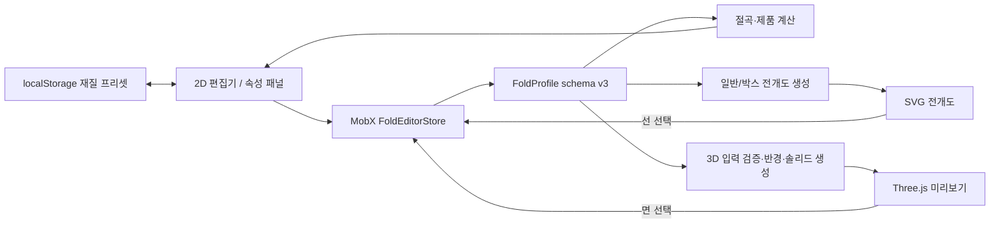

# fold_web 현재 구현 현황

> 기준일: 2026-07-19
>
> 기준 브랜치/커밋: `main` / `1e27a70`
>
> MFC 참조 프로젝트: `/Users/kyhoon/Library/Mobile Documents/com~apple~CloudDocs/회사/hicomtech/도면`
>
> 분석 기준: 저장소의 현재 코드와 자동 검증 결과

## 1. 요약

`fold_web`은 알루미늄 절곡 단면을 2D로 작성하고, 재질별 연신 보정을 적용해 전개 폭을 계산한 뒤 전개도와 3D 판재 모델로 검토하는 클라이언트 중심의 Next.js 프로토타입이다.

현재 핵심 편집 흐름은 실제로 동작하도록 연결되어 있다.

- 일반/박스 단면 작성과 편집
- 선 길이, 절곡 방향, 컷 타입, 각도 편집
- 재질 프리셋과 선별 수동 연신 보정
- 전개 폭, 면적, 수량 계산
- 일반/박스 전개도 생성
- 판 두께와 내부 절곡 반경을 반영한 3D 미리보기
- Undo/Redo와 2D·3D·전개도 선택 동기화
- Docker 이미지 빌드, 태그 기반 배포, 실패 시 롤백

다만 아직 업무용 완성 제품보다는 계산 및 시각화 프로토타입에 가깝다. 도면 저장/불러오기 UI, 사용자·서버 데이터, 제작 파일 출력, E2E 테스트가 없고, 일부 도메인 기능은 코드와 단위 테스트만 존재하며 화면에서는 사용할 수 없다.

### 확정된 재구축 범위

현재 미구현 항목을 모두 향후 구현 대상으로 해석하지 않는다. 다음 내용은 [MFC 도면Pro 웹 재구축 종합 설계](./web-rebuild-architecture.md)의 확정 기준이다.

| 항목 | 확정 내용 |
|---|---|
| 입면도 | 웹 재구축 범위에서 제외한다. 화면, 편집기, API, 활성 데이터 모델과 기능 데이터 이전을 구현하지 않는다. |
| 기계 연동 | 장기 구현 대상이나 1단계에는 메뉴·권한·상태·계약의 자리만 둔다. Agent와 실제 통신은 구현하지 않는다. |
| 인증 | MFC 실행·로그인 방식과 분리된 웹서비스 독자 인증을 구축한다. |
| 데이터베이스 | 운영은 RDS 또는 운영 서버의 별도 PostgreSQL, 개발·테스트는 로컬 PostgreSQL을 사용한다. SQLite는 사용하지 않는다. |
| DB 코드 | Prisma Schema, Prisma Client, Prisma Migrate를 기준으로 설계하고 작성한다. |
| 언어 | 1차 완료 범위는 대한민국·한국어 단일 언어다. 다국어는 후속 범위로 둔다. |

MFC 코드, 화면과 계산 결과는 비교 근거로 사용하지만 1:1 복제를 목표로 하지 않는다. 웹의 자동 저장·검색·오류 안내·이력 같은 장점을 반영하고, MFC 계산 오류나 불합리한 업무 구성은 근거와 사용자 승인을 거쳐 수정된 기대값으로 검증한다.

### 구현 수준 한눈에 보기

| 영역 | 상태 | 비고 |
|---|---|---|
| 2D 단면 편집 | 구현됨 | 연속 선, 스냅, 관절 이동, 길이 수정, 닫기 지원 |
| 일반/박스 도면 | 구현됨 | 박스는 서로 독립된 두 단면을 사용 |
| 절곡·연신 계산 | 구현됨 | 고정/비율 엔진 존재, 현재 UI는 사실상 고정 방식만 사용 |
| 전개도 | 구현됨 | 일반 직사각형, 박스 십자형 전개도 |
| 3D 모델 | 구현됨 | 두께 솔리드, 반경 원호, 박스 직교 모델 |
| 재질 프리셋 | 구현됨 | 브라우저 `localStorage`에만 저장 |
| 도면 저장/불러오기 | 도메인만 구현 | JSON 직렬화·마이그레이션은 있으나 UI와 연결되지 않음 |
| 백엔드/DB/인증 | 기반 구현 | PostgreSQL 16·Prisma migration/seed, 서버 DB 수명주기·transaction 기반 구현. 실제 인증·업무 CRUD는 미구현 |
| STEP/DXF/PDF 출력 | 미구현 | 화면 검토 기능만 제공 |
| 자동 검증 | 양호 | 기본 테스트 94개와 PostgreSQL 통합 테스트 5개, lint/typecheck/build 통과; 브라우저 E2E 없음 |
| 배포 | 구현됨 | Docker Hub 태그 이미지와 self-hosted runner 사용 |

## 2. 시스템 구성

### 기술 스택

| 구분 | 사용 기술 |
|---|---|
| 웹 프레임워크 | Next.js 16.2.10 App Router, React 19.2.4, TypeScript 5 |
| UI | Tailwind CSS 4, Lucide 아이콘 |
| 상태 관리 | MobX 6, mobx-react-lite |
| 2D 편집 | Konva 10, react-konva |
| 3D 렌더링 | Three.js 0.185, React Three Fiber, Drei |
| 테스트 | Vitest 3 |
| 운영 | Node.js 22 Alpine, Docker Compose, GitHub Actions |

애플리케이션은 서버 컴포넌트인 홈 화면 안에 클라이언트 편집 작업 영역을 올린 구조다. Konva, 3D, 전개도 컴포넌트는 모두 동적 import와 `ssr: false`로 브라우저에서만 로드된다.

### 런타임 데이터 흐름



도면의 단일 원본은 `FoldEditorStore.profile`이다. 계산 결과, 전개도, 3D geometry는 저장하지 않고 현재 프로필에서 매 렌더링 시 파생한다. 따라서 한 화면에서 선이나 재질을 바꾸면 다른 표현도 별도 저장 과정 없이 갱신된다.

## 3. 도메인 모델

### MFC 참조 프로젝트

절곡 계산 로직의 원본 근거로 사용하는 MFC `도면Pro` 프로젝트의 현재 로컬 경로는 다음과 같다.

```text
/Users/kyhoon/Library/Mobile Documents/com~apple~CloudDocs/회사/hicomtech/도면
```

이 경로는 macOS iCloud Drive 안의 로컬 절대 경로이므로 다른 사용자나 장비에서는 달라질 수 있다. 2026-07-16 기준으로 다음 참조 파일이 해당 위치에 존재함을 확인했다.

| 참조 파일 | MFC 근거 |
|---|---|
| `_define.h` | `Henum_AngleType` 각 타입 정의 |
| `DrawFx.cpp` | `DFx_CutDepth_SetAt` 재질별 값 선택 |
| `_common.cpp` | `Gn_Elongation_GetFixNA` 고정 계산, `Gn_Elongation_GetRatioOCW` 비율 계산 |
| `Work03Dlg.cpp` | `Fn_CalcLenW_SellFold` 계산 흐름과 소수 처리 |

웹 구현과 MFC 원본을 대조할 때는 위 디렉터리를 기준 루트로 사용한다. 세부 계산 해석은 [절곡 계산 명세](./fold-calculation-spec.md)에 정리되어 있다.

현재 도면 스키마 버전은 3이다. 핵심 구조는 다음과 같다.

```text
FoldProfile
├─ profileType: normal | box
├─ material
│  ├─ thickness
│  ├─ insideBendRadius
│  ├─ cutAngle
│  ├─ elongation[V-CUT | A-CUT | NO-CUT]
│  └─ cutDepth[V-CUT | A-CUT | NO-CUT]
├─ product
│  ├─ length
│  └─ quantity
├─ calculation
│  ├─ mode: fixed | ratio
│  ├─ vCutEnabled
│  ├─ decimalPlaces
│  └─ decimalOperation
└─ blocks[]
   └─ segments[]
      ├─ start / end
      ├─ inputLength
      ├─ bendAfter
      │  ├─ direction: front | back
      │  ├─ cutType
      │  └─ angle
      ├─ elongationOverride?
      ├─ calculateElongation?
      └─ formula?
```

- 일반 도면은 `block` 1개를 사용한다.
- 박스 도면은 서로 연결되지 않은 `block` 2개를 사용한다.
- 절곡 정보는 관절 자체가 아니라 해당 관절로 진입하는 선의 `bendAfter`에 저장된다.
- 좌표와 제품 치수의 단위는 모두 mm다.
- ID는 브라우저 `crypto.randomUUID()`로 생성한다.

도메인 검증기는 빈 이름, 잘못된 재질/제품 값, 빈 도면, 중복 선 ID, 0 이하 길이, 비정상 좌표, 끊어진 선, 잘못된 절곡 각도 등을 검사한다. 빈 도면은 오류가 아니라 경고로 취급한다.

JSON 직렬화와 역직렬화도 구현되어 있다. 스키마 v1의 최상위 `segments`는 v2의 첫 번째 블록으로, v2 재질은 두께를 기본 내부 절곡 반경으로 사용해 v3로 마이그레이션한다. 그러나 현재 화면에는 JSON 내보내기나 가져오기 버튼이 없다.

## 4. 구현된 사용자 기능

### 4.1 초기 화면과 작업 모드

최초 진입 시 다음 예제 도면이 메모리에 생성된다.

- 알루미늄 2T, 내부 절곡 반경 2 mm
- 100 mm → 50 mm → 80 mm의 3개 선
- 앞각 90° V-CUT, 뒷각 90° V-CUT
- 제품 길이 2,400 mm, 수량 10개

상단에서 `절곡(2D)`, `3D`, `전개도`, `분할` 화면을 전환할 수 있다. 분할 모드는 XL 화면에서만 버튼이 보이며 2D와 3D의 가로 비율, 상단 영역과 전개도의 세로 비율을 드래그로 조정할 수 있다. 구분선을 더블 클릭하면 기본 비율로 돌아간다.

### 4.2 2D 단면 편집

Konva 캔버스는 다음 동작을 제공한다.

- 연속 선 작성
- 첫 점 재클릭 또는 근접 클릭으로 닫힌 도형 완성
- 이전 선 끝점에서 자동으로 이어 그리기
- 수평/수직에 가까운 입력을 직교 방향으로 스냅
- 선 클릭 선택과 선택 강조
- 관절점 드래그 및 인접 선 길이 재계산
- 숫자 입력으로 선택 선 길이 변경
- 선택 선 길이 변경 시 뒤쪽 형상 전체를 평행 이동해 연결 유지
- 중간 선 삭제 후 다음 선 시작점을 앞 선 끝점에 다시 연결
- 전체 도면 화면 맞춤
- 포인터 기준 휠 확대/축소
- 빈 공간 드래그, 가운데 버튼, `Space`+드래그로 화면 이동

선을 그을 때 진행 방향이 꺾이면 외적 부호로 앞각/뒷각을 판정하고, 두 선 사이 각도를 계산해 이전 선의 끝에 기본 V-CUT 절곡을 자동 생성한다. 직선으로 연장하면 절곡을 만들지 않는다.

단축키는 다음과 같다.

| 입력 | 동작 |
|---|---|
| `Esc` | 그리기 종료 |
| `Delete` / `Backspace` | 선택 선 삭제 |
| `Ctrl/Cmd + Z` | 실행 취소 |
| `Ctrl/Cmd + Shift + Z` | 다시 실행 |
| `Ctrl/Cmd + Y` | 다시 실행 |
| `Space` + 드래그 | 캔버스 이동 |

Undo 이력은 JSON 스냅샷으로 최대 50개까지 유지되며 페이지를 새로고침하면 사라진다. 선/절곡/재질/도면 타입 변경은 이력에 포함되지만, 현재 제품 길이와 수량 변경은 체크포인트를 만들지 않아 단독 Undo 대상이 아니다.

### 4.3 일반 도면과 박스 도면

일반 도면은 한 개의 연속 단면과 제품 길이를 사용한다. 박스 도면으로 전환하면 두 번째 독립 블록이 추가되고 `면 1`, `면 2`, `두 번째 시작점` 컨트롤이 나타난다.

박스 모드의 두 단면은 같은 2D 좌표 공간에 보이지만 데이터상 독립적이다. 활성 면은 실선, 비활성 면은 점선으로 표시한다. 일반 모드로 돌아가면 면 1만 유지되고 면 2 데이터는 제거되며, 이 전환 자체는 Undo할 수 있다.

박스 바닥 기준선은 두 단면에서 서로 교차하는 선 후보 중 가장 긴 선으로 선택한다. 교차 후보가 없으면 각 단면의 가장 긴 선을 사용한다. 두 기준선의 실제 입력 길이가 완성 바닥 가로·세로가 된다.

### 4.4 선 속성, 재질, 포인트 정보

선 속성 패널에서 다음 항목을 편집한다.

- 입력 길이
- 끝점 절곡 추가/제거
- 앞각/뒷각
- V-CUT/A-CUT/NO-CUT
- 절곡 각도
- 자동 연신 보정 또는 선택 선 전용 수동 보정값

연신율 설정 패널은 다음 항목을 제공한다.

- 알루미늄 1T/2T/3T 기본 프리셋
- 재질명과 두께
- 컷별 연신율
- 내부 절곡 반경
- 기본 컷 깊이
- 적용 제한 각도
- 계산 소수점 0~4자리
- 처리 안 함/반올림/버림/올림
- 현재 재질값을 프리셋에 저장

프리셋은 `fold-web:material-presets:v1` 키로 브라우저 `localStorage`에 저장된다. 동일 ID의 프리셋은 갱신되고 새로운 ID는 추가된다. 현재 UI에는 새 프리셋 ID를 만드는 기능이 없으므로, 보통 선택된 기본 프리셋을 덮어쓰는 형태다.

포인트 탭은 면별 P1, P2… 목록과 좌표, 진입/진출 길이, 절곡 방향, 컷 타입, 각도를 보여준다. 닫힌 도형은 시작점과 끝점을 중복 표시하지 않는다. 행을 선택하면 대응 선도 선택된다.

### 4.5 절곡 및 제품 계산

각 선의 계산 길이는 양 끝에 걸린 절곡 보정의 영향을 받는다.

#### 고정 방식

```text
앞각 기여 = +컷별 연신율
뒷각 기여 = -컷별 연신율
자동 보정 = 소수 보존(이전 절곡 기여 + 다음 절곡 기여)
계산 길이 = 입력 길이 - 적용 보정
```

레거시 MFC의 정수 변환은 절댓값 1 미만의 FIX 보정을 소실시키므로 `LEGACY_DEFECT`로 판정했다. 현재 웹 엔진은 합산 보정값을 소수 5자리까지 안정화해 보존하고, 최종 구간 길이에만 설정된 소수 처리 규칙을 적용한다.

#### 비율 방식

```text
앞각 기여 = 두께 - 컷 깊이
뒷각 기여 = -컷 깊이
계산 길이 = 입력 길이 - 이전 기여 - 다음 기여
```

비율 방식은 절곡 각도가 재질의 적용 제한 각도보다 작을 때만 적용한다. 경계값과 같거나 큰 각도에는 적용하지 않는 규칙이 사용자 승인됐다. 엔진과 테스트는 구현되어 있지만 현재 UI에는 계산 방식을 고정/비율로 바꾸는 컨트롤이 없어 기본값인 `fixed`로만 사용된다.

선에 `elongationOverride`가 있으면 자동값 대신 수동값을 사용한다. `calculateElongation === false`이면 해당 선 끝 절곡의 기여를 절곡 양쪽 구간에서 모두 제외한다. 이 옵션은 현재 UI에 노출되지 않으며, 후속 모델·UI에서 절곡 단위 의미가 분명한 이름으로 바꿀 예정이다.

최종 제품 계산은 다음과 같다.

```text
전개 폭 = 모든 선의 계산 길이 합
개당 면적(m²) = 전개 폭 × 제품 길이 ÷ 1,000,000
총면적(m²) = 개당 면적 × 수량
```

박스 모드는 두 단면의 전개 폭을 각각 표시하고 바닥 가로·세로와 수량을 보여준다. 전체 면적 계산은 화면에 노출하지 않는다.

### 4.6 전개도

일반 도면 전개도는 `제품 길이 × 최종 전개 폭`의 직사각형이다. 선별 계산 길이를 누적해 절곡선을 배치한다.

- V-CUT: 빨간 실선
- A-CUT: 파란 점선
- NO-CUT: 회색 절곡선
- 절곡선에 방향, 각도, 누적 위치 표시
- 절곡선 클릭 또는 키보드 선택 시 원본 선 선택
- 휠/버튼 확대·축소, 드래그 이동, 화면 맞춤

박스 전개도는 두 기준선을 바닥으로 두고 기준선 앞뒤의 계산 길이를 네 방향 패널로 펼쳐 십자형 외곽을 만든다. 완성 바닥 크기와 연신 보정된 전개 바닥 크기를 구분해 표시하며, 경계선을 선택하면 대응 면과 선이 선택된다.

전개도는 화면 SVG로만 제공되며 파일 다운로드 기능은 없다.

### 4.7 3D 미리보기

일반 도면은 2D 단면을 제품 길이 방향으로 압출한다. 각 중심선을 판 두께의 절반만큼 양쪽으로 오프셋하고, 연결부는 최대 `두께의 절반 × 4` 범위의 miter로 접합한다. 열린 단면은 양 끝을 막고 닫힌 단면은 첫 선과 마지막 선을 연결한다.

내부 절곡 반경이 0보다 크고 관절에 절곡 정보가 있으면 중심선 반경 `내부 반경 + 두께/2`의 접선 원호로 모서리를 치환한다. 원호 분할 간격은 최대 5°다. 인접 선이 짧아 요청 반경을 만들 수 없으면 각 선 길이의 45% 안에서 반경을 제한하고 화면에 경고한다.

박스 3D는 두 기준선 길이로 바닥 가로·세로를 정하고 두 단면을 서로 직교 압출한다. 중복되는 두 번째 바닥 면은 제거한다. 박스 형상 자체에는 제품 길이를 사용하지 않는다.

3D 검토 도구는 다음과 같다.

- 등각/정면/측면/평면 시점
- 음영/모서리/투명 표시
- 원근/직교 투영
- 모델 전체 화면 맞춤
- 박스 면별 표시/숨김(최소 한 면은 유지)
- OrbitControls 회전, 확대·축소, 팬
- 3D 면 선택과 2D 선 선택 공유
- 선택 선 청록색 강조
- WebGL 미지원 또는 잘못된 형상의 대체 안내

3D geometry와 Three.js 객체는 MobX에 저장하지 않는다. 프로필 변경 때 순수 TypeScript geometry를 다시 만들고, React 컴포넌트가 사용이 끝난 `BufferGeometry`를 `dispose()`한다.

## 5. 상태 관리와 영속성

현재 도면은 모듈 단위의 `FoldEditorStore` 싱글턴에만 존재한다.

| 데이터 | 저장 위치 | 새로고침 후 유지 |
|---|---|---|
| 현재 도면과 선택 상태 | 브라우저 메모리 | 아니요 |
| Undo/Redo 이력 | 브라우저 메모리 | 아니요 |
| 2D/3D/전개도 카메라 | 각 React 컴포넌트 로컬 상태 | 아니요 |
| 화면 모드와 분할 비율 | 작업 영역 로컬 상태 | 아니요 |
| 재질 프리셋 | `localStorage` | 예 |

따라서 새로고침하면 도면은 초기 예제로 돌아가고 재질 프리셋만 복원된다. 서버 전송, 사용자별 저장, 자동 저장은 없다.

## 6. 서버·운영 구성

### 애플리케이션 라우트

| 라우트 | 형태 | 용도 |
|---|---|---|
| `/` | 빌드 시 정적 생성 | 편집기 단일 화면 |
| `/api/health` | 동적 Route Handler | `{ "status": "ok" }`, 캐시 금지 |
| `/api/internal/database-smoke` | 동적 Node.js Route Handler | 기본 비활성인 PostgreSQL transaction 통합 검증 |

PostgreSQL 16용 Prisma Schema·초기 migration·비식별 seed, DB runtime 설정 검증, singleton pool과 transaction 예제는 구현됐다. 내부 smoke 경로는 32자 이상의 시험 token을 명시적으로 주입할 때만 동작하며 사용자 인증 기능이 아니다. 실제 업무 API, 독자 인증·RBAC와 파일 저장소는 아직 없다.

### Docker

- Node.js 22 Alpine 멀티스테이지 빌드
- Next.js `standalone` 출력
- UID/GID 1001의 non-root 사용자 실행
- 컨테이너 포트 3000
- 호스트 기본 바인딩 `127.0.0.1:10000`
- 30초 간격 `/api/health` Docker healthcheck
- `no-new-privileges` 적용
- `linux/amd64` 대상 이미지

### CI/CD

GitHub Actions `CI` 워크플로는 `main` 대상 PR, `main` push, `v*` 태그, 수동 실행에서 품질 작업을 수행하도록 작업 트리에서 갱신됐다.

```text
npm ci
  → Prisma validate/generate/migration diff
  → unit/lint/typecheck
  → PostgreSQL 16 reset·migration·seed·integration
  → migration status·build
  → production dependency audit
```

전체 npm audit JSON은 14일 artifact로 보관하고 production dependency의 high·critical 취약점은 실패 처리한다. 현재 이 변경은 로컬 검증을 통과했지만 GitHub Actions 실제 실행과 `main` 보호 규칙 적용은 `D0-12` 승인 후 진행한다.

Docker 이미지 빌드·게시와 운영 배포는 `v*` 태그에서만 실행된다. 이미지는 `victoriatech/fold_web`에 게시되고, `production` 라벨의 self-hosted Linux runner가 `/home/kyhoon/fold-web`에 배포 파일을 설치한 뒤 태그 이미지를 올린다. Docker와 배포 job은 품질 job 성공에 의존한다.

배포 스크립트는 이전 이미지 태그를 기록하고 새 컨테이너가 `healthy`가 될 때까지 최대 150초 동안 확인한다. 배포 실패 시 직전 이미지를 다시 기동한다. 수동 `rollback.sh`도 같은 이전 이미지 기록을 사용한다.

## 7. 코드 모듈별 역할

| 경로 | 역할 |
|---|---|
| `src/app/page.tsx` | 단일 편집기 페이지 셸 |
| `src/components/canvas-workspace.tsx` | 도면 타입, 도구, 화면 모드, 속성/결과 패널 통합 |
| `src/components/konva-stage.tsx` | 2D 작성·선택·관절 편집·카메라 |
| `src/components/developed-pattern-preview.tsx` | 일반/박스 SVG 전개도와 뷰포트 |
| `src/components/model-3d/fold-model-preview.tsx` | Three.js 장면, 카메라, 표시 모드, 선택 |
| `src/stores/fold-editor-store.ts` | 현재 프로필, 선택, 편집 명령, Undo/Redo |
| `src/stores/material-preset-store.ts` | 재질 프리셋 `localStorage` 영속화 |
| `src/domain/fold-profile.ts` | 스키마 v3와 생성 유틸리티 |
| `src/domain/fold-profile-validation.ts` | 도면 유효성 검사 |
| `src/domain/fold-profile-serialization.ts` | JSON 저장 형식과 v1/v2 마이그레이션 |
| `src/domain/fold-calculation.ts` | MFC 호환 절곡 및 제품 계산 |
| `src/domain/developed-pattern.ts` | 일반/박스 전개 형상 계산 |
| `src/domain/fold-point-info.ts` | 면별 포인트 목록 생성 |
| `src/domain/3d/fold-model-input.ts` | 3D 입력 정규화와 기본 검증 |
| `src/domain/3d/bend-radius.ts` | 절곡 반경 접선 원호 생성과 제한 경고 |
| `src/domain/3d/solid-geometry.ts` | 두께 판재 솔리드 생성 |
| `src/domain/3d/box-solid-geometry.ts` | 박스 기준선 판별과 직교 솔리드 생성 |
| `src/domain/3d/surface-geometry.ts` | 표면 geometry와 3D 경계 계산 |
| `prisma/schema.prisma` | PostgreSQL 16용 Prisma Schema v1 |
| `prisma/seed.ts` | 사용자·개인정보가 없는 최소 기준정보 seed |
| `src/server/config/database-env.ts` | DB URL·pool·timeout 런타임 검증 |
| `src/server/db/prisma.ts` | 서버 전용 Prisma singleton과 PostgreSQL adapter |
| `src/server/platform/database-smoke.ts` | transaction commit·rollback application 예제 |
| `src/server/platform/platform-repository.ts` | 내부 플랫폼 repository 경계 |
| `src/server/http/api-response.ts` | 표준 오류 envelope와 request ID |

`src/stores/canvas-store.ts`는 초기 MobX/Konva 예제의 사각형 상태로 보이며 현재 애플리케이션에서 import되지 않는다. 제거하거나 별도 샘플로 분리할 수 있는 잔여 코드다.

## 8. 자동 검증 결과

2026-07-19 현재 아래 명령을 로컬에서 직접 실행했다.

| 명령 | 결과 |
|---|---|
| `npm test` | 성공: 12개 테스트 파일, 94개 테스트 통과; DB 통합 파일 1개·5건은 기본 실행에서 제외 |
| `npm run test:integration` | 성공: test DB reset·migration·seed 후 PostgreSQL 통합 테스트 5건 통과 |
| `npm run lint` | 성공: ESLint 오류 없음 |
| `npx tsc --noEmit` | 성공: TypeScript 오류 없음 |
| `npm run build` | 성공: DB 환경변수 없이 Prisma generate·Next.js production build·TypeScript 검사 통과 |

테스트가 다루는 주요 범위는 다음과 같다.

- 도면 생성, 검증, 직렬화, v1/v2 마이그레이션
- 고정/비율 연신 계산과 레거시 반올림
- 편집 명령, 연결 유지, Undo/Redo, 도형 닫기, 박스 두 면
- 재질 프리셋 영속화
- 포인트 정보
- 일반/박스 전개도
- 3D 입력, 표면, 두께 솔리드, 박스 솔리드, 절곡 반경

기본 테스트는 도메인·MobX 스토어와 서버 환경 검증을 다룬다. 별도 PostgreSQL 통합 테스트는 실제 commit·rollback, 내부 경로 차단과 입력 제한을 확인한다. 실제 브라우저에서 클릭·드래그·WebGL 렌더링·반응형 레이아웃·배포 롤백을 자동 검증하는 E2E/시각 회귀 테스트는 없다.

## 9. 현재 한계와 주의사항

### 우선순위 높음

1. **도면이 저장되지 않는다.** 새로고침, 탭 종료, 브라우저 오류 시 현재 작업이 사라진다. JSON 직렬화 로직을 파일 저장/불러오기 또는 서버 저장 UI와 연결해야 한다.
2. **실제 제작 기준 대조가 완료되지 않았다.** `WEB-REFERENCE-V1` 20건은 사용자 승인됐지만, 실제 제작 결과와 측정 가능한 허용 오차를 정한 확대 회귀 검증은 별도 작업이다.
3. **브라우저 E2E 테스트가 없다.** 드래그, 분할 리사이즈, 키보드, WebGL, 모바일 UI는 수동 테스트 계획만 있다.
4. **박스 기준선 판별이 휴리스틱이다.** 복잡하거나 여러 번 교차하는 단면에서는 “가장 긴 교차 선”이 사용자가 의도한 바닥 선이 아닐 수 있다. 명시적 기준선 선택 기능이 필요하다.

### 기능 노출 불일치

- `ratio` 계산 엔진은 있지만 UI에서 선택할 수 없다.
- `vCutEnabled`를 끄는 엔진/전개도 로직은 있지만 UI 컨트롤이 없다.
- 선별 `calculateElongation=false`와 `formula` 필드는 있으나 UI와 연결되지 않는다.
- JSON 저장/불러오기와 스키마 마이그레이션은 화면에서 접근할 수 없다.
- 컷 깊이는 도메인상 컷별 값이지만 UI의 “기본 컷 깊이”를 바꾸면 세 컷 타입에 같은 값을 기록한다.
- 프로필 이름, ID, 생성/수정 시각은 모델에 있으나 관리 UI가 없다.

### 편집 및 상태 제약

- 제품 길이와 수량 변경은 Undo 체크포인트를 만들지 않는다.
- “새 도면”은 새 프로필 ID를 만드는 것이 아니라 기존 프로필의 선 블록만 비우며 재질·제품·계산 설정을 유지한다.
- 모든 편집 상태가 전역 싱글턴 하나에 있어 여러 도면을 동시에 열 수 없다.
- 재질 프리셋은 브라우저와 기기에 종속되며 공유·백업되지 않는다.
- 박스 3D는 형상 계산에 제품 길이를 쓰지 않지만 공통 3D 입력 검증이 `product.length > 0`을 요구한다. 길이 0인 외부 도면을 향후 불러오면 박스 3D도 유효하지 않게 판정될 수 있다.

### 3D 및 출력 제약

- STEP, DXF, SVG, PDF 등 제작/교환 파일 출력이 없다.
- 자기 교차 단면이나 두께 오프셋 충돌을 별도로 탐지하지 않는다.
- miter는 단순 길이 제한 방식이며 실제 가공 조인트 규칙과 다를 수 있다.
- 절곡 반경은 중심선 원호를 다각형으로 근사한 시각 검토용 구현이다.
- 3D는 GPU/WebGL 환경에 의존한다.

### 저장소 관리

- 루트 `README.md`는 create-next-app 기본 문서 상태라 프로젝트 목적과 실행·배포 방법을 충분히 설명하지 않는다.
- `docs/threejs-model-plan.md`와 `docs/editor-test-plan.md`에는 계획 또는 기대 동작이 섞여 있다. 실제 구현 판단에는 이 문서와 코드를 우선해야 한다.
- 사용되지 않는 `canvas-store.ts`가 남아 있다.

## 10. 권장 다음 작업

1. 로컬 PostgreSQL을 준비하고 `prisma/schema.prisma`와 초기 Prisma migration을 작성한다.
2. Prisma 기반 서버 저장, 도면 JSON 가져오기/내보내기와 자동 임시 저장을 연결한다.
3. 계산 방식, V-CUT 적용 여부, 선별 계산 제외를 UI에 노출하고 설정별 회귀 테스트를 추가한다.
4. Playwright 등으로 핵심 P0 편집 흐름과 2D/3D/전개도 선택 동기화를 자동화한다.
5. 박스 기준선을 사용자가 직접 지정할 수 있게 하고 복잡 형상 검증을 추가한다.
6. 합의된 MFC 기준 샘플로 전개 폭과 절곡 반경 치수를 대조한다.
7. 제작 출력이 필요하면 우선순위를 정해 SVG/DXF/STEP 중 하나를 별도 모듈로 설계한다.
8. 기계 연동은 1단계에 비활성 항목과 상태만 두고 실제 통신은 후속 단계로 유지한다.
9. 루트 README를 본 문서의 요약과 실제 실행/배포 절차로 교체하고 잔여 예제 코드를 정리한다.

## 11. 관련 문서

- [MFC 도면Pro 웹 재구축 종합 설계](./web-rebuild-architecture.md)
- [전체 프로젝트 작업계획서](./project-work-plan.md)
- [세부 작업계획 템플릿](./work-item-template.md)
- [절곡 계산 명세](./fold-calculation-spec.md)
- [3D 모델 설계 및 단계 기록](./threejs-model-plan.md)
- [편집기 수동 테스트 계획](./editor-test-plan.md)
- [Docker 및 배포 가이드](./deployment-guide.md)
