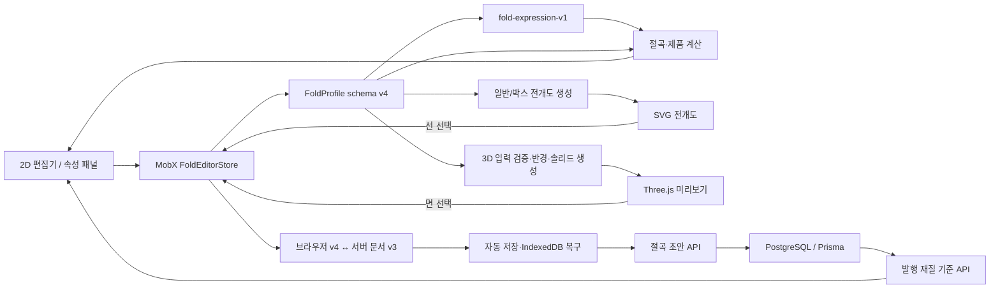

# fold_web 현재 구현 현황

> 기준일: 2026-08-22
>
> 기준: P1과 P2-A01~P2-A11, P2-B01 사용자 검수·승인 완료. P2-A 기준정보·수주 묶음과 P2-B01 작업 queue를 닫았다.
>
> MFC 참조 프로젝트: `/Users/kyhoon/Library/Mobile Documents/com~apple~CloudDocs/회사/hicomtech/도면`
>
> 분석 기준: 저장소의 현재 코드와 자동 검증 결과

## 1. 요약

`fold_web`은 알루미늄 절곡 단면을 작성·저장하고 재질별 연신 보정을 적용해 전개 폭을 계산한 뒤, 전개도·3D·제작 DXF로 검토하는 PostgreSQL 서버 기반 Next.js 웹서비스다.

현재 핵심 편집 흐름은 실제로 동작하도록 연결되어 있다.

- 일반/박스 단면 작성과 편집
- 선 길이, 절곡 방향, 컷 타입, 각도 편집
- 서버 발행 재질·두께·계산 기준과 선별 수동 연신 적용 제외
- 전개 폭, 면적, 수량 계산
- 일반/박스 전개도 생성
- 판 두께와 내부 절곡 반경을 반영한 3D 미리보기
- Undo/Redo와 2D·3D·전개도 선택 동기화
- PostgreSQL 기반 독자 로그인·DB session·비밀번호 재설정
- 단일 조직의 사용자 초대·상태·부서·역할·권한 관리
- 회사 기본정보와 복수 사업장, 기본 사업장 단일성·비활성·검색·감사 관리
- 조직별 거래처 자동 코드·통합 검색, 복수 담당자·고객 현장·기본 지정·비활성·감사 관리
- 조직별 재질·두께 검색·등록·비활성·낙관적 잠금·감사, 계산 기준 필요/발행 상태 관리
- 두께별 연신·컷 계산 규칙 개정, FIX/RATIO·네 옵션·Decimal·유효기간, 비교·검토·게시·예약·취소·감사 관리
- 두께별 원판 규격·마감·방향·trim·중량·잔재 기준, 기본·비활성 수명주기와 설계 선택 관리
- Zod strict 절곡 문서 v3, v1·v2 migration, 원판 물리 snapshot, Decimal 문자열, canonical JSON·checksum, 브라우저 v4 adapter
- PostgreSQL 절곡 초안 CRUD, 1초 자동 저장, 낙관적 잠금, IndexedDB 장애 복구
- 절곡 템플릿 분류·검색·복사, 검토·게시·폐기, 새 개정·이력·비교 화면
- BigInt 고정 소수점 `decimal-v1`, canonical 계산 결과와 0~6자리 화면 정책
- 16개 각 타입, FIX/RATIO, 네 연신 옵션, V-CUT 전환과 절곡별 계산 제외
- `fold-expression-v1` 변수·계산 변수, 구간·제품 수식과 명시적 오류 안내
- 원호 계산·Konva 편집, 교차 직선 자동 판정 박스, 내장 패널과 제품 두 번째 치수
- 게시 패널 템플릿 snapshot·provenance와 고유 ID 적용
- 화면과 분리된 제작 geometry, 원호 3D와 자기 교차 경고
- DXF R2000·mm·제작 layer·SHA-256·FileAsset·출력 감사·다운로드
- 기존 승인 20건과 파생 100건, 합계 120건 계산 회귀 기준선
- 가격등급·세 scope 가격표·게시 개정·Decimal 가격 엔진·할증·trace
- 수주 헤더 자동 번호·거래처 snapshot·복사·취소와 동시 수정 제어
- 게시 절곡 개정의 수주용 불변 복사, 수량·변수·재질·원판 지정
- 입력 hash·엔진 버전을 고정한 계산·금액 불변 snapshot과 재계산 이력
- 계산 완료·승인·생산 요청·생산 중·생산 완료·마감 상태 전이와 승인 후 변경 차단
- 기간·거래처·담당자·복수 상태 검색과 cursor 목록, 수주 단위 안전 이력
- PostgreSQL 기반 작업 queue와 worker, 멱등 등록·lease 회수·backoff 재시도·취소·다시 실행
- 상단 모듈 탭·서브탭·모듈 메뉴 3단 내비게이션과 공통 조회조건 바·탭 기반 목록/상세 화면
- Docker 이미지 빌드, 태그 기반 배포, 실패 시 롤백

P1 구현 기준선은 완료됐다. 운영 인프라, binary object storage, Windows 현장 프로그램 DXF 검수와 생산 업무 연결은 P2 범위이며, 실제 기계 통신은 P3 범위다.

`P2-A01 회사·사업장`부터 [P2-A11 수주 목록·이력](./work-items/P2-A11-order-list-history.md)까지 P2-A 기준정보·수주 묶음 전체가 구현·자동 검증·사용자 승인을 마쳤다. 거래처와 기준정보에서 수주를 만들고, 게시 절곡 개정을 불변 snapshot으로 복사하고, 계산·금액을 고정해 승인한 뒤 생산 요청까지 한 흐름으로 이어진다.

[P2-B01 작업 queue·worker](./work-items/P2-B01-job-queue-worker.md)는 구현과 자동 검증을 마치고 [화면 테스트 가이드](./P2-B01-screen-test-guide.md)에 따른 사용자 검수를 기다린다. 설계 문서의 "초기 PostgreSQL queue" 출발점을 유지해 새 제품이나 새 자원 없이 만들었고, worker는 기존 Docker 이미지에 진입점만 다른 컨테이너로 붙는다.

`P2-B02 파일 저장소`는 object storage 제품과 보존 정책(`D2-B02-*`) 결정이 남아 있다. 비용이 붙는 결정이므로 상세계획에서 후보를 정리해 사용자 승인을 받은 뒤 착수한다.

### 확정된 재구축 범위

현재 미구현 항목을 모두 향후 구현 대상으로 해석하지 않는다. 다음 내용은 [MFC 도면Pro 웹 재구축 종합 설계](./web-rebuild-architecture.md)의 확정 기준이다.

| 항목 | 확정 내용 |
|---|---|
| 입면도 | 웹 재구축 범위에서 제외한다. 화면, 편집기, API, 활성 데이터 모델과 기능 데이터 이전을 구현하지 않는다. |
| 기계 연동 | 장기 구현 대상이나 1단계에는 메뉴·권한·상태·계약의 자리만 둔다. Agent와 실제 통신은 구현하지 않는다. |
| 인증 | MFC 실행·로그인 방식과 분리된 웹서비스 독자 인증을 구축한다. |
| 데이터베이스 | 운영은 RDS 또는 운영 서버의 별도 PostgreSQL, 개발·테스트는 로컬 PostgreSQL을 사용한다. SQLite는 사용하지 않는다. |
| DB 코드 | Prisma Schema, Prisma Client, Prisma Migrate를 기준으로 설계하고 작성한다. |
| 언어 | 1차 완료 범위는 대한민국·한국어 단일 언어다. 다국어는 후속 범위로 둔다. |

MFC 코드, 화면과 계산 결과는 비교 근거로 사용하지만 1:1 복제를 목표로 하지 않는다. 웹의 자동 저장·검색·오류 안내·이력 같은 장점을 반영하고, MFC 계산 오류나 불합리한 업무 구성은 근거와 사용자 승인을 거쳐 수정된 기대값으로 검증한다.

### 구현 수준 한눈에 보기

| 영역 | 상태 | 비고 |
|---|---|---|
| 2D 단면 편집 | 구현됨 | 연속 선, 스냅, 관절 이동, 길이 수정, 닫기 지원 |
| 일반/박스 도면 | 구현됨 | 박스는 서로 독립된 두 단면을 사용 |
| 절곡·연신 계산 | P1-10 완료 | 전체 각 타입·FIX/RATIO·네 옵션·V-CUT·양쪽 계산 제외 구현·검수 완료 |
| 변수·수식 | P1-11 완료 | 버전 parser, 의존성·순환 검증, 구간·제품 수식, DB 왕복 구현·사용자 검수 완료 |
| 곡선·박스·패널 | 완료 | 원호 계산·직접 편집, 교차 직선 자동 바닥 판정, 내장 패널·두 번째 치수와 문서 v3 저장 구현 |
| 전개도 | 구현됨 | 일반 직사각형, 박스 십자형 전개도 |
| 3D 모델 | 구현됨 | 두께 솔리드, 반경 원호, 박스 직교 모델 |
| 재질 프리셋 | 구현됨 | 브라우저 `localStorage`에만 저장 |
| 도면 저장/불러오기 | P1-07 완료 | PostgreSQL CRUD·자동 저장·새로고침 복원·동시 편집 충돌·IndexedDB 복구 구현·사용자 검수 완료 |
| 템플릿 라이브러리 | P1-08 완료 | 분류·검색·복사·검토·게시·폐기·새 개정·이력·비교 구현 및 사용자 검수 완료 |
| 공통 팝업 | 구현됨 | 전역 알림·확인·문자 입력·기능 모달, 위험 variant·초점·키보드·queue 지원 |
| 백엔드/DB/인증 | P1-03 자동 구현 완료 | PostgreSQL·Prisma 기반 독자 인증, DB session, 조직·RBAC·감사 로그 구현 |
| 회사·사업장 | P2-A01 완료 | 회사 프로필, 복수 사업장, 기본 사업장 단일성·비활성·검색·권한·감사 구현·검수 완료 |
| 거래처·고객 현장 | P2-A02 완료 | 자동 코드, 통합 검색, 복수 담당자·현장, 기본 지정·비활성·권한·감사 구현·검수 완료 |
| 원판 품목 | P2-A05 완료 | 규격·trim·면적·중량·기본/비활성, 설계 선택과 문서 v3 snapshot 구현·자동 검증·사용자 검수 완료 |
| 가격 규칙 | P2-A06 완료 | 가격등급·세 scope 가격표·개정·Decimal 엔진·할증·trace·관리/미리보기 UI 구현, 사용자 검수와 20건 가격 기준선 확정 완료 |
| 수주 헤더 | P2-A07 완료 | 연도별 자동 수주번호, 거래처 기본값·snapshot, 복사·취소, 낙관적 잠금·감사 구현·검수 완료 |
| 절곡 작업 snapshot | P2-A08 완료 | 게시 개정 불변 복사, 수량·변수·재질·원판 지정, 복사·정렬·제거와 원본 변경 격리 검증 완료 |
| 계산·금액 snapshot | P2-A09 완료 | 입력 hash·엔진/규칙 버전 고정, 항목별 면적·절곡·V-CUT·할증과 공급가·VAT·총액 불변 저장 |
| 승인·생산 상태 | P2-A10 완료 | 8개 상태 단방향 전이, 승인 계산 고정, 승인 후 변경 차단, 사유 필수 승인 취소와 감사 구현 |
| 수주 목록·이력 | P2-A11 완료 | 기간·거래처·담당자·복수 상태 검색, cursor 목록, 수주 단위 안전 이력, 생산 요청 진입 구현 |
| 작업 queue·worker | P2-B01 검수 대기 | `SKIP LOCKED` 작업 선택, lease 좀비 회수, 멱등 등록, 지수 backoff, 취소·다시 실행, 작업 큐 화면 구현·자동 검증 완료 |
| 출력 | DXF 구현, STEP·PDF 미구현 | 제작 DXF 직접 다운로드 가능; PDF·파일 object storage는 P2-B 범위 |
| 자동 검증 | 양호 | 단위 319건, PostgreSQL 통합 72건, Playwright 28개 시나리오와 lint/typecheck/build 통과 |
| 배포 | 구현됨 | Docker Hub 태그 이미지와 self-hosted runner 사용 |

## 2. 시스템 구성

### 기술 스택

| 구분 | 사용 기술 |
|---|---|
| 웹 프레임워크 | Next.js 16.2.10 App Router, React 19.2.4, TypeScript 5 |
| UI | Tailwind CSS 4, Lucide 아이콘 |
| 상태 관리 | MobX 6, mobx-react-lite |
| 2D 편집 | Konva 10, react-konva |
| 3D 렌더링 | Three.js 0.185, React Three Fiber, Drei |
| 테스트 | Vitest 3 |
| 운영 | Node.js 22 Alpine, Docker Compose, GitHub Actions |

애플리케이션은 서버 컴포넌트인 홈 화면 안에 클라이언트 편집 작업 영역을 올린 구조다. Konva, 3D, 전개도 컴포넌트는 모두 동적 import와 `ssr: false`로 브라우저에서만 로드된다.

### 런타임 데이터 흐름


```mermaid
flowchart LR
  UI["2D 편집기 / 속성 패널"] --> STORE["MobX FoldEditorStore"]
  STORE --> PROFILE["FoldProfile schema v4"]
  PROFILE --> EXPR["fold-expression-v1"]
  EXPR --> CALC
  PROFILE --> CALC["절곡·제품 계산"]
  PROFILE --> DEV["일반/박스 전개도 생성"]
  PROFILE --> MODEL["3D 입력 검증·반경·솔리드 생성"]
  CALC --> UI
  DEV --> SVG["SVG 전개도"]
  MODEL --> THREE["Three.js 미리보기"]
  SVG -->|선 선택| STORE
  THREE -->|면 선택| STORE
  PG --> RULEAPI["발행 재질 기준 API"]
  RULEAPI --> UI
  STORE --> ADAPTER["브라우저 v4 ↔ 서버 문서 v3"]
  ADAPTER --> AUTOSAVE["자동 저장·IndexedDB 복구"]
  AUTOSAVE --> API["절곡 초안 API"]
  API --> PG["PostgreSQL / Prisma"]
```

도면의 단일 원본은 `FoldEditorStore.profile`이다. 계산 결과, 전개도, 3D geometry는 저장하지 않고 현재 프로필에서 매 렌더링 시 파생한다. 따라서 한 화면에서 선이나 재질을 바꾸면 다른 표현도 별도 저장 과정 없이 갱신된다.

## 3. 도메인 모델

### MFC 참조 프로젝트

절곡 계산 로직의 원본 근거로 사용하는 MFC `도면Pro` 프로젝트의 현재 로컬 경로는 다음과 같다.

```text
/Users/kyhoon/Library/Mobile Documents/com~apple~CloudDocs/회사/hicomtech/도면
```

이 경로는 macOS iCloud Drive 안의 로컬 절대 경로이므로 다른 사용자나 장비에서는 달라질 수 있다. 2026-07-16 기준으로 다음 참조 파일이 해당 위치에 존재함을 확인했다.

| 참조 파일 | MFC 근거 |
|---|---|
| `_define.h` | `Henum_AngleType` 각 타입 정의 |
| `DrawFx.cpp` | `DFx_CutDepth_SetAt` 재질별 값 선택 |
| `_common.cpp` | `Gn_Elongation_GetFixNA` 고정 계산, `Gn_Elongation_GetRatioOCW` 비율 계산 |
| `Work03Dlg.cpp` | `Fn_CalcLenW_SellFold` 계산 흐름과 소수 처리 |

웹 구현과 MFC 원본을 대조할 때는 위 디렉터리를 기준 루트로 사용한다. 세부 계산 해석은 [절곡 계산 명세](./fold-calculation-spec.md)에 정리되어 있다.

현재 브라우저 도면 스키마 버전은 4이고 서버 저장 문서는 v3다. 핵심 구조는 다음과 같다.

```text
FoldProfile
├─ profileType: normal | box
├─ material
│  ├─ thickness
│  ├─ insideBendRadius
│  ├─ cutAngle
│  ├─ elongation[V-CUT | A-CUT | NO-CUT]
│  └─ cutDepth[V-CUT | A-CUT | NO-CUT]
├─ sheetItemSnapshot? (원판 ID·규격·마감·방향·trim·면적·중량)
├─ product
│  ├─ length
│  ├─ quantity
│  ├─ formula?
│  └─ formulaEnabled?
├─ variables[]
│  ├─ name
│  ├─ value
│  └─ formula?
├─ calculation
│  ├─ mode: fixed | ratio
│  ├─ elongationOption: standard | two-line | diagonal | ext1
│  ├─ vCutEnabled
│  ├─ decimalPlaces
│  └─ decimalOperation
├─ blocks[]
│  └─ segments[]
│     ├─ start / end
│     ├─ inputLength
│     ├─ geometry: line | arc(side, sagitta)
│     ├─ bendAfter
│     │  ├─ direction: front | back
│     │  ├─ form: standard | a | zero | u
│     │  ├─ secondaryOperation? (복합 절곡)
│     │  ├─ cutType
│     │  └─ angle
│     ├─ elongationOverride?
│     ├─ calculateElongation?
│     └─ formula?
├─ boxDefinition? (과거 문서 읽기 호환 전용, 신규 저장·계산에는 미사용)
│  ├─ widthBaseSegmentId
│  └─ depthBaseSegmentId
└─ panelAttachments[]
   ├─ hostBlockId / hostSegmentId
   ├─ direction
   ├─ dimensionRole
   └─ panel block snapshot
```

- 일반 도면은 `block` 1개를 사용한다.
- 박스 도면은 서로 연결되지 않은 `block` 2개를 사용한다.
- 절곡 정보는 관절 자체가 아니라 해당 관절로 진입하는 선의 `bendAfter`에 저장된다.
- 좌표와 제품 치수의 단위는 모두 mm다.
- ID는 브라우저 `crypto.randomUUID()`로 생성한다.

도메인 검증기는 빈 이름, 잘못된 재질/제품 값, 빈 도면, 중복 선 ID, 0 이하 길이, 비정상 좌표, 끊어진 선, 잘못된 절곡 각도 등을 검사한다. 빈 도면은 오류가 아니라 경고로 취급한다.

브라우저 JSON 직렬화와 v1→v4 순차 migration도 구현되어 있다. 서버 문서는 strict v1·v2 입력을 v3로 올리고 원호·패널·선택 원판 물리 snapshot을 PostgreSQL JSONB에 저장한다. 과거 `boxDefinition`은 읽기 호환만 제공하고 신규 저장에서는 제거한다. 현재 화면에는 JSON 파일 내보내기나 가져오기 버튼이 없다.

## 4. 구현된 사용자 기능

### 4.1 초기 화면과 작업 모드

최초 진입 시 다음 예제 도면이 메모리에 생성된다.

- 알루미늄 2T, 내부 절곡 반경 2 mm
- 100 mm → 50 mm → 80 mm의 3개 선
- 앞각 90° V-CUT, 뒷각 90° V-CUT
- 제품 길이 2,400 mm, 수량 10개

상단에서 `절곡(2D)`, `3D`, `전개도`, `분할` 화면을 전환할 수 있다. 분할 모드는 XL 화면에서만 버튼이 보이며 2D와 3D의 가로 비율, 상단 영역과 전개도의 세로 비율을 드래그로 조정할 수 있다. 구분선을 더블 클릭하면 기본 비율로 돌아간다.

작업 화면은 특정 모니터 해상도에 고정하지 않는다. XL 이상에서는 동적 viewport 높이(`dvh`)에서 헤더·초안 도구·편집 도구·계산 요약이 사용한 공간을 제외한 나머지를 도면과 속성 패널이 함께 채운다. Konva 캔버스는 `ResizeObserver`로 실제 컨테이너 폭·높이를 추적하고, 3D·전개도·분할 화면도 같은 가용 높이를 사용한다. 작은 노트북·태블릿·모바일 폭에서는 고정 viewport 모드를 해제하고 `clamp()` 기반 도면 높이와 자연 스크롤, 속성 패널 재배치를 사용한다.

### 4.2 2D 단면 편집

Konva 캔버스는 다음 동작을 제공한다.

- 연속 선 작성
- 첫 점 재클릭 또는 근접 클릭으로 닫힌 도형 완성
- 이전 선 끝점에서 자동으로 이어 그리기
- 수평/수직에 가까운 입력을 직교 방향으로 스냅
- 선 클릭 선택과 선택 강조
- 관절점 드래그 및 인접 선 길이 재계산
- 숫자 입력으로 선택 선 길이 변경
- 선택 선 길이 변경 시 뒤쪽 형상 전체를 평행 이동해 연결 유지
- 중간 선 삭제 후 다음 선 시작점을 앞 선 끝점에 다시 연결
- 전체 도면 화면 맞춤
- 포인터 기준 휠 확대/축소
- 빈 공간 드래그, 가운데 버튼, `Space`+드래그로 화면 이동

선을 그을 때 진행 방향이 꺾이면 외적 부호로 앞각/뒷각을 판정하고, 두 선 사이 각도를 계산해 이전 선의 끝에 기본 V-CUT 절곡을 자동 생성한다. 직선으로 연장하면 절곡을 만들지 않는다.

단축키는 다음과 같다.

| 입력 | 동작 |
|---|---|
| `Esc` | 그리기 종료 |
| `Delete` / `Backspace` | 선택 선 삭제 |
| `Ctrl/Cmd + Z` | 실행 취소 |
| `Ctrl/Cmd + Shift + Z` | 다시 실행 |
| `Ctrl/Cmd + Y` | 다시 실행 |
| `Space` + 드래그 | 캔버스 이동 |

Undo 이력은 JSON 스냅샷으로 최대 50개까지 유지되며 페이지를 새로고침하면 사라진다. 선/절곡/재질/도면 타입 변경은 이력에 포함되지만, 현재 제품 길이와 수량 변경은 체크포인트를 만들지 않아 단독 Undo 대상이 아니다.

### 4.3 일반 도면과 박스 도면

일반 도면은 한 개의 연속 단면과 제품 길이를 사용한다. 박스 도면으로 전환하면 두 번째 독립 블록이 추가되고 `면 1`, `면 2`, `두 번째 시작점` 컨트롤이 나타난다.

박스 모드의 두 단면은 같은 2D 좌표 공간에 보이지만 데이터상 독립적이다. 활성 면은 실선, 비활성 면은 점선으로 표시한다. 일반 모드로 돌아가면 면 1만 유지되고 면 2 데이터는 제거되며, 이 전환 자체는 Undo할 수 있다.

박스 바닥은 두 단면에서 서로 교차하는 직선 쌍 중 합산 길이가 가장 긴 쌍으로 자동 판정한다. 교차 쌍이 없으면 임의의 최장선을 대체 사용하지 않고 명시적 오류를 표시한다. 선택된 두 직선의 실제 입력 길이가 완성 바닥 가로·세로가 된다.

### 4.4 선 속성, 변수·수식, 재질, 포인트 정보

선 속성 패널에서 다음 항목을 편집한다.

- 입력 길이
- 끝점 절곡 추가/제거
- 앞각/뒷각
- V-CUT/A-CUT/NO-CUT
- 절곡 각도
- 자동 연신 보정 또는 선택 선 전용 수동 보정값
- 직접 길이 또는 `fold-expression-v1` 구간 수식

변수·수식 패널은 대문자 문서 변수, 직접값·계산 변수, 제품 길이 수식을 제공한다. 변수명 변경은 참조 수식을 함께 바꾸고, 구문 오류·미정의 변수·0 나눗셈·순환 참조를 해당 입력 근처에 표시한다. 오류 수식 원문은 보존하고 계산 화면은 마지막 직접값/스냅샷을 사용한다. 변수 삭제 확인은 공통 팝업으로 처리한다.

연신율 설정 패널은 서버 발행 개정의 다음 항목을 읽기 전용으로 제공한다.

- 발행된 알루미늄 1T/2T/3T 기준
- 재질명과 두께
- 컷별 연신율
- 내부 절곡 반경
- 기본 컷 깊이
- 적용 제한 각도
- 계산 소수점 0~6자리
- 처리 안 함/반올림(절반은 0에서 멀리)/버림(0 방향)/올림(0에서 먼 방향)
- `decimal-v1` 정책과 최종 구간 처리 경계 안내

로그인 서비스에서는 `fold-web:material-presets:v1` 브라우저 프리셋을 더 이상 불러오거나 저장하지 않는다. 재질 변경은 초안 도구의 서버 발행 기준 선택으로 수행하고, 규칙 값 작성·검토·게시는 P2-A04에서 제공한다.

포인트 탭은 면별 P1, P2… 목록과 좌표, 진입/진출 길이, 절곡 방향, 컷 타입, 각도를 보여준다. 닫힌 도형은 시작점과 끝점을 중복 표시하지 않는다. 행을 선택하면 대응 선도 선택된다.

### 4.5 절곡 및 제품 계산

각 선의 계산 길이는 양 끝에 걸린 절곡 보정의 영향을 받는다.

#### 고정 방식

```text
앞각 기여 = +컷별 연신율
뒷각 기여 = -컷별 연신율
자동 보정 = 소수 보존(이전 절곡 기여 + 다음 절곡 기여)
계산 길이 = 입력 길이 - 적용 보정
```

레거시 MFC의 정수 변환은 절댓값 1 미만의 FIX 보정을 소실시키므로 `LEGACY_DEFECT`로 판정했다. 현재 웹 엔진은 BigInt 기반 `decimal-v1`으로 합산 보정값을 mm 소수 6자리까지 정확히 보존하고, 최종 구간 길이에만 설정된 소수 처리 규칙을 적용한다. 계산 결과에는 화면 호환 `number`와 승인 기준 canonical Decimal 문자열을 함께 제공한다.

구간 또는 제품 길이에 수식이 활성화되면 `fold-expression-v1`이 먼저 변수 의존성을 계산한다. `+-*/()`와 괄호, 대문자 변수만 실행하며 `eval`은 사용하지 않는다. 중간값은 BigInt 유리수로 정확히 계산하고 최종 mm 값은 소수 6자리로 정규화한 뒤 위의 절곡 Decimal 계산에 전달한다.

#### 비율 방식

```text
앞각 기여 = 두께 - 컷 깊이
뒷각 기여 = -컷 깊이
계산 길이 = 입력 길이 - 이전 기여 - 다음 기여
```

비율 방식은 절곡 각도가 재질의 적용 제한 각도보다 작을 때만 적용한다. 경계값과 같거나 큰 각도에는 적용하지 않는 규칙이 사용자 승인됐다. `연신율 설정`에서 FIX/RATIO를 선택할 수 있고 RATIO에서는 연신 옵션과 무관하게 이 제한각 규칙을 적용한다.

선에 `elongationOverride`가 있으면 자동값 대신 수동값을 사용한다. `calculateElongation === false`이면 해당 선 끝 절곡의 기여를 절곡 양쪽 구간에서 모두 제외한다. 화면의 `이 절곡의 연신 계산 적용` 체크박스로 이 값을 변경할 수 있다.

최종 제품 계산은 다음과 같다.

```text
전개 폭 = 모든 선의 계산 길이 합
개당 면적(m²) = 전개 폭 × 제품 길이 ÷ 1,000,000
총면적(m²) = 개당 면적 × 수량
```

제품 계산 결과는 MFC `IDD_WORK03_DIALOG`의 주 작업 그리드에서 폭·길이·수량을 도면보다 먼저 배치한 정보 우선순위를 참고했다. 웹에서는 표를 복제하지 않고 편집 도구 바로 아래의 가로형 `제품 크기 계산` 요약으로 재구성했다. 최종 전개 폭을 주 결과로 강조하고 제품 길이·수량 입력, 개별 크기·개당 면적·총면적을 한 줄에 모아 일반 데스크톱 화면에서 스크롤 없이 확인하고 즉시 수정할 수 있다.

박스 모드는 두 단면의 전개 폭을 각각 표시하고 바닥 가로·세로와 수량을 보여준다. 전체 면적 계산은 화면에 노출하지 않는다.

### 4.6 전개도

일반 도면 전개도는 `제품 길이 × 최종 전개 폭`의 직사각형이다. 선별 계산 길이를 누적해 절곡선을 배치한다.

- V-CUT: 빨간 실선
- A-CUT: 파란 점선
- NO-CUT: 회색 절곡선
- 절곡선에 방향, 각도, 누적 위치 표시
- 절곡선 클릭 또는 키보드 선택 시 원본 선 선택
- 휠/버튼 확대·축소, 드래그 이동, 화면 맞춤

박스 전개도는 두 기준선을 바닥으로 두고 기준선 앞뒤의 계산 길이를 네 방향 패널로 펼쳐 십자형 외곽을 만든다. 완성 바닥 크기와 연신 보정된 전개 바닥 크기를 구분해 표시하며, 경계선을 선택하면 대응 면과 선이 선택된다.

전개도는 화면 SVG로만 제공되며 파일 다운로드 기능은 없다.

### 4.7 3D 미리보기

일반 도면은 2D 단면을 제품 길이 방향으로 압출한다. 각 중심선을 판 두께의 절반만큼 양쪽으로 오프셋하고, 연결부는 최대 `두께의 절반 × 4` 범위의 miter로 접합한다. 열린 단면은 양 끝을 막고 닫힌 단면은 첫 선과 마지막 선을 연결한다.

내부 절곡 반경이 0보다 크고 관절에 절곡 정보가 있으면 중심선 반경 `내부 반경 + 두께/2`의 접선 원호로 모서리를 치환한다. 원호 분할 간격은 최대 5°다. 인접 선이 짧아 요청 반경을 만들 수 없으면 각 선 길이의 45% 안에서 반경을 제한하고 화면에 경고한다.

박스 3D는 자동 판정한 두 교차 직선 길이로 바닥 가로·세로를 정하고 두 단면을 서로 직교 압출한다. 중복되는 두 번째 바닥 면은 제거하며 제품 길이가 0이어도 생성된다.

3D 검토 도구는 다음과 같다.

- 등각/정면/측면/평면 시점
- 음영/모서리/투명 표시
- 원근/직교 투영
- 모델 전체 화면 맞춤
- 박스 면별 표시/숨김(최소 한 면은 유지)
- OrbitControls 회전, 확대·축소, 팬
- 3D 면 선택과 2D 선 선택 공유
- 선택 선 청록색 강조
- WebGL 미지원 또는 잘못된 형상의 대체 안내

3D geometry와 Three.js 객체는 MobX에 저장하지 않는다. 프로필 변경 때 순수 TypeScript geometry를 다시 만들고, React 컴포넌트가 사용이 끝난 `BufferGeometry`를 `dispose()`한다.

## 5. 상태 관리와 영속성

현재 편집 중 도면의 단일 상태는 모듈 단위 `FoldEditorStore` 싱글턴에 존재하고, 열린 서버 초안의 canonical 문서는 PostgreSQL에 저장한다.

| 데이터 | 저장 위치 | 새로고침 후 유지 |
|---|---|---|
| 저장된 현재 도면 | PostgreSQL `FoldRevision.document` JSONB | 예 |
| 저장 전 복구본 | 사용자·조직·초안별 IndexedDB | 장애·새로고침 시 복구 제안 |
| 선택 상태 | 브라우저 메모리 | 아니요 |
| Undo/Redo 이력 | 브라우저 메모리 | 아니요 |
| 2D/3D/전개도 카메라 | 각 React 컴포넌트 로컬 상태 | 아니요 |
| 화면 모드와 분할 비율 | 작업 영역 로컬 상태 | 아니요 |
| 재질 프리셋 | `localStorage` | 예 |

서버 초안을 열면 변경 후 1초 debounce로 전체 문서를 저장하고, 새로고침하면 같은 초안을 복원한다. 선택·Undo/Redo·카메라·분할 비율은 화면 세션에만 존재한다. 서버 저장이 끝나지 않은 변경은 IndexedDB에 보존하고 복구 여부를 묻는다. 초기 예제는 `새 초안`을 만들기 전에는 서버에 저장하지 않는다.

## 6. 서버·운영 구성

### 애플리케이션 라우트

| 라우트 | 형태 | 용도 |
|---|---|---|
| `/` | 인증된 동적 Server Component | 로그인 사용자용 편집기 |
| `/login`, `/reset-password` | 동적 Server Component | 독자 로그인·일회성 비밀번호 설정 |
| `/admin/users` | 보호된 동적 화면 | 사용자 검색·초대·상태·부서·역할·reset |
| `/admin/departments` | 보호된 동적 화면 | 부서 생성·수정·비활성화 |
| `/admin/roles` | 보호된 동적 화면 | system role 조회·custom role 관리 |
| `/api/v1/auth/*` | Node.js Route Handler | session 생성·조회·폐기와 비밀번호 설정 |
| `/api/v1/admin/*` | Node.js Route Handler | `admin.manage` 기반 사용자·부서·역할 관리 |
| `/api/v1/fold-drafts` | Node.js Route Handler | 조직 범위 최근 초안 목록·생성 |
| `/api/v1/fold-drafts/:draftId` | Node.js Route Handler | 초안 상세·전체 문서 저장·soft delete |
| `/api/v1/fold-material-options` | Node.js Route Handler | 게시된 조직 재질 규칙 선택 목록 |
| `/orders`, `/orders/:orderId` | 보호된 동적 화면 | 수주 검색·목록과 상세 편집·계산·승인·이력 |
| `/api/v1/orders` | Node.js Route Handler | 기간·거래처·담당자·상태 cursor 검색과 수주 생성 |
| `/api/v1/orders/:orderId/fold-items/*` | Node.js Route Handler | 절곡 작업 불변 snapshot 추가·수정·복사·정렬·제거 |
| `/api/v1/orders/:orderId/calculations` | Node.js Route Handler | 계산·금액 snapshot 생성과 현재 계산 상태 조회 |
| `/api/v1/orders/:orderId/transitions` | Node.js Route Handler | `order.approve` 기반 승인·승인 취소·생산 상태 전이 |
| `/api/v1/orders/:orderId/history` | Node.js Route Handler | `order.read` 기반 수주 단위 안전 감사 요약 |
| `/jobs` | 보호된 동적 화면 | 작업 큐 목록·진행·취소·다시 실행 |
| `/api/v1/jobs` | Node.js Route Handler | 멱등 작업 등록과 상태·cursor 목록 |
| `/api/v1/jobs/:jobId/cancel`, `/retries` | Node.js Route Handler | 작업 취소 요청과 실패 작업 다시 실행 |
| `/api/health` | 동적 Route Handler | `{ "status": "ok" }`, 캐시 금지 |
| `/api/internal/database-smoke` | 동적 Node.js Route Handler | 기본 비활성인 PostgreSQL transaction 통합 검증 |

PostgreSQL 16용 Prisma Schema·migration·비식별 seed, DB runtime 설정, singleton pool과 transaction 경계가 구현됐다. 인증은 Argon2id credential과 hash 저장 opaque session/reset token을 사용한다. 활성 membership의 활성 role permission 합집합을 요청마다 다시 읽고, 관리자 API와 application service가 `admin.manage`와 session의 `organizationId`를 모두 검사한다. 절곡 초안 API는 `template.fold.read/edit` 권한과 조직 경계를 강제하고, 생성·저장·삭제와 최소 감사 이벤트를 같은 transaction에서 처리한다. 제작 파일 저장소는 아직 없다.

### Docker

- Node.js 22 Alpine 멀티스테이지 빌드
- Next.js `standalone` 출력
- UID/GID 1001의 non-root 사용자 실행
- 컨테이너 포트 3000
- 호스트 기본 바인딩 `127.0.0.1:10000`
- 30초 간격 `/api/health` Docker healthcheck
- `no-new-privileges` 적용
- `linux/amd64` 대상 이미지

### CI/CD

GitHub Actions `CI` 워크플로는 `main` 대상 PR, `main` push, `v*` 태그, 수동 실행에서 품질 작업을 수행하도록 작업 트리에서 갱신됐다.

```text
npm ci
  → Prisma validate/generate/migration diff
  → unit/lint/typecheck
  → PostgreSQL 16 reset·migration·seed·integration
  → migration status·build
  → Playwright Chromium
  → production dependency audit
```

전체 npm audit JSON은 14일 artifact로 보관하고 production dependency의 high·critical 취약점은 실패 처리한다. PR `#1`의 GitHub Actions 실제 실행이 전체 성공했고, `main`에는 해당 품질 작업을 필수로 하는 보호 규칙을 적용했다. 임시 실패 PR에서는 병합이 `BLOCKED`되고 Docker·운영 배포가 실행되지 않음을 확인한 뒤 시험 branch를 제거했다.

Docker 이미지 빌드·게시와 운영 배포는 `v*` 태그에서만 실행된다. 이미지는 `victoriatech/fold_web`에 게시되고, `production` 라벨의 self-hosted Linux runner가 `/home/kyhoon/fold-web`에 배포 파일을 설치한 뒤 태그 이미지를 올린다. Docker와 배포 job은 품질 job 성공에 의존한다.

배포 스크립트는 이전 이미지 태그를 기록하고 새 컨테이너가 `healthy`가 될 때까지 최대 150초 동안 확인한다. 배포 실패 시 직전 이미지를 다시 기동한다. 수동 `rollback.sh`도 같은 이전 이미지 기록을 사용한다.

## 7. 코드 모듈별 역할

| 경로 | 역할 |
|---|---|
| `src/app/page.tsx` | 단일 편집기 페이지 셸 |
| `src/components/fold-draft-workspace.tsx` | 초안 생성·목록·자동 저장 상태·충돌·복구 UI |
| `src/components/canvas-workspace.tsx` | 도면 타입, 도구, 화면 모드, 속성/결과 패널 통합 |
| `src/components/konva-stage.tsx` | 2D 작성·선택·관절 편집·카메라 |
| `src/components/developed-pattern-preview.tsx` | 일반/박스 SVG 전개도와 뷰포트 |
| `src/components/model-3d/fold-model-preview.tsx` | Three.js 장면, 카메라, 표시 모드, 선택 |
| `src/stores/fold-editor-store.ts` | 현재 프로필, 선택, 편집 명령, Undo/Redo |
| `src/client/fold-draft/*` | 초안 API client, 자동 저장 queue, IndexedDB 복구본 |
| `src/stores/material-preset-store.ts` | 재질 프리셋 `localStorage` 영속화 |
| `src/domain/fold-profile.ts` | 스키마 v3와 생성 유틸리티 |
| `src/domain/fold-profile-validation.ts` | 도면 유효성 검사 |
| `src/domain/fold-profile-serialization.ts` | JSON 저장 형식과 v1/v2 마이그레이션 |
| `src/domain/fold-calculation.ts` | MFC 호환 절곡 및 제품 계산 |
| `src/domain/fold-expression.ts` | 버전 수식 parser, 정확 평가, 변수 의존성·순환·오류 검증 |
| `src/domain/developed-pattern.ts` | 일반/박스 전개 형상 계산 |
| `src/domain/fold-point-info.ts` | 면별 포인트 목록 생성 |
| `src/domain/3d/fold-model-input.ts` | 3D 입력 정규화와 기본 검증 |
| `src/domain/3d/bend-radius.ts` | 절곡 반경 접선 원호 생성과 제한 경고 |
| `src/domain/3d/solid-geometry.ts` | 두께 판재 솔리드 생성 |
| `src/domain/3d/box-solid-geometry.ts` | 박스 기준선 판별과 직교 솔리드 생성 |
| `src/domain/3d/surface-geometry.ts` | 표면 geometry와 3D 경계 계산 |
| `src/domain/permission.ts` | permission catalog와 system role 4종 기준표 |
| `src/app/admin/*` | 사용자·부서·역할 관리자 화면 |
| `src/app/api/v1/auth/*` | 인증 session·비밀번호 설정 API |
| `src/app/api/v1/admin/*` | 조직 관리자 API |
| `src/app/api/v1/fold-drafts/*` | 절곡 초안 목록·생성·상세·저장·삭제 API |
| `src/app/api/v1/fold-material-options/*` | 조직 게시 재질 규칙 조회 API |
| `src/server/auth/*` | 독자 인증, DB session, token, 비밀번호와 요청 제한 |
| `src/server/authorization/*` | permission·조직 경계 guard |
| `src/server/admin/*` | 조직 범위 repository·관리 application service |
| `src/server/company-settings/*` | 회사·사업장 규칙·서비스·권한·감사·API 계약 |
| `src/server/fold-draft/*` | 조직 범위 초안 repository·service·route 계약 |
| `prisma/schema.prisma` | PostgreSQL 16용 Prisma Schema v1 |
| `prisma/seed.ts` | 사용자·개인정보가 없는 최소 기준정보 seed |
| `scripts/ensure-local-screen-test-account.ts` | loopback 개발 DB 전용 고정 화면 검수 관리자 계정 보장 |
| `src/server/config/database-env.ts` | DB URL·pool·timeout 런타임 검증 |
| `src/server/db/prisma.ts` | 서버 전용 Prisma singleton과 PostgreSQL adapter |
| `src/server/platform/database-smoke.ts` | transaction commit·rollback application 예제 |
| `src/server/platform/platform-repository.ts` | 내부 플랫폼 repository 경계 |
| `src/server/http/api-response.ts` | 표준 오류 envelope와 request ID |

`src/stores/canvas-store.ts`는 초기 MobX/Konva 예제의 사각형 상태로 보이며 현재 애플리케이션에서 import되지 않는다. 제거하거나 별도 샘플로 분리할 수 있는 잔여 코드다.

## 8. 자동 검증 결과

2026-08-17 P2-A11 승인 기준으로 아래 명령을 로컬에서 직접 실행했다.

| 명령 | 결과 |
|---|---|
| `npm test` | 성공: 단위 테스트 319건 통과; DB 통합 테스트는 기본 실행에서 제외 |
| `npm run test:integration` | 성공: test DB reset·18개 migration·seed 후 PostgreSQL 통합 테스트 72건 통과 |
| `npm run test:e2e` | 성공: 가격 적용·개정·공통 팝업을 포함한 Playwright Chromium 25개 시나리오 통과 |
| `npm run lint` | 성공: ESLint 오류 없음 |
| `npm run typecheck` | 성공: TypeScript 오류 없음 |
| `npm run build` | 성공: DB 환경변수 없이 Prisma generate·Next.js production build·TypeScript 검사 통과 |
| `npm run db:validate`, `npm run db:migrate:check` | 성공: Prisma schema 유효, migration 차이 없음 |

테스트가 다루는 주요 범위는 다음과 같다.

- 도면 생성, 검증, 직렬화, v1/v2 마이그레이션
- 고정/비율 연신 계산과 레거시 반올림
- 변수 parser, 계산 변수 의존성·순환/오류, 구간·제품 수식과 계산 반영
- 1280×720 화면의 제품 계산 요약 무스크롤 노출, 길이·수량 변경 즉시 반영, 박스 요약 전환
- 편집 명령, 연결 유지, Undo/Redo, 도형 닫기, 박스 두 면
- 재질 프리셋 영속화
- 포인트 정보
- 일반/박스 전개도
- 3D 입력, 표면, 두께 솔리드, 박스 솔리드, 절곡 반경

기본 테스트는 도메인·MobX 스토어, 인증·permission 정책, 거래처 정규화·자동 코드·cursor, 절곡 문서 계약, 편집 정밀도, 수식 parser·의존성·오류, 자동 저장 queue와 서버 환경 검증을 다룬다. PostgreSQL 통합 테스트는 transaction, 인증 수명주기, 조직 격리, role 즉시 반영, 정지 session 폐기, 마지막 관리자 동시 변경, 거래처·담당자·고객 현장 기본값·낙관적 잠금·비활성·감사, 수식 원문·스냅샷을 포함한 절곡 문서 JSONB 왕복, 초안 CRUD·멱등·동시성·감사 불변조건을 확인한다. Playwright는 미인증 차단, 인증 수명주기, 관리자 UI, 거래처·담당자·현장 수명주기, 초안·템플릿 수명주기, 변수·구간·제품 수식 계산과 오류 표시, 390~1,920px 폭의 반응형 배치, 2D·3D·전개도·분할 높이 연동을 검증한다. 편집기 드래그·분할 리사이즈·키보드 조작의 상세 E2E, 픽셀 단위 시각 회귀와 배포 롤백 E2E는 아직 없다.

## 9. 현재 한계와 주의사항

### 우선순위 높음

1. **현장 DXF 수동 검수가 남아 있다.** Windows 실행 환경이 없어 실제 현장 프로그램의 열기·원점·레이어 검증은 사용자가 수행한다.
2. **실제 제작 공차 표본이 부족하다.** 120건 계산 회귀는 확보했지만 제작 측정값과 장비별 허용 오차는 P2에서 축적한다.
3. **WebGL 픽셀 회귀는 제한적이다.** 3D 도메인 좌표·선택 시험은 있으나 GPU별 픽셀 동일성을 합격 조건으로 두지 않았다.

### 기능 노출 불일치

- 직접 JSON 파일 가져오기·내보내기와 과거 파일 schema migration UI는 없다. 서버 초안 저장·불러오기는 화면에서 사용할 수 있다.
- 컷 깊이는 도메인상 컷별 값이지만 UI의 “기본 컷 깊이”를 바꾸면 세 컷 타입에 같은 값을 기록한다.
- 프로필 이름과 최근 초안 수정시각은 화면에 노출된다. 내부 ID와 상세 개정 이력 관리는 P1-08 범위다.

### 편집 및 상태 제약

- 제품 길이와 수량 변경은 Undo 체크포인트를 만들지 않는다.
- `내용 초기화`는 현재 초안의 선 블록만 비우며 재질·제품·계산 설정을 유지한다. 별도 `새 초안`은 새 서버 초안을 만든다.
- 모든 편집 상태가 전역 싱글턴 하나에 있어 여러 도면을 동시에 열 수 없다.
- 재질과 계산 기준은 서버 발행 개정만 사용한다. 브라우저 `localStorage` 재질 프리셋 편집 UI는 제거했으며 규칙 작성·비교·검토·게시 UI는 P2-A04에서 구현했다.
- 박스는 두 단면의 교차 직선으로 바닥 가로·세로를 자동 판정하며 제품 길이가 0이어도 3D·전개·제조 형상을 계산한다. 교차 직선이 없으면 임의 기준선으로 대체하지 않고 오류를 표시한다.

### 3D 및 출력 제약

- DXF는 직접 다운로드할 수 있다. STEP·SVG·PDF와 DXF binary 재보관은 아직 없다.
- 중심선 자기 교차는 경고하지만 모든 두께 offset 국부 충돌까지 판정하지 않는다.
- miter는 단순 길이 제한 방식이며 실제 가공 조인트 규칙과 다를 수 있다.
- 절곡 반경은 중심선 원호를 다각형으로 근사한 시각 검토용 구현이다.
- 3D는 GPU/WebGL 환경에 의존한다.

### 저장소 관리

- 루트 `README.md`는 create-next-app 기본 문서 상태라 프로젝트 목적과 실행·배포 방법을 충분히 설명하지 않는다.
- `docs/threejs-model-plan.md`와 `docs/editor-test-plan.md`에는 계획 또는 기대 동작이 섞여 있다. 실제 구현 판단에는 이 문서와 코드를 우선해야 한다.
- 사용되지 않는 `canvas-store.ts`가 남아 있다.

## 10. 권장 다음 작업

1. `P2-B01` 작업 queue의 사용자 화면 검수를 마친다. 이후 `P2-B02` object storage 제품과 보존·삭제 정책(`D2-B02-*`)을 확정한다. 이 결정은 비용이 붙으므로 상세계획에서 후보를 정리해 승인받는다.
2. 감사 로그의 `after ->> 'salesOrderId'` 조회에 표현식 인덱스를 걸지, `salesOrderId`를 별도 열로 비정규화할지 결정한다. 지금 규모에서는 문제가 없지만 migration이 필요하므로 P2-B 착수와 함께 판단한다.
3. 승인 수주의 전체 작업 복제(`D2-A11-H`에서 후속으로 미룬 범위)를 언제 열지 판단한다. 불변 snapshot 선택 규칙을 먼저 정해야 한다.
4. 운영 인프라는 필요한 작업 직전에 결정하고 실제 기계 통신은 P3에서 구현한다.

## 11. 관련 문서

- [MFC 도면Pro 웹 재구축 종합 설계](./web-rebuild-architecture.md)
- [전체 프로젝트 작업계획서](./project-work-plan.md)
- [P2 실행계획](./work-items/P2-execution-plan.md)
- [P2-A01 회사·사업장 상세계획](./work-items/P2-A01-company-and-business-sites.md)
- [P2-A01 화면 테스트 가이드](./P2-A01-screen-test-guide.md)
- [P2-A02 거래처·담당자·고객 현장 상세계획](./work-items/P2-A02-customer-contacts-sites.md)
- [P2-A02 화면 테스트 가이드](./P2-A02-screen-test-guide.md)
- [P2-A03 재질·두께 상세계획](./work-items/P2-A03-materials-thickness.md)
- [P2-A03 화면 테스트 가이드](./P2-A03-screen-test-guide.md)
- [P2-A04 연신·컷 규칙 상세계획](./work-items/P2-A04-material-calculation-rules.md)
- [P2-A04 화면 테스트 가이드](./P2-A04-screen-test-guide.md)
- [P2-A05 원판 품목 상세계획](./work-items/P2-A05-sheet-items.md)
- [P2-A05 화면 테스트 가이드](./P2-A05-screen-test-guide.md)
- [P2-A06 가격 규칙 상세계획](./work-items/P2-A06-price-rules.md)
- [P2-A06 가격 규칙 화면 테스트 가이드](./P2-A06-screen-test-guide.md)
- [P2-A07 수주 기본정보 상세계획](./work-items/P2-A07-order-header.md)
- [P2-A08 절곡 작업 스냅샷 상세계획](./work-items/P2-A08-order-fold-snapshots.md)
- [P2-A09 계산·가격 스냅샷 상세계획](./work-items/P2-A09-order-calculation-pricing-snapshots.md)
- [P2-A10 승인·생산 상태 상세계획](./work-items/P2-A10-order-approval-production-status.md)
- [P2-A11 수주 목록·이력 상세계획](./work-items/P2-A11-order-list-history.md)
- [P2-A11 수주 목록·이력 화면 테스트 가이드](./P2-A11-screen-test-guide.md)
- [P2-B01 작업 queue·worker 상세계획](./work-items/P2-B01-job-queue-worker.md)
- [P2-B01 작업 queue·worker 화면 테스트 가이드](./P2-B01-screen-test-guide.md)
- [P1-07 절곡 초안 저장](./work-items/P1-07-fold-draft-persistence.md)
- [P1-08 절곡 템플릿 라이브러리](./work-items/P1-08-fold-template-library.md)
- [P1-09 Decimal 계산 정책](./work-items/P1-09-decimal-policy.md)
- [P1-10 전체 각 타입·연신](./work-items/P1-10-bend-types-and-elongation.md)
- [P1-11 변수·수식](./work-items/P1-11-variables-and-formulas.md)
- [P1-12 곡선·박스·패널](./work-items/P1-12-curves-box-panels.md)
- [로컬 화면 테스트 계정](./local-screen-test-account.md)
- [세부 작업계획 템플릿](./work-item-template.md)
- [절곡 계산 명세](./fold-calculation-spec.md)
- [3D 모델 설계 및 단계 기록](./threejs-model-plan.md)
- [편집기 수동 테스트 계획](./editor-test-plan.md)
- [Docker 및 배포 가이드](./deployment-guide.md)
