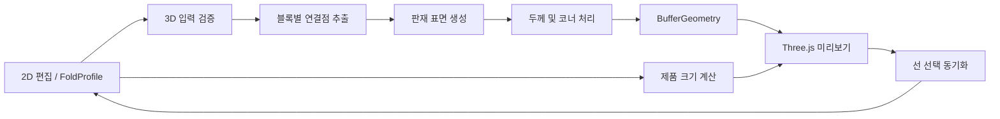

# 3D 모델 생성 설계

## 1. 목표와 범위

2D 절곡 단면을 이용해 알루미늄 제품의 3D 미리보기를 생성한다. 일반 도면은 제품 길이로 압출하고, 박스 도면은 두 직교 단면의 기준선으로 바닥 크기를 결정한다. 3D는 제작 데이터를 새로 입력하는 화면이 아니라 2D 도면을 검증하는 파생 화면이다.

- 원본 데이터: `FoldProfile`
- 단면 형상: `FoldBlock.segments`의 연결 좌표
- 일반 도면 제품 깊이: `product.length`
- 박스 도면 바닥 크기: 두 `FoldBlock`에서 서로 교차하는 기준 선분의 길이
- 판 두께: `material.thickness`
- 절곡 정보: `bendAfter.direction`, `angle`, `cutType`
- 3D 메시: 저장하지 않고 원본 변경 때 다시 생성

초기 목표는 시각 검증이며 STEP, DXF 같은 제작 파일 출력은 별도 단계로 둔다.

## 2. 설계 원칙

1. 2D 좌표를 형상의 기준으로 사용한다. 절곡 각도는 계산·표시 정보이며 2D 좌표를 다시 회전시키는 데 중복 사용하지 않는다.
2. mm를 모델 단위로 유지한다. 카메라가 모델 크기에 맞춰 이동하며 형상을 임의 축척하지 않는다.
3. 일반 도면은 한 단면을 제품 길이로 압출한다. 박스 도면은 두 직교 단면을 서로의 기준선 길이만큼 교차 압출해 바닥과 네 방향 벽을 만든다.
4. 3D 생성 로직은 React와 분리한 순수 TypeScript 함수로 구현하고 수치 테스트를 가능하게 한다.
5. WebGL을 사용할 수 없거나 형상이 잘못된 경우 2D 편집은 계속 사용할 수 있어야 한다.

## 3. 데이터 흐름



### 3D 변환 입력

```ts
type FoldModelInput = {
  profileId: string;
  profileType: "normal" | "box";
  blocks: Array<{
    id: string;
    points: Array<{ x: number; y: number }>;
    segmentIds: string[];
    closed: boolean;
  }>;
  thickness: number;
  productLength: number;
};
```

### 3D 화면 전용 상태

카메라와 표시 옵션은 도면 저장 데이터와 분리한다.

```ts
type ModelViewState = {
  mode: "2d" | "split" | "3d";
  projection: "perspective" | "orthographic";
  renderMode: "solid" | "edges" | "transparent";
  standardView: "iso" | "front" | "side" | "top";
  selectedSegmentId: string | null;
};
```

## 4. 형상 생성 전략

### 정확도 A: 판재 표면 미리보기

각 2D 선분의 시작점과 끝점을 Z축 `0`부터 제품 길이까지 연결해 사각형 두 개의 삼각형으로 만든다.

- 장점: 열린 단면, 닫힌 단면, 박스 교차 형상을 모두 안정적으로 표시
- 지원: 실제 제품 길이, 면별 색상, 선 선택, 법선 계산
- 제한: 판 두께와 절곡 반경을 표현하지 않음
- 구현: 블록별 `BufferGeometry`

이 단계가 첫 번째 사용 가능한 3D 프로토타입이다.

### 정확도 B: 두께가 있는 솔리드

단면 중심선을 두께의 절반만큼 양쪽으로 오프셋해 닫힌 2D 판재 윤곽을 만든 뒤 제품 길이 방향으로 압출한다.

- 열린 선: 양 끝에 마감면 생성
- 닫힌 선: 안쪽·바깥쪽 윤곽 방향을 검사해 벽 생성
- 코너: miter 접합을 기본으로 하고 과도한 miter는 bevel로 제한
- 자기 교차: 솔리드 생성을 중단하고 표면 미리보기와 경고를 제공
- 구현 후보: 윤곽 생성 후 `ExtrudeGeometry`, 또는 인덱스 기반 사용자 정의 `BufferGeometry`

#### 박스 도면 변환 규칙

1. 면 1과 면 2에서 서로 교차하는 선분을 각각 기준선으로 선택한다. 여러 후보가 있으면 가장 긴 교차 선분을 사용한다.
2. 면 1 기준선 길이는 바닥 가로, 면 2 기준선 길이는 바닥 세로가 된다.
3. 면 1 단면은 면 2 기준선 길이만큼 압출하고, 면 2 단면은 면 1 기준선 길이만큼 직교 압출한다.
4. 두 기준선이 만드는 중복 바닥은 한 번만 생성하고, 기준선 바깥의 절곡 선은 각 변의 벽과 플랜지가 된다.
5. 박스 도면에서는 `product.length`를 3D 형상 입력으로 사용하지 않는다.

### 정확도 C: 실제 절곡 반경

코너를 내부 절곡 반경의 원호로 치환한다. 이를 위해 재질 데이터에 `insideBendRadius`가 추가되어야 한다.

- 각도와 방향에 따라 원호 중심·접선점 계산
- 반경 구간을 품질 옵션에 따라 분할
- 겹침, 반경 부족, 짧은 플랜지 검증
- 이 단계부터 3D를 제작 형상에 가까운 검증 자료로 취급

## 5. UI 흐름

### 화면 모드

편집기 상단에 아이콘과 텍스트가 있는 세그먼트 컨트롤을 둔다.

- `2D`: 현재 Konva 편집 화면, 기본 모드
- `분할`: 2D와 3D를 나란히 표시
- `3D`: 모델 검토에 집중하는 전체 작업 영역

데스크톱 폭이 부족하거나 모바일이면 `분할`을 숨기고 2D/3D 탭 전환만 제공한다. 오른쪽 속성 패널은 현재 선택 선과 연신율 설정을 그대로 유지한다.

### 사용자 작업 흐름

1. 일반 도면은 단면과 제품 길이를 작성하고, 박스 도면은 교차하는 가로·세로 단면을 작성한다.
2. `분할` 또는 `3D`를 선택한다.
3. 형상이 유효하면 카메라가 자동으로 제품 전체에 맞춰진다.
4. 회전, 확대, 이동으로 제품을 검토한다.
5. 3D 판재 면을 클릭하면 대응하는 2D 선이 선택되고 `선 속성` 탭이 열린다.
6. 길이·절곡·두께를 수정하면 3D가 즉시 재생성된다. 일반 도면은 제품 길이 변경도 반영한다.
7. 잘못된 형상은 해당 위치를 강조하고 2D로 돌아가 수정할 수 있다.

### 3D 도구

- 화면 맞춤
- 등각, 정면, 측면, 평면 표준 시점
- 솔리드, 모서리, 투명 표시 메뉴
- 원근/직교 투영 전환
- 면 1/면 2 표시 토글(박스만 표시)

마우스 동작은 `OrbitControls` 기준으로 회전, 휠 확대·축소, 보조 입력 팬을 사용한다. 툴팁으로 각 아이콘의 의미를 제공한다.

### 상태와 오류

- 선 없음: 3D 화면 대신 빈 상태 표시
- 일반 도면의 제품 길이 0: 생성하지 않고 제품 길이 입력 위치로 이동할 수 있는 명령 표시
- 박스 기준선 판별 실패: 임시로 일반 솔리드 표시를 유지하고 두 단면 교차 상태를 수정하도록 안내
- WebGL 실패: 2D 편집 유지, 3D 사용 불가 상태 표시
- 자기 교차/두께 오프셋 실패: 표면 모드로 대체하고 문제 블록 표시
- 재생성 중: 이전 모델을 유지하면서 작은 진행 상태 표시

## 6. 컴포넌트와 모듈 경계

```text
src/domain/3d/
  fold-model-input.ts       FoldProfile을 정규화된 입력으로 변환
  surface-geometry.ts       정확도 A의 정점·인덱스 생성
  solid-profile.ts          두께 윤곽 계산
  box-solid-geometry.ts     박스 기준선 판별과 직교 솔리드 생성
  model-validation.ts       0 길이, 단절, 자기 교차 검증

src/components/model-3d/
  model-workspace.tsx       2D/분할/3D 화면 전환
  fold-model-canvas.tsx     React Three Fiber Canvas
  fold-model-mesh.tsx       블록 메시와 선택 이벤트
  model-toolbar.tsx         시점과 표시 옵션
  camera-controller.tsx     화면 맞춤과 표준 시점

src/stores/
  model-view-store.ts       카메라 외 표시 상태와 선택 동기화
```

Three.js 객체와 `BufferGeometry`는 MobX에 저장하지 않는다. `FoldProfile`의 필요한 값으로 메모이제이션해 만들고 교체 시 `dispose()`한다.

## 7. 단계별 구현 계획

### 3D-1: 입력 계약과 표면 형상 엔진

- 상태: 구현 완료
- `FoldProfile`을 블록별 점 목록으로 정규화
- 정확도 A 정점·인덱스·segmentId 매핑 생성
- 일반/박스/열림/닫힘 단위 테스트
- 완료 조건: 브라우저 없이 형상의 정점 수, 면적 방향, 경계가 검증됨

### 3D-2: 기본 3D 미리보기

- 상태: 구현 완료
- `three`, `@react-three/fiber`, `@react-three/drei` 도입
- 조명, 알루미늄 재질, 바닥 없는 중립 배경
- OrbitControls, 화면 맞춤, 리사이즈 대응
- 완료 조건: 일반 도면은 제품 길이로, 박스 도면은 두 기준선의 가로·세로 크기로 표시되고 빈 캔버스가 없음

### 3D-3: 2D/3D UI 통합

- 상태: 구현 완료
- 2D/분할/3D 모드
- 데스크톱과 모바일 전환 규칙
- MobX 변경 시 모델 즉시 갱신
- 완료 조건: 편집 후 별도 새로고침 없이 3D가 바뀌고 레이아웃 겹침이 없음

### 3D-4: 선택 동기화와 검토 도구

- 상태: 구현 완료
- 3D 면 클릭으로 선 선택
- 선택 면 강조
- 표준 시점, 투영, 표시 모드
- 완료 조건: 2D와 3D에서 동일한 `segmentId` 선택 상태를 공유

### 3D-5: 판 두께 솔리드

- 상태: 구현 완료
- 오프셋 윤곽, 코너 접합, 앞뒤·측면 마감
- 자기 교차 검사와 표면 모드 대체
- 완료 조건: 두께 변경 시 솔리드 외곽이 즉시 바뀌며 열린 끝에 구멍이 없음

### 3D-6: 절곡 반경과 제작 검증

- 상태: 프로토타입 구현 완료 (MFC 기준 제작 샘플 치수 대조는 후속 검증)
- 내부 절곡 반경 데이터 모델 추가
- 코너 원호와 형상 경고
- 완료 조건: 기준 샘플의 단면 치수가 허용 오차 안에서 MFC 결과와 일치

## 8. 테스트 전략

### 단위 테스트

- 선분 1개가 제품 길이 방향 사각형으로 생성됨
- L/U/닫힌 단면의 정점·인덱스·법선 방향
- 박스 두 블록이 독립 그룹과 segmentId를 유지
- 박스 기준선 길이가 3D 바닥 가로·세로 경계에 반영
- 박스는 제품 길이를 변경해도 경계가 변하지 않음
- 일반 도면은 제품 길이와 두께 변경이 경계 상자에 반영
- 0 길이, 단절, 자기 교차 오류 반환
- 생성된 모든 정점이 유한한 숫자이며 삼각형 인덱스가 범위 안에 있음

### 브라우저 테스트

- 2D/분할/3D 화면 전환
- 회전, 확대·축소, 팬, 화면 맞춤
- 선 길이·제품 길이·두께 변경 후 모델 갱신
- 3D 선택과 2D 선택 동기화
- WebGL 콘솔 오류와 geometry/material 누수 확인
- 데스크톱 및 모바일 스크린샷 비교
- 캔버스 픽셀 검사로 비어 있지 않은 실제 렌더링 확인

## 9. 권장 첫 구현 범위

첫 작업은 `3D-1`과 `3D-2`까지만 진행한다. 두께가 없는 표면 모델이어도 형상 방향, 박스 교차, 제품 길이와 카메라 UX를 먼저 검증할 수 있다. 이 결과가 안정된 후 두께 솔리드로 확장해야 수치 오류와 화면 문제를 분리해서 해결할 수 있다.

## 10. 기술 근거

- Three.js `BufferGeometry`: 정점, 인덱스, 법선과 사용자 정의 형상 구성
- Three.js `ExtrudeGeometry`: 닫힌 두께 윤곽을 제품 길이 방향으로 압출
- React Three Fiber `Canvas`: React 생명주기와 반응형 Three.js 장면 통합
- OrbitControls: 회전, 확대·축소, 팬 입력

공식 문서:

- https://threejs.org/docs/pages/BufferGeometry.html
- https://threejs.org/docs/pages/ExtrudeGeometry.html
- https://threejs.org/docs/pages/OrbitControls.html
- https://r3f.docs.pmnd.rs/api/canvas
