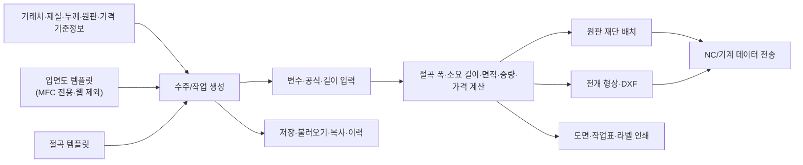
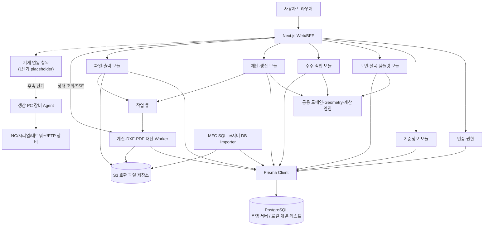
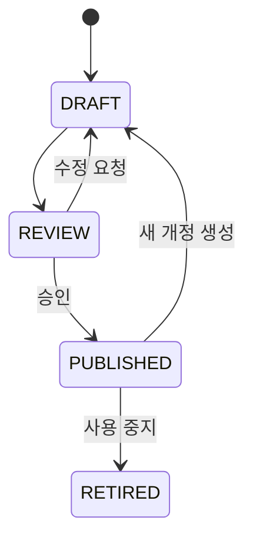
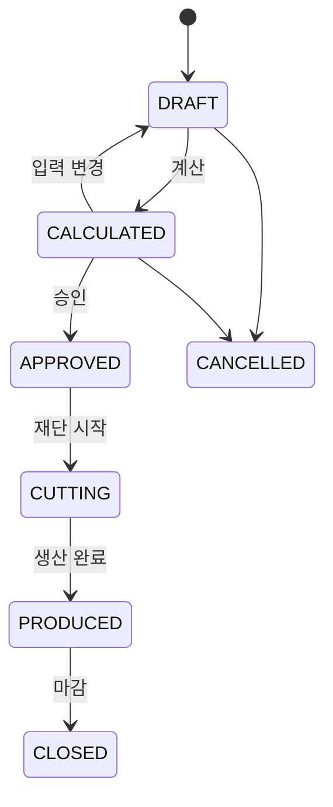
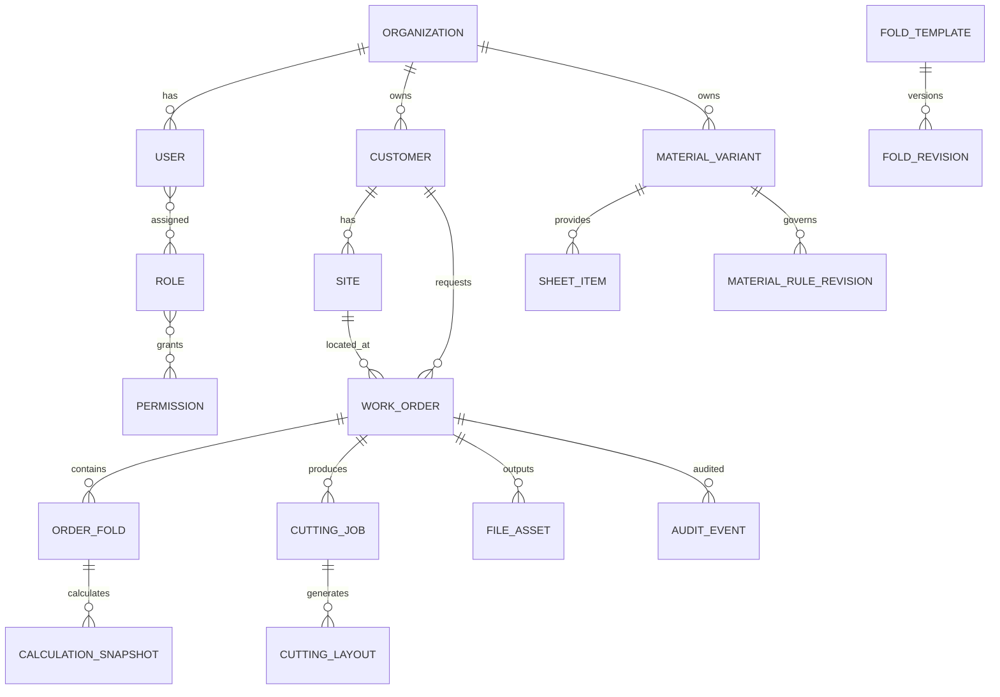
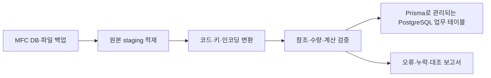

# MFC 도면Pro 웹 재구축 종합 설계

> 문서 상태: 초안 기준 설계
>
> 작성 기준일: 2026-07-18
>
> 웹 기준 커밋: `1e27a70` (`main`)
>
> MFC 참조 루트: `/Users/kyhoon/Library/Mobile Documents/com~apple~CloudDocs/회사/hicomtech/도면`

## 1. 문서 목적

이 프로젝트의 최종 목표는 MFC 기반 `도면Pro`를 일부 화면만 웹으로 옮기는 것이 아니라, 기존 프로그램의 업무 기능과 데이터 자산을 보존하면서 전체 시스템을 웹 기반으로 재구축하는 것이다.

이 문서는 다음 항목의 기준을 정한다.

- 기존 MFC 프로그램의 기능 범위와 핵심 업무 흐름
- 현재 `fold_web`에서 확보한 기능과 재사용 범위
- 목표 웹 시스템의 기능 모듈과 사용자 화면
- 도메인 모델, 저장 구조, API, 계산 엔진
- 절단 최적화, 출력, DXF, NC 장비 연동 방식
- MFC 데이터 마이그레이션과 병행 검증 전략
- 보안, 테스트, 배포, 운영 기준
- 단계별 구현 순서와 완료 조건

이 문서는 MFC 코드 한 줄을 웹 코드 한 줄로 번역하기 위한 문서가 아니다. MFC에 섞여 있는 UI 상태, 업무 규칙, 데이터 접근, 출력, 장비 통신을 분리해 유지보수 가능한 웹 시스템으로 다시 정의하는 문서다.

### 1.1 확정 범위와 기술 결정

다음 항목은 권장안이나 미결정 사항이 아니라 본 프로젝트의 확정 기준이다.

| 항목 | 확정 내용 | 1단계 적용 |
|---|---|---|
| 입면도 | 웹 재구축 범위에서 제외한다. 입면도 편집기, 템플릿, API, 활성 업무 데이터 모델 및 기능 마이그레이션을 구현하지 않는다. | 메뉴와 자리 표시자도 만들지 않는다. |
| 기계 연동 | 최종 시스템에는 포함할 예정이지만 1단계에는 항목만 둔다. | 메뉴, 권한, 상태값 및 향후 연동 계약의 자리만 정의하며 Agent, 통신, 파일 전송은 구현하지 않는다. |
| 인증 | MFC 로그인·실행 메커니즘과 분리된 웹서비스 독자 인증을 구축한다. | 웹 사용자·세션·RBAC·감사 모델을 새로 설계하며 MFC 실행 parameter나 자격증명에 의존하지 않는다. |
| 데이터베이스 | 운영은 RDS 또는 운영 서버의 별도 PostgreSQL을 사용한다. 개발·테스트는 로컬 PostgreSQL을 사용한다. | 운영과 로컬 환경에서 동일한 PostgreSQL 계열 스키마를 사용한다. SQLite를 웹 런타임·테스트·다국어 DB로 사용하지 않는다. |
| 데이터 접근 | 데이터베이스 스키마와 애플리케이션 코드는 Prisma로 설계하고 작성한다. | Prisma Schema, Prisma Client, Prisma Migrate를 기반으로 구축한다. |
| 언어 | 1차 완료 범위는 대한민국·한국어 단일 언어다. | 다국어 UI와 MFC 언어 DB 이전은 구현하지 않고 후속 요구로 관리한다. |

MFC 입면도 코드는 기존 업무 흐름과 데이터 관계를 이해하기 위한 분석 근거로만 참조한다. 이 문서에서 “기존 MFC 현황”으로 설명되는 입면도 항목은 목표 웹 기능을 뜻하지 않는다.

## 2. 분석 범위와 근거

### 2.1 MFC 프로젝트

분석 기준 경로는 다음과 같다.

```text
/Users/kyhoon/Library/Mobile Documents/com~apple~CloudDocs/회사/hicomtech/도면
```

확인된 프로젝트 특성은 다음과 같다.

- Visual Studio 2022, MFC, Win32, Unicode 구성
- 주 프로젝트와 2단계 하위 디렉터리 기준 C++ 소스 269개, 헤더 313개
- 같은 범위의 C/C++ 소스 약 30만 줄
- SQLite 데이터베이스 `folddraw3.db`에 업무 테이블 116개
- SQLite 외에 설정 가능한 서버 DB 연결 코드와 Npgsql 구성 포함
- 도면, 절곡, 수주, 재단, 인쇄, 가격, 사용자, 장비 전송 기능 포함
- `HiCuttingSolver`, `HiGrid`, `HiDB`, `HiDBData`, `HiFTPClient`, `HiSerialComm` 등 별도 엔진 의존
- DXF 라이브러리, DevExpress 보고서, 인쇄 미리보기, USB 라이선스 코드 포함

MFC 솔루션이 참조하는 `../../Engine/Src/...` 프로젝트는 현재 참조 루트에서 해석되는 위치에 존재하지 않았다. 실행 DLL과 LIB는 `Release` 및 `Debug` 폴더에 있으나 Windows 32비트 바이너리이며 소스는 제공되지 않는다. 웹은 이 Engine과 binary wrapper를 계승하지 않고, 관찰 가능한 입출력·업무 규칙·승인 표본을 기준으로 독립 재구현한다.

### 2.2 주요 MFC 근거 파일

| 영역 | 대표 근거 |
|---|---|
| 메인 메뉴와 업무 진입 | `MainDlg.cpp`, `MainDlg.h`, `Drawing.rc`, `resource.h` |
| 수주·작업 중심 흐름 | `Work03Dlg.cpp`, `Work03Dlg.h` |
| 절곡 템플릿 | `Work01Dlg.cpp`, `ZDrawFoldDlg.cpp`, `DrawFx.cpp` |
| 입면도 템플릿·CAD 편집 | `DrawDxDlg.cpp`, `DrawDxView.cpp`, `DrawDxCalculator.cpp` — 레거시 흐름 이해용이며 웹 구현 범위에서는 제외 |
| 절곡 데이터 타입 | `_define.h`, `DrawFxData.h` |
| 연신율·소수 처리 | `_common.cpp`, `Work03Dlg.cpp` |
| DB 접근 | `DBApi.cpp`, `DBApi.h`, `_dbc/`, `_dbcom/` |
| 레거시 스키마 | `Doc/folddraw3.db` |
| 재단·배치 | `CuttingDlg.cpp`, `CuttingOrgDlg.cpp`, `GuillotineCutting.cpp` |
| DXF | `HiExportDxf.cpp`, `Mydxf.cpp`, `dxflib/` |
| 인쇄·라벨 | `ZPrintingDlg.cpp`, `PrintFold*.cpp`, `CutPrint/`, `HiDrawingReport` |
| NC·장비 전송 | `NCCmmDlg.cpp`, `NCCmmSettingDlg.cpp`, `HiDrawingNCManager/` |
| 기준정보 | `CustomerDlg.cpp`, `ItemDlg.cpp`, `MaterialEntryDlg.cpp`, `ThickEntryDlg.cpp` |
| 사용자·권한 | `LoginDlg.cpp`, `UserDlg.cpp`, `SysInfoDlg.cpp` |

### 2.3 현재 웹 구현

현재 구현 상세는 [fold_web 현재 구현 현황](./current-implementation-status.md)에 정리되어 있다. 이 문서에서는 전체 재구축 관점에서 재사용 범위와 부족한 영역을 다룬다.

## 3. 기존 MFC 프로그램의 업무 구조

### 3.1 핵심 업무 흐름

MFC 프로그램의 중심은 `Work03Dlg`다. 단순 CAD 도구가 아니라 거래처의 작업 또는 수주 단위를 만들고, 입면도와 절곡 템플릿을 조합하고, 계산 결과를 생산 단계로 넘기는 구조다. 아래 흐름은 레거시 구조를 설명하며, 입면도 부분은 웹 목표 범위에 포함하지 않는다.



템플릿 데이터와 실제 수주 데이터는 구분되어 있다.

- `foldd`, `foldxy`: 절곡 템플릿과 선 데이터
- `draww`, `drawxy`, `drawvari`: 입면도 템플릿, 도형, 변수
- `sellsum`, `selldraw`, `selldrawxy`, `selldrawvari`: 수주에 복사된 입면도 스냅샷
- `sellfold`, `sellfoldxy`: 수주에 복사된 절곡 스냅샷과 계산 결과
- `sellplaninfo`, `sellrawuse`: 생산·원판 사용 관련 데이터

웹에서도 템플릿을 주문에서 직접 참조만 하게 해서는 안 된다. 템플릿이 나중에 바뀌어도 이미 승인된 작업 결과가 변하지 않도록, 주문에 추가하는 시점의 버전을 스냅샷으로 보존해야 한다.

`draww`, `drawxy`, `drawvari`, `selldraw*` 계열은 원본 백업과 이전 대조 보고서에는 포함할 수 있으나, 웹의 활성 입면도 엔터티로 변환하지 않는다. 웹의 작업 스냅샷은 절곡 템플릿과 계산 데이터만 대상으로 한다.

### 3.2 기능 영역

#### 기준정보

- 회사정보
- 사용자, 부서, 역할, 화면별 읽기/쓰기/인쇄 권한
- 거래처와 현장
- 재질, 두께, 원판 품목, 품목 분류
- 재질별 연신율, V-CUT/A-CUT/NO-CUT, 컷 깊이, 적용 각도
- 거래처 등급, 원판 단가, 절곡비, V컷팅비
- 각도별 추가 V컷팅
- 인쇄 설정, 통신 설정, 시스템 환경 설정

#### 절곡 템플릿

- 선, 곡선, 시작점, 편집 모드
- 앞각, 뒷각, A형, ZERO, U형, 복합 표시 각 타입
- 시계/반시계 방향
- 변수와 길이 공식
- 입력 길이, 계산 길이, 곡선 길이
- 연신 계산 포함/제외
- 일반 절곡, 박스, 패널
- 분류, 검색, 복사, 저장, 삭제

#### 입면도 템플릿 — MFC 현황 기록, 웹 구현 제외

- 선, 사각형, 원, 텍스트, 치수 기준선
- 절곡 템플릿 배치
- 변수와 수식
- 객체 정렬, 동일 크기, 붙이기, 가이드
- 도형 분할과 배치
- Undo/Redo
- 분류, 검색, 저장, 다른 이름 저장

위 기능은 레거시 분석 인벤토리일 뿐이다. 웹 화면, API, 데이터 모델, 마이그레이션 대상으로 구현하지 않는다.

#### 수주·작업

- 날짜, 번호, 거래처, 현장, 연락처, 비고
- 신규, 불러오기, 복사, 삭제
- 절곡 선택, 삽입, 병합
- 변수값 일괄/개별 입력
- 재질 선택과 다중 적용
- 길이 계산, 폭 계산, 박스 계산
- 면적, 중량, 원판 수량, 가공비와 할증률 계산
- 주문 리스트와 작업 데이터 출력

#### 재단·생산

- 작업 부품과 원판 목록 생성
- Guillotine 계열 재단 배치와 그룹 편집
- 원판 사용량, 잔재, 손실, 비용 계산
- 재단 결과 요약과 도면
- DXF 생성
- NC 데이터 생성 및 장비 전송
- 작업표, 절곡도, 라벨, 견적 인쇄

## 4. 현재 웹 구현과 MFC 대응

### 4.1 대응표

| MFC 영역 | 현재 웹 상태 | 목표 |
|---|---|---|
| 절곡 선 작성·편집 | 핵심 구현 | 곡선, 전체 각 타입, 수식, 템플릿 저장까지 확장 |
| 고정/비율 연신 계산 | 엔진 일부 구현 | MFC의 모든 계산 옵션과 회귀 데이터 완성 |
| 일반·박스 절곡 | 프로토타입 구현 | 명시적 박스 기준선과 패널 규칙 완성 |
| 전개도 | 일반·박스 SVG 구현 | 제작용 DXF/SVG와 버전 결과 저장 |
| 3D 미리보기 | 웹 신규 기능 구현 | 검토용 기능으로 유지, 제작 치수 검증 강화 |
| 재질 프리셋 | 브라우저 로컬 저장 | 서버 기준정보와 승인·버전 관리 |
| 절곡 템플릿 관리 | 미구현 | 분류, 검색, 개정, 배포 상태 |
| 입면도 CAD | MFC에는 존재, 웹에는 미구현 | 구현 범위 제외: 화면·API·활성 데이터 이전 없음 |
| 수주/작업 | 미구현 | 작업 스냅샷, 계산, 승인, 생산 상태 |
| 거래처·현장 | 미구현 | 서버 CRUD와 검색 |
| 원판·가격 | 미구현 | 재질/두께/원판/등급/거래처 단가 |
| 재단 최적화 | 미구현 | 비동기 최적화 작업과 수동 편집 |
| 인쇄·라벨 | 미구현 | 서버 PDF와 브라우저 출력 |
| DXF | 미구현 | 서버 작업 생성 및 파일 보관 |
| NC 전송 | 미구현 | 장기 구현 대상. 1단계에는 메뉴·권한·상태·계약의 자리만 존재 |
| 사용자·권한 | 미구현 | 세션 인증과 RBAC |
| DB 저장·이력 | 미구현 | 운영 PostgreSQL 서버, 개발·테스트 로컬 PostgreSQL, Prisma, 개정, 감사 로그 |
| 데이터 이전 | 미구현 | SQLite/서버 DB ETL과 대조 보고서 |

### 4.2 재사용할 현재 웹 자산

다음 코드는 새 아키텍처의 초기 자산으로 유지한다.

| 현재 코드 | 목표 역할 |
|---|---|
| `src/domain/fold-profile.ts` | 절곡 문서 스키마의 출발점 |
| `src/domain/fold-calculation.ts` | 버전 관리되는 계산 엔진의 첫 구현 |
| `src/domain/developed-pattern.ts` | 전개 형상 엔진의 첫 구현 |
| `src/domain/3d/` | 3D 검토 geometry 패키지 |
| `src/components/konva-stage.tsx` | 절곡 편집기 클라이언트 |
| `src/components/developed-pattern-preview.tsx` | 전개도 뷰어 |
| `src/components/model-3d/` | 3D 검토 뷰어 |
| `src/stores/fold-editor-store.ts` | 편집 세션 상태와 명령 패턴의 출발점 |
| 도메인·스토어·WEB-REFERENCE 테스트 91개 | 회귀 테스트의 초기 세트 |

현재 전역 싱글턴과 `localStorage`는 서버 문서 구조로 교체한다. 편집 중인 UI 상태만 클라이언트 스토어에 두고, 영속 데이터와 승인 상태는 서버를 단일 원본으로 사용한다.

## 5. 목표 시스템의 설계 원칙

1. **계산 결과는 재현 가능해야 한다.** 같은 입력, 같은 기준정보 버전, 같은 엔진 버전은 언제나 같은 결과를 만들어야 한다.
2. **템플릿과 작업 스냅샷을 분리한다.** 기준 템플릿 변경이 과거 작업을 바꾸지 않게 한다.
3. **도형과 계산을 UI에서 분리한다.** React나 Konva 없이도 계산·DXF·검증을 실행할 수 있어야 한다.
4. **긴 작업은 요청 처리와 분리한다.** 재단 최적화, 대량 DXF, PDF, 데이터 이전은 작업 큐에서 처리한다.
5. **입면도는 구현하지 않는다.** 레거시 분석 자료는 보존하되 웹 기능, API, 활성 데이터 모델과 이전 범위에서 제외한다.
6. **기계 연동은 단계적으로 연다.** 1단계에는 항목과 계약의 자리만 두고 실제 통신은 후속 단계에서 생산 PC의 로컬 장비 Agent를 통해 구현한다.
7. **PostgreSQL과 Prisma를 표준으로 사용한다.** 운영은 PostgreSQL 서버, 개발·테스트는 로컬 PostgreSQL을 사용하고 스키마·마이그레이션·DB 코드는 Prisma로 관리한다.
8. **웹 인증은 독립적으로 구축한다.** MFC의 HiStarter, command line DB parameter, 로그인 테이블과 실행 방식을 웹 런타임에 가져오지 않는다.
9. **1차는 한국어 단일 언어로 완성한다.** SQLite 언어 DB나 MFC 번역 메커니즘을 사용하지 않으며 다국어는 후속 범위로 둔다.
10. **초기에는 모듈형 모놀리스를 사용한다.** 업무 경계는 분리하되 배포 단위를 불필요하게 마이크로서비스로 쪼개지 않는다.
11. **레거시는 비교 근거이지 절대 정답이 아니다.** MFC 입력·중간값·결과를 golden master로 자동 대조하되, MFC 계산 오류와 불합리한 구성을 그대로 복제하지 않는다. 차이는 업무 규칙, 제작 기준과 사용자 승인으로 판정한다.
12. **모든 생산 결과에 버전을 남긴다.** 계산, 전개, DXF, 재단, 인쇄 결과가 어떤 입력에서 나왔는지 추적한다.
13. **삭제보다 상태 변경과 이력을 우선한다.** 사용된 기준정보와 승인된 작업은 물리 삭제하지 않는다.
14. **웹의 장점을 추가한다.** 자동 저장, 동시 접근 제어, 검색, 감사, 작업 상태 추적을 기본 기능으로 둔다.

## 6. 목표 시스템 전체 구성

### 6.1 논리 아키텍처



### 6.2 권장 배포 단위

| 배포 단위 | 책임 |
|---|---|
| `web` | Next.js UI, API/BFF, 인증, 일반 CRUD, 편집 문서 저장 |
| `worker` | 재단 최적화, DXF/PDF/라벨 생성, 대량 계산, 데이터 가져오기 |
| `machine-agent` | 후속 단계 배포 단위. 1단계에는 배포하거나 통신 기능을 구현하지 않음 |
| `postgres` | 운영 PostgreSQL 서버의 트랜잭션 업무 데이터와 감사 로그. 개발·테스트는 로컬 PostgreSQL 사용 |
| `object-storage` | DXF, PDF, 미리보기, 가져오기 원본, 결과 파일 |
| `queue` | 긴 작업 예약과 재시도; 초기에는 PostgreSQL 기반 큐도 가능 |

웹과 worker는 같은 TypeScript 도메인 패키지와 Prisma 기반 DB 패키지를 사용한다. 장비 Agent는 후속 단계에서 Windows 서비스 또는 트레이 앱으로 구현하며, 기존 DLL을 재사용해야 한다면 .NET 또는 C++가 현실적이다.

### 6.3 PostgreSQL·Prisma 구성

- 운영 환경은 애플리케이션과 분리된 RDS 또는 운영 서버 PostgreSQL을 사용한다.
- 개발자 환경과 자동 테스트는 로컬 PostgreSQL을 사용한다. 운영과 같은 주 버전, 확장, 시간대 및 정렬 규칙을 맞추는 것을 원칙으로 한다.
- `prisma/schema.prisma`가 애플리케이션 데이터 모델의 기준이며, Prisma Migrate가 스키마 변경 이력을 관리한다.
- 애플리케이션의 일반 조회·변경과 트랜잭션은 Prisma Client와 `$transaction`을 사용한다.
- 금액과 정밀 계산값은 PostgreSQL `numeric`과 Prisma `Decimal`로 처리한다. geometry 문서는 `Json`/PostgreSQL `jsonb`로 저장한다.
- 원시 SQL은 Prisma가 표현하기 어려운 검증된 쿼리에만 예외적으로 허용하고, 사용 근거와 테스트를 남긴다.
- CI는 PostgreSQL 서비스 컨테이너 또는 동등한 로컬 인스턴스를 올린 뒤 `prisma generate`와 migration을 적용한다. SQLite 대체 테스트는 사용하지 않는다.

## 7. 기능 모듈 설계

### 7.1 인증·조직·권한

인증은 도면Pro의 실행 방식과 분리된 웹 전용 시스템으로 구현한다. HiStarter, MFC command line parameter, ODBC 연결 정보와 MFC 비밀번호 검증 코드는 사용하지 않는다.

기능:

- 로그인, 로그아웃, 세션 만료
- 사용자, 부서, 역할 관리
- 화면이 아닌 업무 권한 기준 RBAC
- 읽기, 편집, 승인, 출력, 장비 전송, 관리자 권한
- 회사정보와 사업장
- 로그인과 중요 행위 감사

권한 예:

```text
customer.read
customer.write
material.approve
template.fold.edit
template.fold.publish
order.edit
order.calculate
order.approve
cutting.optimize
cutting.approve
output.print
machine.transfer
admin.manage
```

MFC의 `roleform`은 화면별 `r_priv`, `w_priv`, `p_priv` 구조다. 업무 권한 설계의 참고 자료로만 변환하며 웹 사용자와 역할은 새 인증 시스템에서 생성한다. 원본 권한은 추적 정보로 보존할 수 있지만 MFC 자격증명을 인증에 재사용하지 않는다.

### 7.2 기준정보

하위 영역:

- 거래처와 현장
- 재질과 두께
- 절곡/컷 계산 규칙
- 원판 품목과 규격
- 품목 분류, 도면 분류, 절곡 분류
- 가격 등급
- 거래처별/등급별 재료비와 가공비
- 각도별 추가 V-CUT 규칙
- 회사·인쇄·생산 환경 설정

기준정보에는 `active`, `effectiveFrom`, `effectiveTo`, `revision`을 둔다. 작업 계산 시 현재값을 직접 참조하지 않고 사용한 기준정보 버전을 계산 스냅샷에 기록한다.

### 7.3 절곡 템플릿 라이브러리

기능:

- 폴더/분류와 검색
- 신규, 복사, 다른 이름 저장
- 일반, 박스, 패널 타입
- 선과 곡선 편집
- 전체 MFC 각 타입 지원
- 변수와 수식
- 계산 포함/제외와 수동 보정
- 재질 규칙 미리보기
- 2D/전개도/3D 동시 검토
- 초안, 검토, 게시, 폐기 상태
- 개정 비교와 복원

권장 상태:



게시된 개정은 수정하지 않는다. 변경은 새 개정으로 만든다.

### 7.4 수주·작업

수주/작업이 전체 시스템의 업무 집계 루트다.

구성:

- 작업 번호, 날짜, 거래처, 현장, 담당자, 연락처, 비고
- 절곡 작업 항목
- 품목별 수량
- 변수 입력
- 재질/두께/원판 지정
- 할증과 단가
- 계산 결과
- 생산·출력 상태

권장 상태:



승인 이후 입력을 수정하려면 승인 취소 또는 새 작업 개정을 만들어야 한다. 승인된 계산 결과에서 DXF, 재단, 인쇄, NC 데이터를 생성한다.

### 7.5 계산 엔진

계산 엔진은 UI, DB, 네트워크에 의존하지 않는 순수 패키지로 둔다.

입력:

- 절곡 geometry
- 변수값과 수식
- 재질/두께
- 컷 타입, 컷 깊이, 연신율
- 계산 모드와 옵션
- 소수점 처리
- 수량과 제품 길이

출력:

- 선별 입력 길이와 계산 길이
- 이전/다음 절곡 기여값
- 적용 연신율과 출처
- 전개 폭과 박스 두 번째 길이
- 면적, 중량, 필요 원판량
- V-CUT 길이/횟수
- 경고와 오류
- 계산 엔진 버전과 입력 해시

반드시 구현할 MFC 규칙:

- `FIX`, `RATIO`
- `EL_OPTION_NA`, `EL_OPTION_LN`, `EL_OPTION_DG`, `EL_OPTION_EXT1`
- V-CUT 적용/미적용 시 각 타입 변환
- 적용 제한 각도
- 앞각/뒷각/A/ZERO/U/복합 각 타입
- 직선과 곡선의 계산 차이
- 2선 적용 잔여 연신율 이월
- 대각선 적용
- 박스/패널 블록
- 공식과 변수
- MFC 반올림, 버림, 올림

JavaScript `number`만으로 소수 계산 정책을 암묵적으로 처리하지 않는다. MFC 동등성 구간은 명시적인 십진 연산 또는 고정 소수 단위와 레거시 반올림 함수를 사용한다.

계산 결과는 다음 식별자를 포함한다.

```text
engineVersion
ruleSetVersion
inputSchemaVersion
inputHash
calculatedAt
```

### 7.6 전개·DXF·파일

전개도는 화면용 SVG와 제작용 geometry를 분리한다.

- `DevelopedPattern`: 단위가 mm인 제작 geometry
- SVG: 화면 미리보기 파생물
- DXF: 버전이 명시된 파일 파생물
- 3D: 검토용 파생물

DXF 생성 작업은 입력 해시를 기준으로 멱등 처리한다. 같은 입력으로 중복 요청하면 기존 결과를 재사용할 수 있다.

파일 메타데이터:

- 원본 업무 객체
- 파일 종류와 MIME
- 생성기 버전
- 입력 해시
- 저장소 키
- 크기와 체크섬
- 생성자와 생성 시각
- 보존 기간

### 7.7 재단 최적화

재단은 일반 HTTP 요청 안에서 처리하지 않는다.

입력:

- 승인된 작업 부품 목록
- 부품 전개 크기와 수량
- 원판 규격과 수량
- 결 방향, 회전 허용
- 칼날 폭, 가장자리 트림
- 그룹, 우선순위, 재질/두께
- 기존 잔재

출력:

- 원판별 배치
- 절단 순서와 절단선
- 사용 원판 수
- 사용 면적, 손실 면적, 수율
- 잔재 목록
- 예상 비용
- 작업 경고

재단 solver는 다음 순서로 독립 재구현한다.

1. 부품·원판·회전·결·칼날·트림·잔재를 표현하는 중립 입출력 계약을 확정한다.
2. MFC/Cut_Pro의 관찰 가능한 결과와 실제 제작 사례를 비교 표본으로 수집한다.
3. 서버 worker에서 동작하는 신규 solver를 구현한다.
4. 원판 수, 사용 면적, 수율, 제약 위반과 실행시간을 승인 기대값으로 검증한다.

기존 `HiCuttingSolver` DLL을 웹 서버나 Windows wrapper에 포함하지 않는다. 레거시 결과와 다를 때는 MFC를 절대 정답으로 취급하지 않고 차이 유형과 제작 근거를 승인한다.

### 7.8 인쇄·보고서·라벨

인쇄는 서버에서 PDF를 생성하고 브라우저에서 미리보기와 인쇄를 제공한다.

출력 종류:

- 작업 지시서
- 절곡도
- 재단 배치도
- 재단 결과 요약
- 견적/원가 자료
- 제품/원판 라벨

인쇄 템플릿은 코드와 분리해 버전 관리한다. 승인된 작업은 당시 사용한 출력 템플릿 버전을 기록한다.

### 7.9 NC·기계 연동

이 기능은 최종 목표에는 포함하지만 1단계에는 실제 연동을 구현하지 않는다.

1단계 제공 범위:

- 메뉴와 화면 진입 항목
- `machine.read`, `machine.transfer` 등 향후 권한 키
- `미구성`, `연동 예정` 같은 비활성 상태 표시
- 향후 사용할 장비·전송 상태 enum과 API 계약 초안
- 실제 전송 버튼은 숨기거나 비활성화하고 “1단계 미지원”을 명확히 표시

1단계 제외 범위:

- Windows Agent 개발·배포
- COM, TCP, FTP, Bluetooth, 전용 DLL 통신
- NC 파일의 장비 전송 실행
- 재시도, 장비 응답 수집, 현장 연결 시험

후속 단계의 실제 연동은 다음 구조를 기준으로 한다.

브라우저는 일반적으로 현장 장비의 COM 포트, 전용 DLL, 로컬 파일 경로에 안정적으로 접근할 수 없다. 따라서 생산 PC에 별도 Agent를 설치한다.

Agent 책임:

- 서버에서 승인된 전송 작업 조회
- 장비 채널과 포맷 선택
- 시리얼, TCP, FTP, Bluetooth 또는 전용 DLL 통신
- 전송 전 로컬 검증
- 진행률, 성공, 실패, 장비 응답 보고
- 동일 작업 중복 전송 방지
- 네트워크 중단 시 재시도

서버는 장비 비밀번호나 로컬 포트 세부사항을 브라우저에 전달하지 않는다. Agent는 outbound 연결을 기본으로 하고 장비별 인증서 또는 발급 토큰으로 식별한다.

## 8. 데이터 모델

### 8.1 모델링 원칙

- 새 내부 키는 UUID를 사용한다.
- MFC의 `sellno`, `fcode`, `rawcode` 등은 `legacyKey`로 별도 보존한다. 입면도 키인 `dcode`는 활성 도메인 키가 아니라 원본 보관·대조 메타데이터에만 남긴다.
- 길이와 좌표는 mm를 기준 단위로 사용한다.
- 금액과 정밀 계산값은 PostgreSQL `numeric`을 사용한다.
- 날짜/시각은 UTC 저장, 사용자 화면은 Asia/Seoul로 표시한다.
- geometry는 개정 단위 JSONB 문서로 원자적으로 저장한다.
- 검색·관계·상태·금액은 정규화된 관계형 컬럼으로 저장한다.
- 승인된 결과는 변경하지 않고 새 개정을 만든다.
- Prisma Schema를 모델의 기준으로 삼고, 모든 스키마 변경은 Prisma Migrate 이력으로 관리한다.

### 8.2 핵심 관계



기계 연동의 실제 구현 단계에서는 `Machine`, `MachineAgent`, `MachineTransfer`와 `CuttingLayout`/`FileAsset`의 전송 관계를 새 Prisma migration으로 추가한다. 1단계 핵심 관계에는 포함하지 않는다.

### 8.3 주요 엔터티

| 엔터티 | 책임 |
|---|---|
| `Organization`, `CompanyProfile` | 회사와 사업장 정보 |
| `User`, `Role`, `Permission` | 인증과 권한 |
| `Customer`, `Site` | 거래처와 현장 |
| `Material`, `MaterialVariant` | 재질과 두께 조합 |
| `MaterialRuleRevision` | 연신율, 컷 깊이, 적용 각도, 계산 옵션 |
| `SheetItem` | 원판 규격, 재고 단위, 중량·원가 |
| `PriceGrade`, `PriceRule` | 등급/거래처별 단가 |
| `FoldTemplate`, `FoldRevision` | 절곡 템플릿 메타데이터와 불변 개정 |
| `WorkOrder` | 수주/작업 집계 루트 |
| `OrderFold` | 주문에 복사된 절곡 작업 스냅샷 |
| `CalculationSnapshot` | 입력, 기준정보, 엔진 버전, 계산 결과 |
| `CuttingJob`, `CuttingLayout`, `Remnant` | 재단 요청, 결과, 잔재 |
| `ExportJob`, `PrintJob`, `FileAsset` | 파일과 출력 작업 |
| `MachineIntegrationConfig` | 1단계에는 연동 예정 상태와 계약 버전만 저장. 실제 장비·Agent·전송 엔터티는 후속 단계 migration에서 추가 |
| `AuditEvent` | 사용자 행위와 상태 변경 |
| `LegacyMapping` | MFC 원본 테이블·키와 새 ID 연결 |

### 8.4 절곡 geometry 문서

현재 `FoldProfile`을 확장하되, 템플릿 개정과 작업 스냅샷이 같은 geometry 계약을 공유한다.

```ts
type FoldDocument = {
  schemaVersion: number;
  documentType: "normal" | "box" | "panel";
  coordinateUnit: "mm";
  blocks: Array<{
    id: string;
    role: "primary" | "secondary" | "panel";
    closed: boolean;
    baseSegmentId?: string;
    segments: Array<{
      id: string;
      kind: "line" | "arc";
      start: { x: string; y: string };
      end: { x: string; y: string };
      inputLength: string;
      formula?: string;
      bendAfter?: {
        legacyAngleType?: number;
        semanticType: string;
        angle: string;
        cutType: "v-cut" | "a-cut" | "no-cut";
      };
      calculateElongation: boolean;
      correctionOverride?: string;
      operator?: string;
      operand?: string;
    }>;
  }>;
  variables: Array<{
    name: string;
    defaultValue?: string;
    expression?: string;
    unit: "mm" | "count" | "ratio";
  }>;
};
```

예시는 방향을 나타내기 위한 계약 초안이다. 실제 필드와 문자열 십진값 사용 여부는 계산 엔진 ADR에서 확정한다.

## 9. API 설계

### 9.1 공통 원칙

- `/api/v1` 버전 경로
- JSON 요청/응답과 OpenAPI 계약
- 런타임 스키마 검증
- 표준 오류 형식 `application/problem+json`
- 목록 cursor pagination
- 저장 시 `revision` 또는 ETag 기반 낙관적 잠금
- 생성/작업 요청은 idempotency key 지원
- 모든 변경 API에서 사용자와 감사 컨텍스트 기록
- 대용량 파일은 서명 URL 또는 스트리밍 사용
- 비동기 작업 상태는 polling과 SSE 지원

### 9.2 대표 API

```text
POST   /api/v1/auth/login
POST   /api/v1/auth/logout
GET    /api/v1/session

GET    /api/v1/customers
POST   /api/v1/customers
GET    /api/v1/material-variants
POST   /api/v1/material-rules
GET    /api/v1/sheet-items
GET    /api/v1/price-rules

GET    /api/v1/fold-templates
POST   /api/v1/fold-templates
POST   /api/v1/fold-templates/{id}/revisions
POST   /api/v1/fold-revisions/{id}/publish
POST   /api/v1/fold-revisions/{id}/calculate-preview

GET    /api/v1/work-orders
POST   /api/v1/work-orders
POST   /api/v1/work-orders/{id}/folds
POST   /api/v1/work-orders/{id}/calculate
POST   /api/v1/work-orders/{id}/approve

POST   /api/v1/work-orders/{id}/exports
GET    /api/v1/export-jobs/{jobId}
POST   /api/v1/work-orders/{id}/print-jobs

POST   /api/v1/cutting-jobs
GET    /api/v1/cutting-jobs/{id}
POST   /api/v1/cutting-layouts/{id}/approve

GET    /api/v1/machine-integration

POST   /api/v1/legacy-imports
GET    /api/v1/legacy-imports/{id}/report
```

`calculate-preview`는 저장하지 않은 편집 중 입력을 빠르게 검증한다. 주문 승인에 사용하는 정식 계산은 서버가 현재 기준정보와 엔진 버전을 고정해 `CalculationSnapshot`으로 저장한다.

`GET /api/v1/machine-integration`은 1단계에서 `planned` 또는 `not-configured` 상태와 계약 버전만 반환하는 자리 표시용 읽기 API다. 실제 장비 목록, 전송 생성 및 전송 상태 API는 기계 연동 단계가 시작될 때 별도 버전으로 추가한다. 입면도 API는 만들지 않는다.

## 10. 프런트엔드 정보 구조

### 10.1 주요 메뉴

```text
대시보드
수주·작업
  ├─ 작업 목록
  ├─ 작업 작성
  └─ 생산 상태
도면 라이브러리
  └─ 절곡도
생산
  ├─ 재단 작업
  ├─ 출력·라벨
  └─ 기계 연동 (1단계: 연동 예정·비활성)
기준정보
  ├─ 거래처·현장
  ├─ 재질·두께·원판
  ├─ 연신·컷 규칙
  └─ 가격
관리
  ├─ 사용자·권한
  ├─ 회사·환경 설정
  ├─ 기계 연동 설정 (1단계: 상태만 표시)
  └─ 가져오기·감사 로그
```

### 10.2 편집기 상태 구분

| 상태 | 저장 위치 |
|---|---|
| geometry와 변수 | 서버 문서 초안 |
| 선택 선, 활성 도구 | 클라이언트 |
| 줌, 팬, 3D 카메라 | 클라이언트 |
| 계산 미리보기 | 클라이언트 캐시 또는 서버 preview |
| 게시/승인 상태 | 서버 |
| Undo/Redo | 현재 편집 세션; 저장 시 개정 이력과 별도 |

편집기는 주기적 자동 저장과 명시적 저장을 함께 제공한다. 서버 저장 충돌 시 마지막 저장을 덮어쓰지 않고 개정 번호로 충돌을 알려야 한다.

## 11. 코드베이스 구성

장기적으로 다음과 같은 workspace 구조를 권장한다.

```text
apps/
  web/                 Next.js UI + API/BFF
  worker/              계산·DXF·PDF·재단 작업자
  machine-agent/       후속 단계에 추가할 Windows 장비 Agent
packages/
  contracts/           API DTO, schema, OpenAPI
  fold-domain/         절곡 문서, 검증, 명령
  calculation/         MFC 호환 계산 엔진
  geometry/            전개, DXF 중간 geometry, 3D 입력
  order-domain/        작업 상태와 계산 스냅샷
  cutting-domain/      재단 입력/출력 계약
  db/
    prisma/
      schema.prisma    PostgreSQL 데이터 모델의 기준
      migrations/      Prisma Migrate 변경 이력
    src/               Prisma Client 초기화와 repository
  mfc-importer/        SQLite/서버 DB 변환
  ui/                  공용 UI
```

현재 저장소는 바로 monorepo로 바꾸지 않아도 된다. 1단계에서는 저장소 안에 `prisma/schema.prisma`와 migration을 두고 `src/domain`을 업무 경계별로 나눈 뒤 서버 저장을 연결한다. worker가 필요해지는 시점에 공용 패키지와 DB 패키지를 추출한다.

권장 모듈 내부 규칙:

```text
module/
  domain/          엔터티, 값 객체, 순수 규칙
  application/     use case와 transaction 경계
  infrastructure/  DB, 파일, 외부 시스템 adapter
  ui/              route와 component
```

다른 모듈의 DB 테이블을 직접 조작하지 않고 application contract를 통해 호출한다.

## 12. MFC 데이터 마이그레이션

### 12.1 사전 조사

`Doc/folddraw3.db`에는 116개 테이블이 있으나 수주 데이터가 없는 기초·표본 DB다. 실제 MFC 참조 PostgreSQL 9.2의 `postgres` 스키마에는 109개 테이블과 수주 19,238건, 절곡 항목 140,761건, 절곡 선 1,060,688건이 있음을 읽기 전용으로 확인했다.

이 레거시 PostgreSQL은 검증·선택적 이관 입력이며 웹 운영 DB가 아니다. 웹은 별도 PostgreSQL을 만들고 Prisma Schema를 기준으로 조직, 인증, 주문, 절곡 개정, 계산 snapshot과 감사 구조를 효율적으로 재설계한다. 레거시 table parity는 목표가 아니다.

확인 항목:

- 레거시 참조 PostgreSQL과 SQLite의 역할·스키마 차이
- 운영 회사별 DB 차이
- 마지막 사용 중인 테이블과 폐기 테이블
- 코드값과 언어값
- 파일 시스템에 별도 저장된 DXF/이미지/출력 파일
- 외부 엔진 DB와 설정
- 비밀번호, USB 라이선스, 장비 설정의 처리 범위

### 12.2 이전 파이프라인



각 원본 행에는 다음 추적값을 남긴다.

```text
legacySystem
legacyTable
legacyPrimaryKey
sourceChecksum
importBatchId
importedAt
```

### 12.3 이전 순서

1. 코드, 회사, 사용자, 권한
2. 거래처와 현장
3. 재질, 두께, 원판, 가격
4. 절곡 분류·템플릿·선·변수
5. 입면도 관련 테이블의 원본 백업·건수·체크섬 보고서 생성. 활성 웹 모델로 가져오지는 않음
6. 수주 헤더와 절곡 작업 스냅샷
7. 계산·생산·재단 이력
8. DXF, 출력, 첨부 파일
9. 기계·통신 설정 원본 보관. 1단계에는 연동 예정 상태만 생성하고 실제 설정을 활성화하지 않음

MFC의 평문 또는 약한 형식 비밀번호와 로그인 검증 코드는 이전하지 않는다. 웹 사용자 계정은 독자 인증 시스템에서 신규 생성·초대하고, 필요한 경우에만 기존 사용자 ID를 감사·이력 연결용 legacy key로 매핑한다.

Importer는 Prisma Client를 통해 대상 DB에 쓰고, 배치 단위 `$transaction`과 재실행 가능한 `LegacyMapping`을 사용한다. 대량 적재 때문에 raw SQL 또는 PostgreSQL COPY가 필요하면 별도 검토와 대조 테스트를 거친 예외 경로로 둔다.

### 12.4 대조 기준

- 테이블별 원본/대상 건수
- 외래키 누락 0건
- 템플릿별 선 수와 좌표 체크섬
- 작업별 수량과 금액 합계
- 작업별 계산 폭·길이·면적·중량
- 생성된 DXF의 경계와 선 수
- 재단 결과의 원판 수와 수율
- 오류 행 전수 보고

## 13. MFC 비교·업무 타당성 검증

### 13.1 Golden master

대표 MFC 데이터 세트를 고정하고 원본 입력과 결과를 함께 보관한다. Golden master는 레거시 동작을 재현하고 차이를 탐지하기 위한 비교 자료이며, 웹의 기대 결과를 무조건 MFC 값으로 고정하는 승인 기준은 아니다.

필수 표본:

- 모든 각 타입
- FIX/RATIO
- 모든 연신 옵션
- V-CUT 사용/미사용
- 직선, 대각선, 곡선
- 열린/닫힌 형상
- 박스와 패널
- 변수와 공식
- 소수점 경계값과 음수 보정
- 서로 다른 재질·두께·적용 각도
- 다중 절곡 작업
- 재단 배치와 NC 출력

최소 20개 계산 샘플은 1차 목표일 뿐이다. 전체 교체 전에는 실제 작업 기준 100개 이상과 오류 사례를 포함하는 회귀 세트가 필요하다.

### 13.2 비교 단계

```text
도메인 입력 비교
→ 선별 계산값 비교
→ 최종 폭/길이/면적 비교
→ 전개 geometry 비교
→ DXF 비교
→ 재단 결과 비교
→ 출력/NC 검증
```

불일치가 발생하면 웹 결과를 임의로 맞추지 않는다. MFC 코드 근거, 설정, 데이터 정제 여부, 실제 제작 기준을 함께 기록해 규칙으로 확정한다.

### 13.3 차이 판정과 승인

MFC와 웹 결과 또는 사용 흐름에 차이가 있으면 다음 유형으로 분류한다.

| 유형 | 의미 | 처리 |
|---|---|---|
| `PARITY_REQUIRED` | MFC 동작이 현재 업무·제작 기준에 맞고 유지해야 함 | 웹 결과를 허용 오차 내에서 일치시키고 회귀 테스트로 고정 |
| `LEGACY_DEFECT` | MFC 계산 또는 상태 처리가 잘못된 것으로 확인됨 | 실제 제작식·업무 규칙으로 수정하고 MFC와 다른 기대값을 사용자 승인 후 테스트로 고정 |
| `WEB_IMPROVEMENT` | MFC UI·절차가 웹에 부적합하거나 불필요하게 복잡함 | 웹 사용성에 맞게 재설계하고 동일한 업무 결과와 데이터 추적성을 검증 |
| `RULE_CHANGE` | 기존 규칙을 사업적으로 변경함 | 변경 사유, 적용 시점, 과거 데이터 영향과 버전을 승인 후 새 규칙으로 구현 |
| `UNRESOLVED` | 근거가 부족해 판정할 수 없음 | 운영 적용을 보류하고 추가 표본·현장 확인을 수행 |

계산 차이는 입력, 중간값, 최종값과 제작 영향을 함께 비교한다. MFC 오류로 판단해 결과를 변경할 때는 근거 공식, 실제 제작 사례, 적용 범위와 이전 결과 영향까지 기록한다.

UI는 화면 배치와 클릭 순서를 1:1로 복제하지 않는다. 동일한 업무 목적을 더 적은 단계, 명확한 오류 안내, 자동 저장, 검색과 이력 추적으로 달성하는지 검증한다. 주요 검증 지표는 업무 완료율, 오류율, 작업 시간, 데이터 누락 여부와 사용자 승인이다.

## 14. 테스트 전략

### 단위 테스트

- 계산 공식과 모든 옵션
- geometry 연결성, 면적, 경계
- 상태 전이와 권한
- 가격과 금액 계산
- 파일 포맷 변환

### 속성 기반 테스트

- geometry의 모든 좌표가 유한값
- 계산 후 선 수와 ID 추적 유지
- Undo/Redo 왕복 불변
- 동일 입력의 결과 결정성
- DXF 내보내기/가져오기 허용 오차 왕복

### 통합 테스트

- 로컬 PostgreSQL에서 Prisma Client transaction과 Prisma migration
- 빈 DB에 전체 migration 적용, 기존 DB의 단계 migration, rollback 절차 검증
- API 권한과 낙관적 잠금
- object storage와 작업 큐
- worker 재시도와 멱등성
- MFC importer

### E2E 테스트

- 로그인과 권한
- 템플릿 작성·검토·게시
- 주문 작성·계산·승인
- 재단 요청·결과 승인
- PDF/DXF 다운로드
- 기계 연동 메뉴의 1단계 `연동 예정` 상태와 비활성 동작
- 모바일은 조회 중심, 데스크톱은 편집 중심

### 시각·성능 테스트

- Konva 편집기 스크린샷
- SVG 전개도
- Three.js 모델
- PDF/라벨 기준 이미지
- 1천 개 이상 객체 도면
- 대량 주문과 batch export
- 재단 solver 시간과 메모리

### 하드웨어 테스트

이 항목은 기계 연동 후속 단계가 시작된 뒤 적용한다. 1단계 테스트 범위에는 포함하지 않는다.

- 장비별 정상/실패 응답
- 케이블 분리, 타임아웃, 재연결
- 중복 전송 방지
- Agent 업데이트와 롤백

## 15. 보안과 감사

- TLS 전 구간 적용
- Secure, HttpOnly, SameSite 세션 쿠키
- Argon2id 등 현대적 비밀번호 해시
- 서버측 RBAC 검사
- 조직/사업장 데이터 접근 범위 검사
- CSRF, rate limit, 입력 검증
- DXF/첨부 파일 크기와 형식 제한
- DB, Docker Hub, 장비 자격증명은 secret으로 관리
- 운영 DB를 인터넷에 직접 노출하지 않음
- 관리자·승인·출력·장비 전송 감사 로그
- 감사 로그는 수정 불가 append-only 정책
- 개인정보 필드 접근과 다운로드 기록
- 백업 암호화와 복구 권한 분리

MFC의 `hicom.ini`에는 DB 연결 자격증명 필드가 있다. 실제 값은 문서나 저장소에 복사하지 않고 운영 secret으로 다시 발급한다.

## 16. 운영·배포 설계

현재 Docker Hub 태그와 self-hosted runner 기반 배포는 초기 web 배포에 재사용할 수 있다. 전체 시스템으로 확장할 때 다음 구성이 필요하다.

```text
reverse proxy / TLS
web container
worker container
PostgreSQL server
queue
object storage
backup job
monitoring/logging
machine-agent release channel (후속 단계)
```

운영 PostgreSQL은 별도 서버로 두고 방화벽과 전용 자격증명으로 접근을 제한한다. 개발·테스트는 로컬 PostgreSQL을 사용하며, 배포 전 `prisma migrate deploy`와 `prisma generate`가 성공해야 한다. 개발 편의를 위한 SQLite 대체 경로는 만들지 않는다.

1단계에는 `machine-agent`를 배포하지 않는다. 관련 운영 지표와 릴리스 채널은 실제 기계 연동 단계부터 활성화한다.

필수 운영 지표:

- HTTP 오류율과 응답 시간
- DB connection, lock, slow query
- 자동 저장 실패
- 계산 불일치와 경고
- 큐 적체, 작업 실패와 재시도
- DXF/PDF 생성 시간
- 재단 solver 실행 시간과 수율
- 장비 Agent online 상태 (후속 단계)
- 장비 전송 성공률 (후속 단계)
- 백업 성공과 복구 시험

다음 운영 목표는 2026-07-19 P0-07에서 공식 승인됐다.

| 항목 | 초기 제안 |
|---|---|
| 일반 조회 p95 | 500 ms 이하 |
| 일반 절곡 preview | 200 ms 이하 |
| 자동 저장 | 변경 후 2초 이내 |
| 가용성 | 월 99.5% 이상 |
| DB RPO | 15분 이하 |
| RTO | 4시간 이하 |

## 17. 단계별 전환 계획

### 단계 0. 기준선 확보

목표:

- MFC 기능 목록과 실제 사용자 흐름 확정
- 운영 DB와 파일 원본 확정, 향후 기계 연동 대상 목록 수집
- 계산과 생산 결과 golden master 구축
- 외부 Engine 비계승 범위와 독립 재구현 전략 확정
- 입면도 제외 범위를 기능 인벤토리와 이전 목록에 표시

완료 조건:

- 기능 인벤토리에 담당자와 중요도 부여
- 핵심 작업 100건 회귀 데이터 확보 계획 승인
- 데이터 소스와 백업 방법 확정
- 향후 지원할 기계와 통신 방식의 조사 목록 확정. 구현은 하지 않음

### 단계 1. 웹 기반·DB 구축

목표:

- 운영 PostgreSQL 서버 연결
- 개발·테스트용 로컬 PostgreSQL 구성
- Prisma Schema, Prisma Client, Prisma Migrate 기반 DB 계층
- 인증, 권한, 감사
- 기준정보 최소 기능
- 절곡 문서 서버 저장과 개정
- 자동 저장, 불러오기, 충돌 처리
- 기계 연동 메뉴·권한·`연동 예정` 상태·계약 자리만 제공
- 입면도 화면, API, 모델은 만들지 않음

완료 조건:

- 빈 로컬 PostgreSQL에 Prisma migration 전체 적용 및 테스트 통과
- 운영 PostgreSQL의 migration과 백업·복구 절차 검증
- 현재 절곡 편집기가 사용자 계정으로 저장·복원됨
- 게시된 템플릿 개정이 불변
- 기계 연동 항목이 실제 전송 없이 명확한 비활성 상태로 표시됨
- 백업과 복구 시험 통과

### 단계 2. 절곡 기능 검증·개선

목표:

- 전체 각 타입과 곡선
- 모든 연신 계산 옵션
- 변수와 공식
- 박스·패널
- 제작용 전개 geometry와 DXF

완료 조건:

- golden master 차이가 모두 `PARITY_REQUIRED`, `LEGACY_DEFECT`, `WEB_IMPROVEMENT`, `RULE_CHANGE` 중 하나로 판정되고 승인됨
- 유지 대상으로 판정된 선별/최종 계산 결과가 허용 오차 내에서 일치
- MFC 오류 수정 항목은 승인된 기대값과 회귀 테스트를 보유
- 기준 DXF 허용 오차 통과
- 웹 사용성과 실제 제작 결과에 대한 사용자 검수 통과

### 단계 3. 수주·계산·가격

목표:

- 거래처/현장
- Work03 업무 흐름
- 주문 스냅샷
- 면적, 중량, 원판량, 가격, 할증
- 승인 상태

완료 조건:

- 실제 주문을 웹에서 처음부터 승인까지 처리
- 주문 합계와 MFC 결과 대조
- 수정·승인·취소 감사 이력 확인

### 단계 4. 재단·출력

목표:

- 재단 작업과 solver 연동
- 수동 배치 편집
- PDF, 작업표, 라벨
- 대량 DXF

완료 조건:

- 대표 작업의 원판 수와 배치 검증
- 현장 인쇄물 사용자 승인
- 실패 작업 재시도와 추적 가능

### 단계 5. 기계 연동

목표:

- Windows Agent
- 장비/채널 설정
- 전송 큐와 상태
- 전용 NC 포맷

완료 조건:

- 장비별 현장 전송 시험
- 네트워크/장비 장애 복구
- 중복 전송 방지와 감사 로그

### 단계 6. 전체 이전과 MFC 종료

목표:

- 범위에 포함된 전체 데이터 최종 이전
- 일정 기간 병행 운영
- 웹을 단일 원본으로 전환
- MFC 읽기 전용 보관

종료 조건:

- 데이터 대조 보고 승인
- 핵심 업무 2회 이상 마감 주기 통과
- 재단·출력·기계 연동 오류 대응 절차 확정
- MFC에서 신규 입력 중단
- 복구 가능한 최종 MFC 백업 보관

## 18. 위험과 대응

| 위험 | 영향 | 대응 |
|---|---|---|
| `Work03Dlg`에 규칙이 집중됨 | 숨은 업무 규칙 누락 | 함수 단위 인벤토리와 golden master |
| 외부 Engine 원본 부재 | 숨은 재단/통신 규칙 누락 | 중립 계약, 비교 표본, 독립 구현과 차이 승인 |
| 레거시 숫자 enum | 잘못된 각 타입 변환 | 원본 숫자 보존 + 의미 enum mapping |
| 부동소수·반올림 차이 | 전개 폭 불일치 | 십진 정책과 엔진 버전 고정 |
| MFC 오류를 정답으로 복제 | 계산·업무 불합리성 재생산 | 차이 분류, 제작 근거와 사용자 승인으로 기대값 확정 |
| MFC UI의 1:1 이전 | 웹 사용성 저하 | 업무 목적·결과 중심으로 흐름을 재설계하고 사용성 검증 |
| SQLite와 서버 DB 혼재 | 잘못된 원본 이전 | 실제 운영 연결과 쓰기 경로 조사 |
| 운영·로컬 PostgreSQL 차이 | 배포 시 migration 또는 계산 차이 | 동일 주 버전·확장·시간대 사용, Prisma migration을 CI에서 검증 |
| Prisma 밖의 임의 스키마 변경 | 모델과 운영 DB 불일치 | Prisma Schema와 migration을 단일 변경 경로로 강제 |
| 입면도 요구의 재유입 | 일정과 데이터 모델 범위 확대 | 명시적 범위 제외 유지, 별도 프로젝트 결정 없이는 backlog에 추가하지 않음 |
| 1단계 기계 연동 범위 확대 | 기반 구축 지연 | 1단계는 메뉴·상태·계약 자리로 제한 |
| 기계별 전용 통신 | 브라우저만으로 대체 불가 | 후속 단계에서 로컬 Agent와 기계별 adapter |
| 재단 solver 결과 차이 | 원판 비용 증가 | 제작 제약 검증, 수율·원판 수 비교, 사용자 승인과 수동 보정 |
| 보고서/라벨 차이 | 현장 업무 중단 | 실제 출력물 기준 시각 회귀 |
| 긴 범위와 우선순위 충돌 | 일정 지연 | 단계별 사용자 가치와 종료 조건 |
| 동시 편집 | 작업 덮어쓰기 | 낙관적 잠금, 자동 저장, 개정 |
| 과거 데이터 품질 | 이전 실패 | staging, 오류 보고, 수동 보정 큐 |

## 19. 주요 아키텍처 결정

### ADR-001: 모듈형 모놀리스로 시작

현재 팀과 코드 규모에서는 업무별 마이크로서비스보다 하나의 web/worker 코드베이스가 적합하다. 도메인 모듈 경계를 지키고 실제 독립 확장이 필요한 재단·기계 연동만 실행 경계를 분리한다.

### ADR-002: 계산 엔진은 공용 순수 패키지

브라우저 preview와 서버 승인 계산이 같은 규칙 패키지를 사용한다. 승인 결과는 반드시 서버에서 다시 계산해 저장한다.

### ADR-003: 관계형 메타데이터 + 버전 geometry JSONB

거래처, 작업, 상태, 금액, 관계는 정규화한다. 도형은 개정 단위 JSONB로 원자 저장하고 필요한 검색 인덱스만 별도 파생한다.

### ADR-004: 기계 통신은 로컬 Agent

Web Serial 같은 브라우저 전용 기능에 전체 생산 시스템을 종속시키지 않는다. 실제 구현 단계에서는 생산 PC Agent가 하드웨어 차이를 흡수한다. 1단계에는 Agent와 통신을 구현하지 않고 항목과 계약 자리만 둔다.

### ADR-005: 점진적 교체

MFC를 즉시 폐기하지 않는다. 웹 모듈이 계산·출력·현장 검증을 통과한 순서대로 쓰기 권한을 전환한다.

### ADR-006: PostgreSQL과 Prisma를 DB 표준으로 채택

운영 데이터베이스는 별도 PostgreSQL 서버를 사용하고 개발·테스트는 로컬 PostgreSQL을 사용한다. 데이터 모델, migration과 애플리케이션 DB 접근은 Prisma를 기준으로 한다. 웹 런타임과 테스트에서 SQLite로 대체하지 않는다.

### ADR-007: 입면도 기능은 재구축 범위에서 제외

MFC 입면도 코드는 업무 흐름 파악과 레거시 원본 보존을 위해서만 분석한다. 웹 편집기, 템플릿, API, 활성 엔터티, 기능 데이터 마이그레이션 및 테스트 범위에는 포함하지 않는다.

## 20. 아직 결정해야 할 사항

| 결정 | 권장 출발점 |
|---|---|
| 단일 회사/다중 회사 | 조직 경계는 두되 초기 단일 회사 운영 |
| 큐 | 초기 PostgreSQL queue, 부하 증가 시 Redis 계열 검토 |
| 파일 저장 | S3 호환 object storage |
| 오프라인 편집 | 자동 로컬 draft까지만 우선, 완전 오프라인은 별도 요구 확인 |
| 재단 solver | 기존 DLL 비계승, 서버 worker용으로 독립 재구현 |
| 장비 Agent 기술 | 기존 DLL 재사용 가능성을 보고 .NET 우선 검토 |
| 지원 DXF 버전 | 현장 프로그램과 장비 조사 후 고정 |
| 승인 체계 | 템플릿 게시와 작업 생산 승인 최소 2종 |
| 가격/회계 범위 | 도면Pro 내부 계산까지만 우선, 외부 ERP 연동은 별도 |
1차 완료 범위는 대한민국·한국어 단일 언어로 확정했다. 다국어 UI, 번역 키 체계와 언어별 데이터는 후속 범위 변경으로만 추가한다.

## 21. 바로 이어서 할 작업

1. 로컬 PostgreSQL 버전과 운영 PostgreSQL 서버 버전·접속 정책을 확정한다.
2. `prisma/schema.prisma`의 1차 모델과 초기 Prisma migration을 작성한다.
3. 로컬 PostgreSQL에서 migration, seed, 테스트 DB 초기화 절차를 자동화한다.
4. 운영 `folddraw3` 데이터 원본과 서버 DB 사용 여부를 확정하고 입면도 계열은 보관 전용으로 분류한다.
5. 실제 MFC 작업 20개를 1차 golden master로 만들고 단계적으로 100개 이상으로 확대한다.
6. 현재 `FoldProfile`과 MFC `foldxy`/`sellfoldxy`의 필드 매핑 문서를 작성한다.
7. Prisma 기반 서버 저장, 사용자 인증, 절곡 템플릿 개정부터 단계 1 구현을 시작한다.
8. 기계 연동 메뉴·권한·상태 계약은 placeholder로만 추가하고 실제 통신 코드는 작성하지 않는다.
9. `HiCuttingSolver`, `HiDB`, `HiSerialComm`은 비계승하고 후속 단계의 중립 계약과 독립 구현 요구사항을 확정한다.
10. 계산 옵션별 미구현 항목을 테스트 우선으로 추가한다.

## 22. 관련 문서

- [전체 프로젝트 작업계획서](./project-work-plan.md)
- [세부 작업계획 템플릿](./work-item-template.md)
- [fold_web 현재 구현 현황](./current-implementation-status.md)
- [절곡 전개 계산 명세](./fold-calculation-spec.md)
- [3D 모델 생성 설계](./threejs-model-plan.md)
- [편집기 테스트 계획](./editor-test-plan.md)
- [배포 가이드](./deployment-guide.md)
