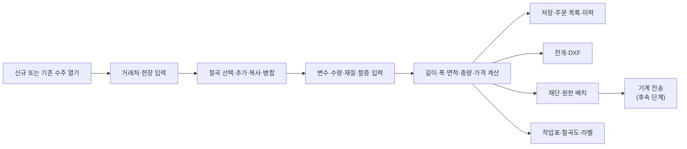

# P0-02 — MFC 기능·화면 인벤토리

> 상태: `DONE`
>
> 우선순위: `P0`
>
> 담당자: 구현·조사 담당
>
> 검수자: 사용자
>
> 관련 게이트: `G0`, `D0-02`
>
> 계획 작성일: 2026-07-18
>
> 착수일: 2026-07-18
>
> 완료일: 2026-07-18
>
> 상위 계획: [fold_web 전체 프로젝트 작업계획서](../project-work-plan.md)
>
> P0 실행계획: [P0 실행계획](./P0-execution-plan.md)

## 1. 목표

MFC 화면을 그대로 복제하기 위한 목록이 아니라, 웹에서 보존해야 하는 업무 목적·입력·결과와 제거·개선할 UI 구성을 구분하는 기능 인벤토리를 만든다.

## 2. 조사 기준

MFC 참조 루트:

```text
/Users/kyhoon/Library/Mobile Documents/com~apple~CloudDocs/회사/hicomtech/도면
```

주요 근거:

- `Drawing.rc`, `resource.h`: 화면·메뉴·컨트롤 리소스
- `MainDlg.cpp`, `MainDlg.h`: 메인 메뉴와 업무 진입
- `Work03Dlg.cpp`, `Work03Dlg.h`: 수주·절곡·계산 중심 흐름
- `Work01Dlg.cpp`, `ZDrawFoldDlg.cpp`, `DrawFx.cpp`: 절곡 템플릿·편집
- `CuttingDlg.cpp`, `CuttingOrgDlg.cpp`: 재단
- `ZPrintingDlg.cpp`, `PrintFold*.cpp`, `CutPrint/`: 출력
- `NCCmmDlg.cpp`, `HiDrawingNCManager/`: 기계 연동
- 기준정보·사용자 Dialog와 `DBApi.cpp`, `_dbcom/`

정적 조사 결과:

- `Drawing.rc`에 다수의 업무 Dialog, context menu와 편집 보조 Dialog가 존재한다.
- 주요 파일의 메시지 handler 수는 `Work03Dlg.cpp` 74개, `ZDrawFoldDlg.cpp` 58개, `MainDlg.cpp` 41개, `Work01Dlg.cpp` 36개로 업무 규칙과 UI 이벤트가 강하게 결합되어 있다.
- 현재 `MainDlg` 초기화에서는 `Work03Dlg`가 주 업무 화면으로 표시된다. `Work01Dlg`와 `DrawDxDlg`의 직접 생성 코드는 주석 처리된 상태다.
- 메인 toolbar의 신규·열기·복사·삭제·출력·절곡 선택·절곡 추가·재단·계산 명령은 대부분 `Work03Dlg` handler로 전달된다.

## 3. 기능 인벤토리

| ID | 업무 영역 | MFC 기능·입력 | 결과·데이터 | 대표 근거 | 웹 처리 | 연결 작업 |
|---|---|---|---|---|---|---|
| `F-01` | 로그인·사용자 | ID·비밀번호, 사용자·역할, 화면 권한 | 로그인 사용자, 권한 | `LoginDlg`, `UserDlg`, `role*`, `emp` | 웹 세션·업무 RBAC로 재설계 | `P1-01`~`P1-03` |
| `F-02` | 회사·환경 | 회사정보, 소수 처리, 연신·원판·출력·자동저장 옵션 | 전역 설정 | `CompanyDlg`, `ReferDlg`, `refer`, `company` | 전역 설정을 버전·범위별 설정으로 분리 | `P2-A01`, `P2-A04` |
| `F-03` | 거래처·현장 | 거래처, 연락처, 등급, 현장 검색·선택 | 수주 고객·가격 기준 | `CustomerDlg`, `FirmSearchDlg`, `customer`, `sitee` | 검색 중심 CRUD와 수주 내 빠른 선택 | `P2-A02` |
| `F-04` | 재질·두께 | 재질, 두께, 컷 깊이, 연신, 밀도 | 계산 규칙·품목 기준 | `MaterialEntryDlg`, `ThickEntryDlg`, `item*`, `rawcate` | 유효기간·개정이 있는 기준정보 | `P2-A03`~`P2-A05` |
| `F-05` | 원판·가격 | 원판 품목, 규격, 거래처·등급별 재료비·절곡비·V-CUT·할증 | 수주 금액·원판 원가 | `ItemDlg2`, `UnitPrice*`, `cost*`, `itemgradecost` | 규칙 엔진과 가격 근거 표시 | `P2-A05`, `P2-A06` |
| `F-06` | 절곡 분류·템플릿 | 분류, 목록, 검색, 신규, 저장, 복사, 삭제 | `foldd`, `foldxy` | `Work01Dlg`, `ZDrawFoldDlg`, `FoldSearcherDlg` | 템플릿·불변 개정·게시 흐름 | `P1-05`~`P1-08` |
| `F-07` | 절곡 2D 편집 | 선·곡선, 길이, 각 타입, 방향, Undo/Redo, 저장·다른 이름 저장 | 절곡 geometry | `ZDrawFoldDlg`, `DrawFx*`, context menu | 웹 도구 상태와 도메인 명령 분리 | `P1-06`, `P1-12`, `P1-13` |
| `F-08` | 변수·수식 | 길이 변수, 공용·개별 입력, 공식, 계산 제외 | 계산 입력 | `Work03Dlg`, `ZDrawFoldDlg`, `*Vari*` | 명시적 수식 계약·오류·순환 검증 | `P1-11` |
| `F-09` | 수주 헤더 | 날짜, 번호, 고객, 현장, 연락처, 납기, 비고 | `sellsum` | `Work03Dlg`, `SellOpenDlg` | 자동 저장·낙관적 잠금·검색 | `P2-A07`, `P2-A11` |
| `F-10` | 수주 절곡 항목 | 절곡 선택·추가·복사·붙여넣기·병합·삭제, 수량, 재질 다중 적용 | `sellfold`, `sellfoldxy` | `Work03Dlg`, `Work03SelectFoldDlg`, `Work3CopyFold` | 게시 템플릿의 불변 작업 스냅샷 | `P2-A08` |
| `F-11` | 계산 | 길이·폭, FIX/RATIO, 컷 옵션, 박스, 면적·중량·원판량 | 계산·금액 결과 | `Work03Dlg`, `_common.cpp`, `DrawFx.cpp` | MFC 비교와 오류 개선 기대값을 분리 | `P1-09`~`P1-12`, `P2-A09` |
| `F-12` | 주문·승인 | 신규, 열기, 복사, 삭제, 저장, 주문 목록 | 작업 상태·이력 | `Work03Dlg`, `SellOrderDlg` | 명시적 상태 전이·승인·감사 | `P2-A10`, `P2-A11` |
| `F-13` | 전개·DXF | 전개 보기, 확장 옵션, 작업 DXF 생성 | 전개 geometry·DXF | `Work03Dlg`, `HiExportDxf`, `Mydxf` | 제작 geometry와 파일 작업 분리 | `P1-14`, `P1-16` |
| `F-14` | 3D 검토 | MFC 핵심 기능보다 웹에서 강화된 검토 기능 | 검토용 geometry | 현재 `fold_web` `src/domain/3d`, `model-3d` | 웹 개선 기능으로 유지·검증 | `P1-15` |
| `F-15` | 재단 | 원판·부품, 배치, 그룹 재단, 수동 보정, 잔재·수율 | `sellplaninfo`, `sellrawuse`, 배치 결과 | `CuttingDlg`, `CuttingOrgDlg`, `HiCuttingSolver` | worker 작업·수동 승인·이력 | `P2-B03`~`P2-B06` |
| `F-16` | 출력·라벨 | 작업표, 절곡도, 재단 배치·요약, 견적, 라벨 | PDF·인쇄물 | `ZPrintingDlg`, `PrintFold*`, `CutPrint`, `HiDrawingReport` | 서버 PDF·버전 템플릿·브라우저 미리보기 | `P2-B07`, `P2-B08` |
| `F-17` | 기계 연동 | NC 설정·파일·전송·채널·장비 응답 | 전송 상태 | `NCCmmDlg`, `NCCmmSettingDlg`, `HiDrawingNCManager` | P1 placeholder, P3 Agent·adapter | `P1-04`, `P3-A01`~`P3-A08` |
| `F-18` | DB 백업·업데이트 | DB 백업, 시스템 정보, 프로그램 업데이트 | 백업·버전 | `MainDlg`, `SysInfoDlg`, `DBbackup` | 운영 backup·restore와 배포 pipeline로 대체 | `P2-C08`~`P2-C11` |
| `F-X1` | 입면도 | DrawDx 편집, 템플릿, 수주 입면도 | `draww`, `drawxy`, `selldraw*` | `DrawDxDlg`, `DrawDxView` | 기능 제외, 원본 manifest만 보관 | `P2-C04` |

## 4. Work03 중심 업무 흐름

정적 코드 기준 주 흐름은 다음과 같다.



대표 명령:

- 신규 수주, 열기, 복사, 삭제
- 거래처 검색과 현장·연락처 입력
- 절곡 템플릿 선택과 새 절곡 편집
- 절곡 행 복사·삽입·붙여넣기·병합·삭제
- 재질 전체·선택 항목 적용
- 변수 개별·일괄 입력
- 연신 옵션, 길이 계산, 면적 계산, 할증
- 주문 목록, 인쇄, DXF, 재단

## 5. 웹 재설계 원칙과 개선 후보

| MFC 구성 | 문제·위험 | 웹 방향 | 검증 |
|---|---|---|---|
| `Work03Dlg` 한 화면에 업무 집중 | 1만 5천 줄 이상 코드와 74개 handler가 상태·계산·DB를 공유 | 수주 헤더, 절곡 항목, 계산 요약, 생산 탭을 도메인 모듈로 분리 | 업무 완료율·오류율·사용자 검수 |
| toolbar와 화면 버튼의 명령 중복 | 같은 handler를 여러 진입점에서 호출 | 주요 행동을 상태에 맞는 명확한 action으로 정리 | 클릭 수·오작동 감소 |
| 전역 설정이 계산에 즉시 반영 | 과거 결과 재현 어려움 | 규칙 개정과 계산 스냅샷에 버전 저장 | 과거 수주 재계산 재현 |
| 수동 저장·복사 중심 | 충돌·데이터 손실 위험 | 자동 저장, 충돌 감지, 명시적 개정·복사 | 새로고침·동시 수정 E2E |
| 화면별 raw DB 접근 | 규칙과 transaction 경계 불명확 | application use case와 Prisma transaction으로 분리 | 통합 테스트·감사 로그 |
| MFC UI를 통한 오류 은폐 | 잘못된 값과 경고 근거를 추적하기 어려움 | 계산 상세, 규칙 출처, 경고와 개선 기대값 표시 | 차이 판정 보고·사용자 승인 |
| 모달 Dialog 연쇄 | 흐름 단절과 다중 작업 어려움 | 검색 drawer, inline editor, 비동기 작업 상태 | 작업 시간·취소·복귀 검증 |
| 입면도와 절곡 결합 흔적 | 제외 범위가 다시 유입될 위험 | 수주 집계 루트를 절곡 항목 중심으로 재설계 | Prisma/API에 입면도 모델 없음 |

## 6. 정적 분석으로 확인된 주의점

- `MainDlg`의 현재 main child는 `Work03Dlg`이며 절곡 템플릿과 입면도 편집 화면의 직접 생성 코드는 주석 처리되어 있다.
- `Work03Dlg`에는 입면도 선택·추가 handler와 `selldraw*` 데이터가 남아 있다. 웹 수주 흐름에서는 제거해야 한다.
- 일부 버튼 이름과 실제 기능이 불명확하거나 재사용되어 있다. 예: toolbar 설정 handler가 면적 계산 handler를 호출하는 코드가 있어 실제 동작 확인이 필요하다.
- 저장 handler 일부가 주석 처리되거나 `CheckBatch`만 수행한다. 실제 자동 저장·저장 시점은 런타임 확인이 필요하다.
- NC 버튼 일부는 주석 처리되어 있으나 별도 NCCmm 화면과 라이브러리가 존재한다. 지원 기계 범위는 P3에서 다시 확인한다.
- MFC 화면 존재 여부만으로 웹 우선순위를 정하지 않는다. 실제 사용 여부와 업무 결과를 기준으로 한다.

## 7. 상세 실행 단계

| 단계 ID | 상태 | 작업 내용 | 산출물 | 검증 |
|---|---|---|---|---|
| `01` | `DONE` | MainDlg 메뉴·toolbar 진입 조사 | 메인 명령 목록 | handler와 Dialog 연결 |
| `02` | `DONE` | Drawing.rc 업무 Dialog 분류 | 화면 영역 목록 | resource ID 대조 |
| `03` | `DONE` | Work03 중심 명령·흐름 조사 | 주 업무 흐름 | handler·DB 테이블 대조 |
| `04` | `DONE` | 절곡·기준정보·재단·출력·NC 근거 연결 | 기능 인벤토리 | 대표 파일 대조 |
| `05` | `DONE` | 입면도 제외와 작업 ID 연결 | 제외 항목 | 종합 범위 대조 |
| `06` | `DONE` | 웹 개선 후보와 검증 방법 작성 | 개선 후보표 | 승인된 검증 원칙 대조 |
| `07` | `IN_PROGRESS` | 실제 일상 업무 흐름과 사용 여부 사용자 검수 | 검수 결과 | 사용자 확인 |
| `08` | `TODO` | 확인 결과 반영·P0-02 완료 | 완료 인벤토리 | 체크리스트 |

## 8. 사용자 검수 결과

- `Work03`의 “수주 생성 → 절곡 항목 구성 → 계산 → 재단·DXF·출력” 순서는 대략적인 핵심 업무 흐름과 일치한다.
- MFC 실행 메커니즘, 화면 구조와 조작 순서를 웹에서 따르지 않는다.
- 웹의 독자 인증, 서버 기반 저장, 자동 저장·검색·이력·오류 안내를 중심으로 업무 흐름을 재구성한다.
- MFC의 다국어 SQLite 메커니즘을 사용하지 않고 1차는 한국어로 완성한다.

## 9. 완료 기준

- [x] 대상 업무 영역과 대표 MFC 근거가 연결됐다.
- [x] 각 대상 영역이 P1~P3 작업과 연결됐다.
- [x] 입면도가 웹 기능 제외로 표시됐다.
- [x] MFC 1:1 UI 이전이 아닌 웹 개선 후보가 기록됐다.
- [x] 사용자가 실제 핵심 업무 흐름과 사용 여부를 검수했다.
- [x] 사용자 검수 결과가 인벤토리에 반영됐다.

## 10. 변경 기록

| 날짜 | 변경 내용 | 작성자 |
|---|---|---|
| 2026-07-18 | MFC 정적 코드·resource 기반 기능 인벤토리 초안 작성 | 구현·조사 담당 |
| 2026-07-18 | 대략적인 핵심 흐름 승인, MFC 실행·UI 비계승과 웹 독자 구조 원칙 반영 후 완료 | 구현·조사 담당 |
