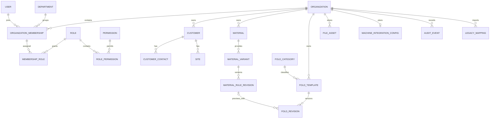

# P0-09 — Prisma 데이터 모델 v1

> 상태: `DONE`
>
> 우선순위: `P0`
>
> 담당자: 사용자 본인
>
> 검수자: 사용자 본인
>
> 관련 게이트: `G0`, `D0-09`
>
> 계획 작성일: 2026-07-19
>
> 착수일: 2026-07-19
>
> 완료일: 2026-07-19
>
> 상위 계획: [fold_web 전체 프로젝트 작업계획서](../project-work-plan.md)
>
> P0 실행계획: [P0 실행계획](./P0-execution-plan.md)
>
> 환경 기준: [P0-08 PostgreSQL 환경 기준](./P0-08-postgresql-environment.md)
>
> Prisma Schema: [`prisma/schema.prisma`](../../prisma/schema.prisma)

## 1. 목표

PostgreSQL 16과 Prisma를 기준으로 첫 수직 기능에 필요한 조직, 독자 인증, RBAC, 기준정보, 절곡 템플릿 개정, 파일 메타데이터와 감사를 설계한다.

MFC 참조 프로젝트는 다음 경로에 있지만 물리 스키마를 복제하지 않는다.

```text
/Users/kyhoon/Library/Mobile Documents/com~apple~CloudDocs/회사/hicomtech/도면
```

레거시 필드·키 참고는 [P0-04 레거시 스키마·키 참고 매핑](./P0-04-legacy-schema-mapping.md), 실제 참조 데이터 분포는 [P0-03 MFC 참조 PostgreSQL 조사](./P0-03-legacy-postgresql-reference.md)를 사용한다.

## 2. Prisma 7 적용 기준

2026-07-19 확인한 최신 Prisma CLI·Client 버전은 `7.8.0`이다. v1 schema는 Prisma 7 규약으로 작성했다.

- generator는 `prisma-client`를 사용한다.
- Prisma 7에서 필수인 사용자 지정 output을 `src/generated/prisma`로 지정한다.
- 생성 코드는 git에 저장하지 않는다.
- datasource는 PostgreSQL과 database foreign key를 사용한다.
- 연결 URL은 `schema.prisma`에 넣지 않고 P0-10의 root `prisma.config.ts`에서 환경변수로 공급한다.
- preview feature에 의존하지 않는다.

Prisma 7은 `prisma-client` generator의 output을 필수로 요구하고 datasource URL을 `prisma.config.ts`로 옮겼다. [Prisma Client 생성](https://www.prisma.io/docs/orm/prisma-client/setup-and-configuration/generating-prisma-client), [Prisma 7 업그레이드 가이드](https://docs.prisma.io/docs/guides/upgrade-prisma-orm/v7), [Schema API](https://www.prisma.io/docs/orm/reference/prisma-schema-reference)

## 3. v1 범위

### 포함

- 조직과 회사정보
- 웹 독자 사용자·비밀번호 credential·세션·비밀번호 재설정 token
- 부서, 조직 membership, 역할과 업무 permission
- 거래처·담당자·현장
- 재질·두께 variant·계산 규칙 개정
- 절곡 분류·템플릿·불변 개정·geometry JSONB
- 파일 object metadata
- 기계 연동 `연동 예정` placeholder
- 감사 이벤트
- 레거시 원본 키 매핑

### 후속 migration

- 수주·작업과 주문 절곡 snapshot
- 계산 snapshot과 가격
- 재단 요청·layout·잔재
- 출력·batch job
- 실제 Machine, Agent, Transfer와 NC payload
- object와 FileAsset의 업무별 연결

### 제외

- 입면도 관련 모델 전체
- MFC 로그인·PC serial·MAC 인증
- SQLite 호환 모델
- 회계·세무·DM·매입
- 레거시 집계 테이블

## 4. 모델 구성

총 25개 model과 10개 enum으로 구성했다.

| 영역 | 모델 |
|---|---|
| 조직·인증 | `Organization`, `CompanyProfile`, `User`, `PasswordCredential`, `AuthSession`, `PasswordResetToken` |
| RBAC | `Department`, `OrganizationMembership`, `Role`, `Permission`, `MembershipRole`, `RolePermission` |
| 거래처·현장 | `Customer`, `CustomerContact`, `Site` |
| 재질·계산 규칙 | `Material`, `MaterialVariant`, `MaterialRuleRevision` |
| 절곡 템플릿 | `FoldCategory`, `FoldTemplate`, `FoldRevision` |
| 운영 공통 | `FileAsset`, `MachineIntegrationConfig`, `AuditEvent`, `LegacyMapping` |

## 5. 핵심 관계



## 6. 필드 사전

### 6.1 조직·인증·권한

| 모델 | 핵심 필드 | 주요 제약·의미 |
|---|---|---|
| `Organization` | `code`, `name`, `status` | `code` 전역 unique, 업무 tenant 루트 |
| `CompanyProfile` | 사업자번호, 대표자, 연락처, 주소 | 조직과 1:1, 업무 표시 정보 |
| `User` | `email`, `normalizedEmail`, `displayName`, `status` | 이메일 원문과 정규화값 모두 unique, 레거시 비밀번호 미이관 |
| `PasswordCredential` | `algorithm`, `passwordHash`, `passwordChangedAt` | 사용자와 1:1, hash만 저장 |
| `AuthSession` | `tokenHash`, `expiresAt`, `revokedAt` | 원본 session token 미저장 |
| `PasswordResetToken` | `tokenHash`, `expiresAt`, `usedAt` | 일회성 token hash |
| `Department` | 조직별 `code`, `name`, `active` | 조직 내 code unique |
| `OrganizationMembership` | 조직, 사용자, 부서, 상태 | 조직+사용자 unique |
| `Role` | 조직별 `key`, `name`, `active` | 화면명이 아닌 업무 역할 |
| `Permission` | 전역 `key`, 설명 | `order.approve` 형식의 업무 행위 |
| `MembershipRole` | membership, role | 명시적 다대다, 할당 시각 보존 |
| `RolePermission` | role, permission | 명시적 다대다, 부여 시각 보존 |

### 6.2 기준정보·절곡

| 모델 | 핵심 필드 | 주요 제약·의미 |
|---|---|---|
| `Customer` | 조직별 code, 이름, 사업자번호, 상태 | soft delete, 이름 정규화 검색 |
| `CustomerContact` | 고객, 이름, 연락처, 대표 여부 | 표시 이름을 키로 사용하지 않음 |
| `Site` | 고객, 조직별 code, 주소, 상태 | 고객 하위 현장, soft delete |
| `Material` | 조직별 code, 이름, 밀도 | 재질 본체, soft delete |
| `MaterialVariant` | 재질, 두께, 기본 내부 반경 | 재질+두께 unique, soft delete |
| `MaterialRuleRevision` | 계산 방식, cut angle, 연신, 컷 깊이, 소수 정책 | variant별 revision unique, 게시 후 불변 |
| `FoldCategory` | 조직별 code, 이름, 정렬 | 절곡 템플릿 전용 분류 |
| `FoldTemplate` | 조직별 code, 이름, 문서 타입 | 개정의 mutable 루트, soft delete |
| `FoldRevision` | revision, 상태, schema version, JSONB, SHA-256 | 게시 후 불변, geometry 원자 저장 |

### 6.3 운영 공통

| 모델 | 핵심 필드 | 주요 제약·의미 |
|---|---|---|
| `FileAsset` | kind, storage key, 이름, media type, 크기, checksum | binary는 object storage, DB에는 metadata만 저장 |
| `MachineIntegrationConfig` | 상태, 계약 version, 메모 | endpoint·credential·장비는 없음 |
| `AuditEvent` | actor, action, entity, request, 시각, metadata | append-only 운용 |
| `LegacyMapping` | source system/table/key, entity type/id | 조직·원본별 unique, importer 재실행 기준 |

## 7. 키·tenant·관계 정책

- 기본키는 PostgreSQL UUID다.
- 모든 업무 데이터에는 `organizationId`가 있다.
- 조직 안의 code는 복합 unique constraint로 보호한다.
- relation은 PostgreSQL foreign key로 보호한다.
- PostgreSQL은 foreign key 컬럼의 index를 자동 생성하지 않으므로 조회·삭제 검증에 필요한 relation index를 schema에 명시했다.
- repository는 현재 세션의 membership에서 `organizationId`를 얻고 모든 업무 조회·변경 조건에 강제한다.
- 다른 조직의 UUID를 관계 필드에 넣는 요청은 transaction 전에 거부한다.
- database RLS는 Prisma transaction·migration과 함께 별도 검증이 필요하므로 v1에 넣지 않는다.
- P0-11 통합 테스트에 cross-organization 읽기·쓰기 거부 사례를 포함한다.

전역 `User`가 여러 조직에 가입할 수 있도록 사용자와 membership을 분리했다. 초기에는 하나의 조직만 seed하지만 schema를 다시 깨지 않고 조직을 추가할 수 있다.

## 8. 상태·개정·삭제 정책

### 8.1 상태

- 사용자: `INVITED`, `ACTIVE`, `SUSPENDED`, `DISABLED`
- membership: `ACTIVE`, `SUSPENDED`
- 개정: `DRAFT`, `REVIEW`, `PUBLISHED`, `RETIRED`
- 파일: `PENDING`, `READY`, `FAILED`, `DELETED`
- 기계 연동: `PLANNED`, `DISABLED`

### 8.2 불변 개정

- `MaterialRuleRevision`과 `FoldRevision`은 `PUBLISHED` 이후 수정하지 않는다.
- 변경은 revision number를 증가시킨 새 row로 생성한다.
- 게시 transaction은 상태, 게시자, 게시 시각과 감사 이벤트를 함께 기록한다.
- schema 자체만으로 조건부 불변성을 완전히 표현할 수 없으므로 P0-11 repository와 transaction 테스트로 강제한다.

### 8.3 삭제

| 데이터 | 정책 |
|---|---|
| 사용자·membership | row 삭제 대신 상태 비활성 |
| 고객·현장·재질·variant·절곡 template | `deletedAt` soft delete |
| 게시된 규칙·절곡 revision | 삭제 금지, `RETIRED` |
| session·reset token | 만료 후 보존 정책에 따라 hard delete 가능 |
| 파일 | object 삭제와 별도로 `DELETED`, `deletedAt` 기록 |
| 감사 이벤트 | 애플리케이션에서 수정·삭제 API 제공 금지 |
| 레거시 매핑 | importer rollback 절차에서만 명시적 제거 |

보존 기간은 승인된 [P0-07](./P0-07-nfr-and-tolerance.md) 기준을 적용한다.

## 9. Decimal·JSONB·시간 정책

- 길이·반경·연신·컷 깊이: `Decimal(18,6)`, mm
- 각도: `Decimal(9,4)`, degree
- 재질 밀도: `Decimal(18,6)`, kg/m³
- 모든 시각: `timestamptz(6)`, UTC
- 업무 표시는 `Asia/Seoul`
- geometry document와 확장 options: PostgreSQL `jsonb`
- JSONB 내부 계산 Decimal: JSON number가 아닌 정규화 문자열
- `FoldRevision.documentSchemaVersion`으로 문서 migration을 관리
- `documentChecksumSha256`으로 canonical document를 대조

현재 브라우저 `FoldProfile`은 number 기반 schema version 3이다. 서버 문서 계약의 문자열 Decimal 전환과 호환 migration은 P1-06에서 구현한다.

## 10. 인덱스 기준

- 모든 tenant 목록은 `organizationId` 선두 index를 사용한다.
- active·deleted 목록은 조직+상태 index를 사용한다.
- 템플릿·재질 revision은 부모+revision unique와 부모+상태 index를 사용한다.
- 감사는 조직+발생시각, 조직+entity+발생시각을 사용한다.
- session·reset token은 hash unique와 만료시각 index를 사용한다.
- 레거시 매핑은 조직+원본 키 unique와 새 entity 역조회 index를 사용한다.
- 실제 쿼리 계획과 부분 index는 P2 성능 측정 후 migration으로 보완한다.

## 11. 검증 결과

실행 명령:

```text
npx -y prisma@7.8.0 format --schema prisma/schema.prisma
npx -y prisma@7.8.0 validate --schema prisma/schema.prisma
```

결과:

- schema format 성공
- Prisma schema validation 성공
- model 25개, enum 10개 확인
- 입면도·수주·재단·실제 기계 전송 model 없음 확인
- datasource는 PostgreSQL만 사용
- credential·endpoint 값 없음

P0-09 검증 시점에는 Prisma package를 설치하지 않았고 사용자 npm registry의 평문 HTTP 설정을 발견했다. P0-10에서 프로젝트 `.npmrc`를 HTTPS registry로 고정하고 Prisma 7.8 dependency를 설치했다.

## 12. 상세 실행 결과

| 단계 ID | 상태 | 작업 내용 | 산출물·검증 |
|---|---|---|---|
| `01` | `DONE` | P0-04·P0-08·아키텍처 모델 대조 | v1 aggregate 경계 |
| `02` | `DONE` | Prisma 7 generator·datasource 규약 확인 | URL 분리·output 명시 |
| `03` | `DONE` | UUID·조직·인증·RBAC 모델 작성 | schema 조직 영역 |
| `04` | `DONE` | 거래처·재질·규칙 개정 모델 작성 | schema 기준정보 영역 |
| `05` | `DONE` | 절곡 템플릿·불변 개정 모델 작성 | JSONB·checksum |
| `06` | `DONE` | 파일·감사·legacy·기계 placeholder 작성 | 운영 공통 모델 |
| `07` | `DONE` | 관계·unique·index·삭제 정책 검토 | 필드 사전·정책 |
| `08` | `DONE` | 입면도·후속 범위 미포함 대조 | 제외 검색 |
| `09` | `DONE` | Prisma 7.8 format·validate | schema valid |
| `10` | `DONE` | 사용자 schema·보존 정책 승인 | D0-09 전체 권장안 승인 |

## 13. 사용자 승인 요청

| 결정 ID | 결정 항목 | 권장안 |
|---|---|---|
| `D0-09-A` | v1 model 범위 | 현재 25개 model, 수주·재단은 후속 migration |
| `D0-09-B` | 인증 저장 구조 | 독자 User + password hash + DB session |
| `D0-09-C` | tenant 강제 | 모든 업무 row `organizationId`, repository 강제, RLS는 보류 |
| `D0-09-D` | 게시 개정 | 게시 후 불변, 수정은 새 revision |
| `D0-09-E` | 삭제·보존 | mutable root soft delete, 게시 개정·감사 삭제 금지 |
| `D0-09-F` | geometry 저장 | revision 단위 JSONB + schema version + SHA-256 |

전체 권장안을 승인하면 P0-10에서 안전한 npm registry, Prisma 7.8 dependency, `prisma.config.ts`, 초기 migration, seed와 로컬 PostgreSQL 테스트 자동화를 구현한다.

### 13.1 사용자 결정 결과

`D0-09-A`부터 `D0-09-F`까지 전체 권장안을 승인했다. Prisma Schema v1, 독자 인증 저장 구조, `organizationId` tenant 경계, 게시 개정 불변, soft delete·보존과 revision JSONB 계약을 후속 구현 기준으로 사용한다.

## 14. 변경 기록

| 날짜 | 변경 내용 | 작성자 |
|---|---|---|
| 2026-07-19 | Prisma Schema v1 25개 모델, ERD, 필드 사전, tenant·개정·삭제 정책 작성 및 Prisma 7.8 검증 | 사용자 본인 |
| 2026-07-19 | D0-09-A~F 권장안 전체 승인, P0-09 완료 | 사용자 본인 |
