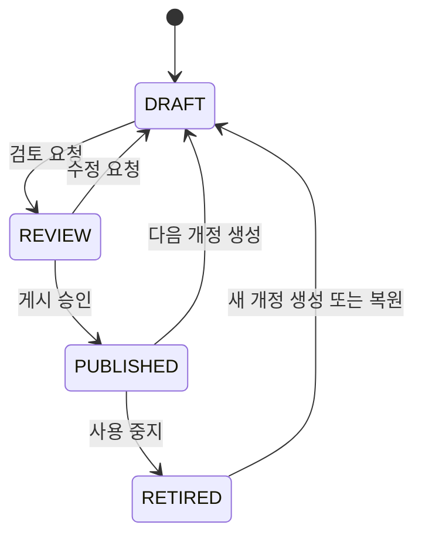

# P1-08 — 절곡 템플릿 라이브러리

> 상태: `DONE`
>
> 우선순위: `P1`
>
> 담당자: 사용자 본인
>
> 검수자: 사용자 본인
>
> 관련 게이트: `D1-08`
>
> 계획 작성일: 2026-07-25
>
> 착수일: 2026-07-25
>
> 완료일: 2026-07-25
>
> D1-08 승인일: 2026-07-25
>
> 상위 계획: [P1 실행계획](./P1-execution-plan.md)
>
> 선행 기준선: [P1-07 절곡 초안 저장](./P1-07-fold-draft-persistence.md)
>
> MFC 참조 루트: `/Users/kyhoon/Library/Mobile Documents/com~apple~CloudDocs/회사/hicomtech/도면`

## 1. 목표와 사용자 결과

로그인 사용자가 조직의 절곡 템플릿을 분류·검색·복사하고, 초안을 검토 요청·게시·폐기하며, 게시본을 직접 바꾸지 않고 새 개정으로 안전하게 발전시킬 수 있는 웹 기반 라이브러리를 완성한다.

P1-08 완료 시 다음 업무 흐름이 실제 화면에서 연결돼야 한다.

```text
템플릿 라이브러리 열기
→ 이름·분류·상태·타입으로 검색
→ 초안 생성 또는 기존 게시본에서 새 개정 생성
→ 편집기 자동 저장
→ 검토 요청
→ 승인자 게시
→ 게시본 읽기 전용 사용
→ 변경 필요 시 다음 개정 생성
→ 이전·현재 개정 비교 또는 과거본 기반 복원
→ 더 이상 사용하지 않는 게시본 폐기
```

P1-08은 수주에서 게시 템플릿을 선택할 수 있는 불변 기반을 만든다. 실제 수주 스냅샷 연결은 P2-A08에서 구현한다.

## 2. 조사 근거와 현재 기반

### 2.1 MFC 참조 의미

MFC 실행 메커니즘·윈도우 message·ODBC SQL 조립 방식은 계승하지 않는다. 다음 코드는 사용자 업무 의미를 확인하는 참고 자료로만 사용한다.

| 파일·함수 | 확인한 의미 | 웹 재구현 판단 |
|---|---|---|
| `Work01Dlg.cpp::Fn_SaveOn` | 이름 필수, 분류 선택, 저장·다른 이름 저장 | 초안 자동 저장과 명시적 복사로 분리 |
| `Work01Dlg.cpp::OnButtonWork01Modeladd` | 미저장 확인 후 신규 도면 | P1-07의 새 초안 흐름 유지 |
| `Work01Dlg.cpp::OnButtonWork01Modeldel` | 사용 여부 확인 후 삭제 | 게시 이력이 있으면 삭제 대신 폐기, 초안은 취소 처리 |
| `Work01Dlg.cpp::OnSelchangeListWork01Model` | 분류 목록에서 템플릿 선택·불러오기 | 웹 library route와 editor route로 분리 |
| `_dbcom/DBCommon.cpp::Foldd_GetList` | 분류 filter와 이름순 목록 | 서버 검색·cursor pagination으로 재구현 |
| `_dbcom/DBCommon.cpp::Foldd_GetFcodeList*` | 이름 부분 검색 | PostgreSQL 안전 parameter query와 trigram index 사용 |
| `_dbcom/DBCommon.cpp::Fold_Save` | `foldd`와 `foldxy` transaction 저장, 이름 중복 차단 | P1-07 JSONB aggregate와 transaction 유지 |
| `_dbcom/DBCommon.cpp::Foldd_DelCheck` | 다른 기능 사용 중이면 삭제 차단 | 수주 참조 전에는 게시·폐기 상태로 통제하고 향후 FK로 보강 |
| `FoldSearcherDlg.cpp` | 전체/분류/이름/형상 검색과 미리보기 | P1-08은 분류·이름·상태·타입 검색과 미리보기, 형상 검색은 후속 |
| `ZDrawFoldSaveDlg.cpp` | 저장과 다른 이름 저장 선택 | 일반 저장은 자동 저장, 다른 이름 저장은 템플릿 복사 |

레거시 PostgreSQL 참조 원본은 `drawcate`, `foldd`, `foldxy`를 사용하며 조사 기준 `foldd` 189건, `foldxy` 1,606건이다. 레거시 numeric key나 물리 schema는 복제하지 않고 importer 단계에서 `LegacyMapping`으로만 연결한다.

### 2.2 현재 웹 기반

| 대상 | 현재 상태 | P1-08 확장 |
|---|---|---|
| `FoldCategory` | 조직·code·name·active·sortOrder, 기본 분류 seed | 분류 CRUD·정렬·비활성화·낙관적 잠금 |
| `FoldTemplate` | 조직·분류·code·이름·타입·soft delete | 라이브러리 metadata·상태 집계·복사·개정 root |
| `FoldRevision` | DRAFT/REVIEW/PUBLISHED/RETIRED enum, 문서·checksum·lock version | 상태 전이·게시 불변·폐기·취소·개정 이력 |
| P1-07 draft API | 최근 DRAFT CRUD·자동 저장·충돌·IndexedDB 복구 | DRAFT 편집 기반으로 재사용, library workflow API 추가 |
| 문서 계약 v1 | strict server document·canonical checksum | 모든 복사·게시·복원 경계에서 재검증 |
| RBAC | `template.fold.read/edit/publish` | 조회·작성·게시 책임 분리 |
| 감사 v2 | 초안 생성·저장·삭제 action | 분류·복사·검토·게시·폐기·개정 action 추가 |
| UI | `/` 편집기·최근 초안 dialog | 별도 `/fold-library` 검색·목록·상세·개정 화면 |

## 3. 포함·제외 범위

### 포함

- 평면 분류 생성·이름 변경·정렬·비활성화와 템플릿 이동
- 템플릿 이름·내부 code·도면 타입·현재 상태·최신 개정 표시
- 이름·code·분류·상태·도면 타입 검색과 cursor pagination
- 초안·검토·게시·폐기 상태 전이
- 게시본 기반 다음 DRAFT 개정 생성
- 템플릿 전체 복사와 현재 작업의 다른 이름 저장
- 개정 이력·metadata/문서 의미 차이 비교
- 과거 개정 문서를 새 DRAFT로 복원
- 게시·폐기 개정의 읽기 전용 상세·미리보기
- 초안 취소와 게시 이력이 없는 빈 템플릿 soft delete
- 조직·권한·낙관적 잠금·원자 감사
- PostgreSQL·API·Playwright·Chrome·Edge 검증

### 제외

- 계층형 폴더·분류 무제한 depth
- 즐겨찾기·사용자별 최근 항목 설정·태그
- 유사 형상·그림 입력 검색
- 저장된 raster thumbnail·파일 저장소
- 다중 선택 일괄 게시·일괄 폐기
- 실시간 공동 편집·자동 merge
- 검토 의견 thread·전자결재·다단 승인
- 재질·계산 규칙 작성·게시 UI
- 레거시 `foldd/foldxy` importer 실행
- 수주에서 템플릿 선택·스냅샷 생성
- P1-09 이후 계산 결과 승인과 제작용 DXF
- 입면도와 기계 통신

## 4. 선행 조건과 의존성

| 구분 | 대상 | 상태 | 확인 방법 |
|---|---|---|---|
| 선행 작업 | P1-02 조직·RBAC | 완료 | read/edit/publish permission 통합 시험 |
| 선행 작업 | P1-03 감사 v2 | 자동 구현 완료 | typed action·append-only transaction |
| 선행 작업 | P1-06 문서 계약 v1 | 완료 | strict parse·checksum·adapter |
| 선행 작업 | P1-07 초안 저장 | 완료 | 2026-07-25 사용자 검수 승인 |
| 환경 | 로컬 PostgreSQL·Prisma Migrate | 완료 | 전체 migration·seed·통합 시험 |
| MFC 근거 | 참조 프로젝트와 레거시 DB 조사 | 완료 | 본 문서 2.1장 |
| 사용자 결정 | D1-08-A~L | 전체 승인 | 2026-07-25 사용자 자체 승인·지속 진행 지시 |

## 5. 도메인·상태 설계

### 5.1 aggregate와 개정 cardinality

```text
FoldCategory
└─ FoldTemplate (안정된 라이브러리 항목)
   ├─ FoldRevision r1 RETIRED
   ├─ FoldRevision r2 PUBLISHED  ← 현재 사용 가능 게시본
   └─ FoldRevision r3 DRAFT/REVIEW ← 작업 개정, 최대 1개
```

- 템플릿은 이름·분류·타입과 개정 이력을 묶는 root다.
- 한 템플릿에는 삭제되지 않은 작업 개정(DRAFT 또는 REVIEW)이 최대 하나다.
- 현재 사용 가능한 PUBLISHED 개정도 최대 하나다.
- 새 개정 게시 시 직전 PUBLISHED를 같은 transaction에서 RETIRED로 전환한다.
- RETIRED는 역사 보존 상태이며 문서 내용을 수정하지 않는다.
- 템플릿 타입은 최초 생성 뒤 변경하지 않는다. 다른 타입이 필요하면 복사해 새 템플릿을 만든다.

### 5.2 상태 전이



- DRAFT만 P1-07 편집 API로 내용을 바꿀 수 있다.
- REVIEW는 편집·자동 저장을 차단하고 승인자가 읽기 전용으로 검토한다.
- PUBLISHED와 RETIRED 문서·checksum·name snapshot은 불변이다.
- 템플릿 표시 이름·분류는 개정 문서 이름과 분리하지 않는다. 이름 변경은 작업 개정이 있을 때만 허용하고 문서·template·revision을 함께 갱신한다.
- 검토 요청 전에 자동 저장 queue를 flush하고 server checksum을 기준으로 전이한다.

### 5.3 역할

| permission | 허용 작업 |
|---|---|
| `template.fold.read` | library 검색, template·revision 상세, 읽기 전용 preview·비교 |
| `template.fold.edit` | 분류 관리, 초안 생성·편집·복사·이동·검토 요청·다음 개정·복원·초안 취소 |
| `template.fold.publish` | 검토 반려, 게시, 게시본 폐기 |

`ADMINISTRATOR`는 전체, `DESIGNER`는 read/edit, `APPROVER`는 read/edit/publish, `VIEWER`는 read만 갖는 현재 기준을 유지한다.

## 6. 데이터베이스·Prisma 계획

### 6.1 모델 변경

| 모델 | 변경 | 목적 |
|---|---|---|
| `FoldCategory` | `lockVersion Int @default(1)`, `deletedAt` nullable | 동시 수정과 soft delete |
| `FoldTemplate` | `lockVersion Int @default(1)` | 이름·분류 변경 충돌 방지 |
| `FoldRevision` | `statusChangedAt`, `statusChangedByUserId`, `deletedAt`, `deletedByUserId` | 상태 담당자·시각과 취소된 작업 개정 보존 |
| `User` | 상태 변경·삭제 역관계 | Prisma relation 완결 |

별도 current revision FK는 두지 않는다. 부분 unique index와 status query를 단일 기준으로 사용해 이중 진실을 피한다.

### 6.2 index와 제약

- 삭제되지 않은 `(templateId)`별 `status IN ('DRAFT','REVIEW')` 부분 unique index
- 삭제되지 않은 `(templateId)`별 `status='PUBLISHED'` 부분 unique index
- 삭제되지 않은 템플릿의 조직·분류 내 대소문자 무시 이름 unique index
- `FoldTemplate(organizationId, categoryId, updatedAt DESC, id DESC)` 목록 index
- `FoldRevision(templateId, revisionNumber DESC)` 이력 index
- `FoldRevision(organizationId, status, updatedAt DESC, id DESC)` 상태 목록 index
- `pg_trgm` extension과 템플릿 이름·code 검색 GIN index
- `lockVersion > 0`, `revisionNumber > 0` CHECK 유지·보강

모든 부분·함수 index는 Prisma schema에 완전히 표현되지 않으므로 migration SQL과 `db:migrate:check` 검증 범위를 문서화한다.

### 6.3 migration과 기존 데이터

1. 신규 nullable·default column을 추가한다.
2. 기존 revision의 `statusChangedAt=updatedAt`, `statusChangedByUserId=updatedByUserId`로 backfill한다.
3. 기존 `DRAFT-<UUID>` template code는 안정된 `FOLD-<UUID>`로 바꾸되 외부 공개 key로 사용하지 않는다.
4. 동일 조직·동일 분류의 이름 충돌을 사전 report한다. 자동으로 사용자 이름을 바꾸지 않고 migration 전 해결한다.
5. 부분 unique index와 trigram index를 생성한다.
6. 빈 DB, 현재 개발 DB upgrade, seed, 전체 통합 시험을 수행한다.

신규 코드로 상태 전이를 시작한 뒤 rollback은 column 제거가 아니라 application 이전 버전 재배포와 DB backup 복원을 기준으로 한다.

## 7. API·Application 계약 계획

### 7.1 library endpoint

| method | endpoint | permission | 용도 |
|---|---|---|---|
| `GET` | `/api/v1/fold-categories` | `template.fold.read` | 활성/비활성 분류 목록 |
| `POST` | `/api/v1/fold-categories` | `template.fold.edit` | 분류 생성 |
| `PATCH` | `/api/v1/fold-categories/:categoryId` | `template.fold.edit` | 이름·정렬·활성 상태 변경 |
| `GET` | `/api/v1/fold-templates?q&categoryId&status&type&cursor&limit` | `template.fold.read` | library 검색 |
| `GET` | `/api/v1/fold-templates/:templateId` | `template.fold.read` | template와 개정 이력 상세 |
| `PATCH` | `/api/v1/fold-templates/:templateId` | `template.fold.edit` | 이름·분류 변경 |
| `POST` | `/api/v1/fold-templates/copies` | `template.fold.edit` | 지정 개정을 새 template DRAFT로 복사 |
| `POST` | `/api/v1/fold-templates/:templateId/revisions` | `template.fold.edit` | 게시·폐기·과거 개정에서 다음 DRAFT 생성 |
| `POST` | `/api/v1/fold-revisions/:revisionId/review-requests` | `template.fold.edit` | DRAFT → REVIEW |
| `POST` | `/api/v1/fold-revisions/:revisionId/returns` | `template.fold.publish` | REVIEW → DRAFT |
| `POST` | `/api/v1/fold-revisions/:revisionId/publications` | `template.fold.publish` | REVIEW → PUBLISHED |
| `POST` | `/api/v1/fold-revisions/:revisionId/retirements` | `template.fold.publish` | PUBLISHED → RETIRED |
| `DELETE` | `/api/v1/fold-revisions/:revisionId` | `template.fold.edit` | DRAFT 취소·soft delete |
| `GET` | `/api/v1/fold-revisions/:revisionId` | `template.fold.read` | 모든 상태의 canonical 문서 읽기 |

개정 비교 화면은 각 개정의 canonical 문서를 기존 `GET /api/v1/fold-revisions/:revisionId`로 읽어 브라우저에서 결정적으로 비교한다. 비교 결과 자체는 업무 원본이 아니므로 별도 저장·서버 상태를 만들지 않는 구성을 구현 기준으로 채택했다.

P1-07 `/api/v1/fold-drafts`는 DRAFT 문서 편집 전용으로 유지한다. library endpoint가 P1-07 repository를 우회해 DRAFT 내용을 바꾸지 못하게 한다.

### 7.2 검색과 목록

- `q`는 trim 후 2~100자이며 이름과 내부 code를 parameterized contains 검색한다.
- filter는 조직 범위 안에서 AND 결합한다.
- 기본 25개·최대 100개, `(updatedAt DESC, id DESC)` cursor를 사용한다.
- 기본 목록은 삭제되지 않은 template의 현재 작업 개정 또는 현재 게시본을 한 행으로 집계한다.
- 상태 filter `DRAFT/REVIEW/PUBLISHED/RETIRED`는 해당 상태 개정이 존재하는 template를 반환한다.
- URL query를 화면 filter의 원본으로 사용해 새로고침·링크 공유를 지원한다.

### 7.3 복사·새 개정·복원

- 요청은 client UUID `draftId`, source revision ID, 새 이름·분류를 받는다.
- 복사는 새 `FoldTemplate`과 revision 1 DRAFT를 생성한다.
- 새 개정은 같은 template에서 `max(revisionNumber)+1` DRAFT를 만든다.
- 복원도 과거 문서를 직접 덮지 않고 최신 번호의 새 DRAFT로 복제한다.
- canonical document의 ID·name·timestamp는 새 aggregate에 맞게 adapter로 재생성한다.
- material rule은 같은 조직의 게시 revision인지 재검증하고 snapshot을 서버값으로 다시 구성한다.
- 같은 client UUID·source checksum 재시도는 기존 결과를 성공 반환한다.

### 7.4 상태 전이·동시성

- mutation은 `expectedLockVersion`을 요구한다.
- repository는 template와 revision row를 일정한 순서로 `FOR UPDATE` lock한다.
- 검토·게시 직전 strict document·row metadata·checksum·material snapshot을 다시 검증한다.
- 게시 transaction은 대상 REVIEW 게시와 이전 PUBLISHED 폐기를 함께 commit한다.
- 상태와 checksum이 이미 기대 결과면 응답 유실 재시도로 성공 처리한다.
- stale version 또는 다른 상태면 `409 CONFLICT`와 현재 상태·version·수정자·시각을 반환한다.
- 타 조직 ID는 `404`, 권한 부족은 `403`으로 처리한다.

## 8. UI·상태 계획

### 8.1 route와 구조

```text
/fold-library
├─ 검색·filter toolbar
├─ 분류 sidebar
├─ template 목록·간단 SVG 미리보기
└─ template 상세 drawer
   ├─ 현재 상태·metadata
   ├─ 개정 이력
   ├─ 읽기 전용 preview
   ├─ 비교
   └─ 권한별 작업 menu

/fold-editor?draft=<revisionId>
└─ DRAFT 편집과 자동 저장
```

- 전역 header에 `템플릿 라이브러리` link를 추가한다.
- library filter는 desktop sidebar, 작은 화면에서는 dialog로 제공한다.
- 행 전체를 keyboard로 선택할 수 있고 작업 button에는 명확한 accessible name을 둔다.
- 검색 입력은 300ms debounce하되 Enter로 즉시 실행한다.
- 목록은 loading skeleton, empty filter 안내, retry 가능한 오류를 구분한다.
- thumbnail 파일은 만들지 않고 canonical document 좌표에서 on-demand SVG 외곽 미리보기를 생성한다.

### 8.2 작업 UX

- `새 템플릿`: P1-07 새 초안 dialog를 library 진입점에서도 연다.
- `복사/다른 이름 저장`: source·새 이름·분류 확인 후 새 DRAFT editor로 이동한다.
- `검토 요청`: 미저장 변경 flush 후 확인 dialog, 성공하면 editor를 읽기 전용으로 전환한다.
- `수정 요청`: 승인자가 사유 없이 REVIEW를 DRAFT로 되돌린다. 의견 thread는 제외한다.
- `게시`: 불변조건 결과를 요약하고 확인받은 뒤 게시한다.
- `새 개정`: 현재 게시본 또는 선택한 과거본을 source로 새 DRAFT를 만든다.
- `폐기`: 현재 게시본이 더 이상 신규 사용 대상이 아님을 확인한다.
- `초안 취소`: 게시 이력 없는 template면 template도 soft delete하고, 게시 이력이 있으면 작업 revision만 취소한다.

### 8.3 비교

P1-08 비교는 계산 결과 재평가가 아니라 저장 문서의 의미 차이를 보여준다.

- 이름·타입·재질 rule revision·계산 설정 차이
- block/segment 수와 추가·삭제·변경 segment ID
- 좌표·길이·절곡·컷·연신·수식 field path와 이전/이후 값
- 좌우 canonical checksum·revision number·게시 시각
- 좌우 읽기 전용 2D preview

자동 merge와 과거본 직접 복원은 하지 않는다. `이 개정으로 새 초안 만들기`만 제공한다.

## 9. 권한·감사

### 감사 action 계획

| action | 발생 조건 |
|---|---|
| `fold.category_created` | 분류 생성 |
| `fold.category_updated` | 이름·정렬·활성 변경 |
| `fold.template_metadata_updated` | 이름·분류 변경 |
| `fold.template_copied` | 새 template DRAFT 복사 |
| `fold.revision_created` | 게시·폐기·과거본 기반 새 개정 |
| `fold.revision_review_requested` | DRAFT → REVIEW |
| `fold.revision_returned` | REVIEW → DRAFT |
| `fold.revision_published` | REVIEW → PUBLISHED |
| `fold.revision_retired` | PUBLISHED → RETIRED |
| `fold.revision_discarded` | 작업 개정 soft delete |

감사 payload에는 template/revision ID, 이름, 분류 ID, 이전/이후 상태, revision number, lock version, checksum만 둔다. geometry·문서 전체·재질 수치 전체는 넣지 않는다. 성공 mutation과 audit는 같은 transaction에서 commit/rollback한다.

## 10. 상세 실행 단계

| 단계 | 상태 | 작업 | 종료 검증 |
|---|---|---|---|
| `01` | `DONE` | P1-07·Prisma·RBAC·감사·MFC 분류/검색/저장 조사 | 본 문서 2~9장 |
| `02` | `DONE` | D1-08-A~L 승인 | 2026-07-25 전체 승인 |
| `03` | `DONE` | schema·부분 index·trigram migration | 빈 DB reset·개발 DB upgrade·migration diff 통과 |
| `04` | `DONE` | category·library DTO·cursor·repository | AND filter·정렬·조직 경계 PostgreSQL 시험 |
| `05` | `DONE` | 복사·새 개정·복원 service | client UUID 재시도·revision 번호·material 재검증 통과 |
| `06` | `DONE` | review·return·publish·retire·discard service | 원자 게시·기존 게시본 RETIRED·lock version 시험 통과 |
| `07` | `DONE` | library/category/revision API와 감사 | permission·Origin·조직 경계·원자 감사 구현 |
| `08` | `DONE` | semantic document diff·SVG preview | canonical field path 비교·빈 형상 상태·읽기 전용 preview 구현 |
| `09` | `DONE` | `/fold-library` 검색·상세·개정 UI | loading·empty·error·filter·상세·작업 UI 구현 |
| `10` | `DONE` | editor workflow 연결 | 편집 link·review→publish→new revision Playwright 통과 |
| `11` | `DONE` | 전체 자동 검증·성능·문서 | lint·typecheck·단위 141·통합 32·E2E 6·build 통과 |
| `12` | `DONE` | Chrome·Edge 사용자 검수 | 2026-07-25 사용자 완료 승인 |

## 11. 테스트 계획

| 종류 | 핵심 사례 | 완료 기준 |
|---|---|---|
| 단위: 상태 | 허용·거부 전이, 현재 작업/게시 cardinality | 전이표 전 사례 통과 |
| 단위: 검색 | query normalize, filter, cursor encode/decode | 안정 정렬·중복/누락 없음 |
| 단위: diff | metadata·material·segment 추가/삭제/수정 | 결정적 path와 값 출력 |
| PostgreSQL | 부분 unique, trigram, revision 번호 경합, 게시 원자성 | 동시 transaction invariant 통과 |
| API | strict body, status, cursor, conflict, idempotency | 표준 envelope·request ID |
| 보안 | 미인증, read-only mutation, editor publish, cross-org ID | 401/403/404와 데이터 무변경 |
| 감사 | 모든 상태 mutation commit/rollback | 행위자·전후 상태·checksum 일치 |
| E2E | 분류→생성→검색→편집→검토→게시→새 개정 | 수직 흐름 성공 |
| E2E 충돌 | 두 탭 metadata·검토·게시 경합 | stale mutation 409, 중복 게시 없음 |

## 12. 화면 검수 기준선

2026-07-25 자동 구현·자체 검증을 완료하고 P1-08을 사용자 화면 검수 가능한 `VERIFYING` 상태로 전환했다.

- 실행 주소: `http://localhost:3000/fold-library`
- 로그인 계정: `screen-test-admin@local.test`
- 비밀번호: `Browser verification phrase 2026!`
- 개발 DB: 로컬 PostgreSQL `fold_web_dev`
- 개발 서버: `localhost:3000`
- 자체 검증: lint, typecheck, 단위 141건, PostgreSQL 통합 32건, Playwright 6건, production build, migration diff
- 실제 브라우저 확인: 로그인, 라이브러리 진입, 기본 분류, 빈 목록·상세 안내 렌더링, console error 없음

사용자 검수 범위는 분류 생성·수정, 새 초안 생성, 검색·상세, 검토 요청·수정 요청·게시, 게시본 폐기, 새 개정, 다른 이름 복사와 개정 비교다. 2026-07-25 사용자가 검수 완료를 승인해 P1-08을 `DONE`으로 확정했다.
| E2E 비교 | r1/r2 차이와 과거본 새 초안 | 원본 불변·새 revision 생성 |
| 회귀 | P1-01~07 인증·관리·감사·초안 저장 | 기존 suite 전체 통과 |
| 성능 | 10,000 template·평균 10 revision synthetic 목록 | 로컬 query plan 기록, 운영 p95는 P2-C12 재검증 |
| MFC 대조 | 분류·이름 검색·복사·삭제 의미 | 실행 mechanism 미복제, 업무 의미 문서 대조 |
| 시각·사용자 | desktop·작은 화면·Chrome·Edge | 검색·상태·권한 사용자 승인 |

## 12. 데이터 이전·호환성

- 기존 P1-07 DRAFT URL과 API는 유지한다.
- 기존 draft는 revision 1 DRAFT 작업 개정으로 자동 인식한다.
- soft deleted P1-07 template는 library 기본 목록에서 제외한다.
- 레거시 `drawcate/foldd/foldxy`는 이번 단계에서 적재하지 않는다.
- P2-C03 importer는 source key를 `LegacyMapping`으로 매핑하고 게시 여부는 별도 승인 정책으로 정한다.
- 입면도 `draww/drawxy`는 active model로 가져오지 않는다.

## 13. 배포·운영

- 신규 외부 서비스·파일 저장소·환경변수는 없다.
- migration 전 template 이름 충돌 report와 DB backup을 확인한다.
- migration → seed → application 배포 → category/library/read API smoke → 상태 mutation smoke 순으로 진행한다.
- 게시 기능은 server permission과 migration 준비가 끝난 뒤에만 UI에 노출한다.
- 관측 대상은 검색 latency, 결과 수, 상태 전이 성공/충돌/거부, 복사·게시 transaction latency다.
- query·log·metric에 검색 원문, geometry, 문서 전체를 남기지 않는다.
- rollback 시 신규 상태 mutation을 먼저 차단하고 application 이전 버전 또는 backup 복원을 선택한다.

## 14. 위험과 대응

| 위험 | 영향 | 대응 |
|---|---|---|
| 현재 초안 이름 중복 | unique migration 실패 | 사전 report, 사용자 확인 없는 자동 이름 변경 금지 |
| 게시와 새 개정 동시 실행 | 복수 현재 게시본·revision 번호 충돌 | 부분 unique index·row lock·retry 가능한 409 |
| REVIEW에서 자동 저장 지속 | 검토 중 내용 변경 | 전이 전 flush, 전이 응답 즉시 read-only, 서버 DRAFT-only 강제 |
| P1-07 삭제가 template 전체 soft delete | 게시 이력 손실 | 작업 revision 취소와 template 삭제 규칙 분리 |
| 과거 material rule 비활성 | 복사·복원 실패 | 원본은 읽기 허용, 새 DRAFT 생성 시 현재 허용 rule 선택 요구 |
| 비교 결과가 지나치게 큼 | UI·응답 지연 | path summary pagination·상한·문서 원문 미응답 |
| 목록 query join 증가 | 성능 저하 | 상태별 부분 index·cursor·query plan fixture |
| 게시가 계산 정확성 승인으로 오해 | 잘못된 제작 신뢰 | P1-08 게시 범위를 문서 구조·업무 승인으로 명시, 계산 회귀는 P1-09~17 |

## 15. D1-08 결정 게이트 — 승인 기준선

2026-07-25 사용자가 화면 테스트 가능 시점까지 자체 검증·승인 후 지속 진행하도록 지시해 `D1-08-A~L` 권장안 전체를 공식 기준선으로 확정했다.

| ID | 권장안 | 영향 |
|---|---|---|
| `D1-08-A` | 별도 `/fold-library` 화면을 만들고 `/`는 DRAFT 편집기로 유지 | 검색·관리와 고밀도 편집 UI 책임 분리 |
| `D1-08-B` | 분류는 P1-08에서 평면 1단계로 구현하고 미분류를 허용하며 삭제 대신 비활성화 | MFC 의미를 충족하면서 계층 구조 복잡도 보류 |
| `D1-08-C` | template당 DRAFT/REVIEW 작업 개정 최대 1개, 현재 PUBLISHED 최대 1개를 DB 부분 unique로 강제 | 동시 생성·게시에서도 단일 현재본 보장 |
| `D1-08-D` | edit 사용자는 생성·복사·검토 요청, publish 사용자는 반려·게시·폐기를 담당 | 현재 RBAC를 바꾸지 않고 책임 분리 |
| `D1-08-E` | 새 개정 게시 시 직전 PUBLISHED를 같은 transaction에서 RETIRED로 전환 | 현재 사용 가능 게시본을 명확히 유지 |
| `D1-08-F` | 작업 개정은 soft discard하고, 게시 이력이 없는 template만 soft delete하며 게시 이력은 폐기로 관리 | 참조·감사 이력 손실 방지 |
| `D1-08-G` | 복사는 새 template r1 DRAFT, 새 개정·복원은 같은 template의 다음 번호 DRAFT로 만들고 원본을 절대 수정하지 않음 | MFC 다른 이름 저장과 웹 개정 이력을 명확히 구분 |
| `D1-08-H` | 활성 이름은 조직·분류 안에서 대소문자 무시 unique, 내부 code는 `FOLD-<UUID>` 자동 생성·불변 | 사용자는 간단한 이름을 쓰고 importer·API는 안정 key 확보 |
| `D1-08-I` | 이름·code contains 검색에 `pg_trgm`, 분류·상태·타입 filter와 25건 cursor를 사용 | 10,000건 규모에서도 서버 검색 확장 가능 |
| `D1-08-J` | 비교는 semantic field diff와 좌우 읽기 전용 2D preview, 복원은 과거본 기반 새 DRAFT만 제공 | 직접 덮어쓰기·자동 merge 없이 이력 보존 |
| `D1-08-K` | 모든 metadata·상태 mutation에 lock version·row lock·원자 감사·동일 결과 재시도 멱등성을 적용 | 두 탭과 응답 유실에서 중복·덮어쓰기 방지 |
| `D1-08-L` | 게시 전 strict 문서·checksum·동일 조직 material을 재검증하고 PostgreSQL·Playwright·Chrome·Edge로 전체 흐름을 검수 | 게시본 구조 신뢰와 사용자 업무 검증 확보 |

기준선 변경 시 schema·상태표·권한·API·E2E 영향을 먼저 갱신한다.

## 16. 완료 기준

- [x] `D1-08-A~L`을 사용자가 승인했다.
- [ ] 분류 생성·수정·정렬·비활성화와 template 이동이 조직 범위에서 동작한다.
- [ ] 이름·code·분류·상태·타입 검색과 cursor가 안정적으로 동작한다.
- [ ] 복사·새 개정·과거본 복원이 원본을 바꾸지 않고 DRAFT를 생성한다.
- [ ] DRAFT→REVIEW→PUBLISHED와 반려·폐기 상태 전이가 permission 표대로 동작한다.
- [ ] 게시본 문서·checksum은 불변이고 새 게시 시 직전 게시본이 원자적으로 폐기된다.
- [ ] 초안 취소·template soft delete·게시 폐기 의미가 분리된다.
- [ ] 두 탭 경합에서 복수 작업본·복수 현재 게시본·stale overwrite가 발생하지 않는다.
- [ ] 모든 mutation과 감사가 함께 commit 또는 rollback된다.
- [ ] 타 조직·권한 없는 ID 접근이 403/404로 차단된다.
- [ ] semantic diff와 읽기 전용 preview가 개정 차이를 정확히 보여준다.
- [ ] lint·typecheck·unit·integration·E2E·build·migration 검사가 통과한다.
- [ ] Chrome·Edge 사용자 검수와 P1-08 완료 승인을 받는다.

## 17. 변경 기록

| 날짜 | 변경 내용 | 작성자 |
|---|---|---|
| 2026-07-25 | P1-07 완료 후 Prisma·초안 API·RBAC·감사와 MFC `Work01Dlg`·`DBCommon`·`FoldSearcherDlg`를 조사하고 상세 계획·D1-08-A~L 작성 | 사용자 본인 |
| 2026-07-25 | D1-08-A~L 전체 승인, 화면 테스트 가능 시점까지 자체 검증 후 지속 진행 | 사용자 본인 |
